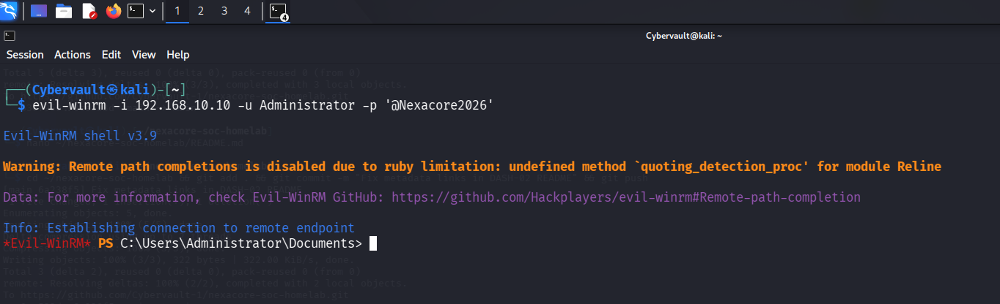
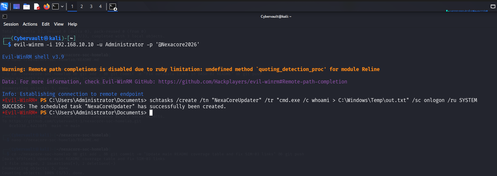
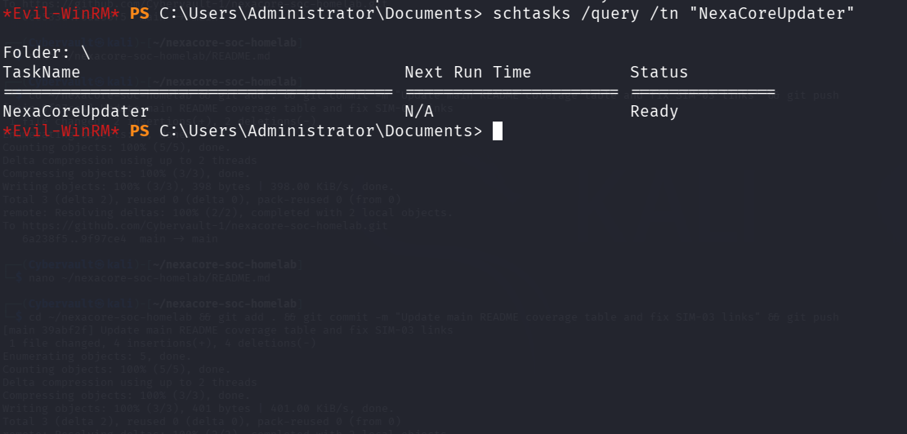

# Attack Simulation 04 — Persistence via Scheduled Task

## Simulation Metadata

| Field | Detail |
|---|---|
| Simulation ID | SIM-04 |
| Date | 20 May 2026 |
| Author | Adedeji Adetayo |
| Status | Complete |
| MITRE Technique | T1053.005 — Scheduled Task/Job: Scheduled Task |
| Linked Detection | DET-04 — Persistence via Scheduled Task |
| Linked Incident Report | IR-004 — Persistence via Scheduled Task |

---

## Objective

The objective of this simulation was to demonstrate how an attacker with an active remote session on NEXACORE-WS01 establishes persistence by creating a scheduled task using the native Windows schtasks.exe binary. The simulation generates detectable evidence in Splunk via Windows Event ID 4698 and Sysmon Event ID 1, confirming scheduled task creation through a remote WinRM session.

---

## Environment

| Role | Machine | IP Address | OS |
|---|---|---|---|
| Attacker | Kali Linux | 192.168.10.20 | Kali Linux 2025.4 |
| Target | NEXACORE-WS01 | 192.168.10.10 | Windows Server 2019 |
| Domain Controller | NexaCore-DC01 | 192.168.10.1 | Windows Server 2019 |
| SIEM | Splunk Enterprise | 192.168.56.1 | Host Machine |

---

## MITRE ATT&CK Mapping

| Field | Detail |
|---|---|
| Tactic | Persistence |
| Technique | Scheduled Task/Job: Scheduled Task |
| Sub-technique | T1053.005 |
| Reference | https://attack.mitre.org/techniques/T1053/005/ |

---

## Prerequisites — Security Gaps That Allowed This Attack

| Gap | Detail |
|---|---|
| No scheduled task monitoring | No alerting was configured for scheduled task creation events, allowing the attacker to plant persistence without triggering any response |
| WinRM exposed and accessible | Port 5985 remained open from SIM-03, providing the active session from which the scheduled task was created |
| No application whitelisting | schtasks.exe was unrestricted, allowing any authenticated user to register tasks that execute arbitrary commands |
| Excessive account privileges | The Administrator account had unrestricted ability to create SYSTEM-level scheduled tasks with no approval or logging controls in place |

---

## Attack Flow Architecture

    Kali Linux (192.168.10.20)
        |
        | Active Evil-WinRM session established in SIM-03
        | schtasks /create executed inside remote session
        |
        v
    NEXACORE-WS01 (192.168.10.10)
        |
        | wsmprovhost.exe spawns schtasks.exe
        | Scheduled task NexaCoreUpdater registered
        | Configured to run cmd.exe as SYSTEM on every logon
        |
        | Windows Security Log — Event ID 4698 (task created)
        | Sysmon Operational Log — Event ID 1 (process creation)
        v
    Splunk Enterprise (192.168.56.1) — centralised log monitoring

---

## Tools Used

| Tool | Version | Purpose |
|---|---|---|
| Evil-WinRM | v3.9 | Maintain remote PowerShell session on NEXACORE-WS01 |
| schtasks.exe | Native Windows | Register persistence via scheduled task |

---

## Attack Steps

### Step 1 — Establish Evil-WinRM Session

The attacker reopened the Evil-WinRM session from Kali Linux using the Administrator credential recovered during SIM-01.

    evil-winrm -i 192.168.10.10 -u Administrator -p '@Nexacore2026'

Expected output: Evil-WinRM establishes connection and presents an interactive PowerShell prompt running as Administrator on NEXACORE-WS01.

---

### Step 2 — Create Scheduled Task

From within the remote session, the attacker created a scheduled task named NexaCoreUpdater. The task name was chosen to appear as a legitimate Windows update component. The task was configured to execute a command as SYSTEM on every user logon.

    schtasks /create /tn "NexaCoreUpdater" /tr "cmd.exe /c whoami > C:\Windows\Temp\out.txt" /sc onlogon /ru SYSTEM

Expected output: A success message confirming the scheduled task has been created and registered on NEXACORE-WS01.

---

### Step 3 — Verify Task Creation

The attacker queried the task scheduler to confirm the task was successfully registered and would survive a reboot.

    schtasks /query /tn "NexaCoreUpdater"

Expected output: Task details returned showing NexaCoreUpdater is registered, its trigger set to logon, and its status as ready.

---

## Outcome

The attack succeeded without interruption. The attacker created a scheduled task on NEXACORE-WS01 from within a remote WinRM session using only native Windows tooling. No malware was dropped and no third-party tools were installed on the target machine, making the attack difficult to detect through traditional antivirus approaches.

Windows Security log recorded the task creation as Event ID 4698, capturing the full task definition including the embedded command and trigger configuration. Sysmon recorded the execution of schtasks.exe as Event ID 1, with wsmprovhost.exe identified as the parent process confirming the task was created from within a remote session.

In a hardened environment this attack would have been prevented by monitoring and alerting on scheduled task creation events, restricting WinRM access to authorised management hosts only, and applying least privilege principles to limit which accounts can create SYSTEM-level tasks.

---

## References

- Detection write-up: DET-04 — Persistence via Scheduled Task
- Incident report: IR-004 — Persistence via Scheduled Task
- MITRE ATT&CK T1053.005: https://attack.mitre.org/techniques/T1053/005/
