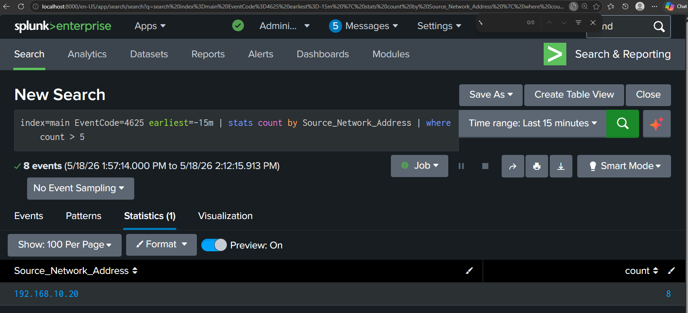
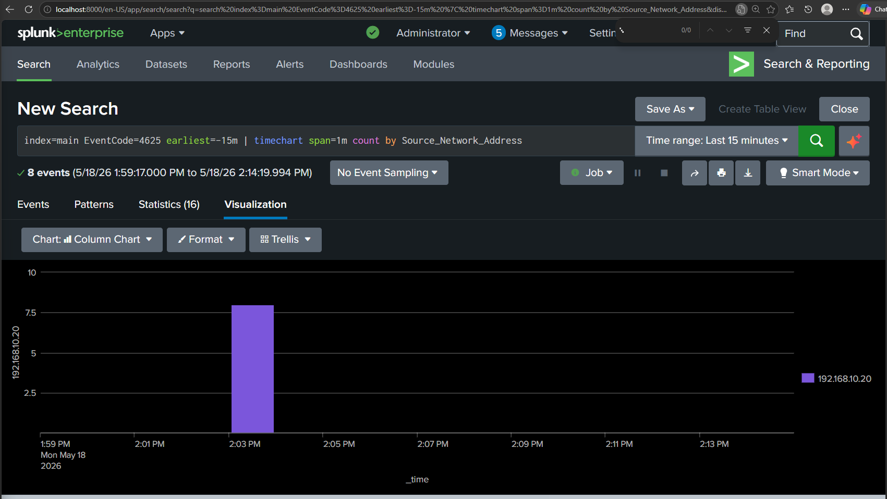

# Detection 01 — SMB Brute Force (Event ID 4625)

## Detection Metadata

| Field | Detail |
| --- | --- |
| Detection ID | DET-01 |
| Date | 18 May 2026 |
| Author | Adedeji Adetayo |
| Status | Active |
| MITRE Technique | T1110.001 — Password Guessing |
| Linked Simulation | [SIM-01 — SMB Brute Force](../../03-attack-simulations/sim-01-smb-brute-force/README.md) |
| Linked Incident Report | [IR-001 — SMB Brute Force](../../05-incident-reports/IR-001-smb-brute-force/README.md) |

---

## Overview

This detection identifies brute force authentication attempts against Windows machines by monitoring for a high volume of failed login events (Event ID 4625) originating from the same source IP within a short timeframe. It was built and validated against the SMB brute force simulation documented in SIM-01.

---

## MITRE ATT&CK Mapping

| Field | Detail |
| --- | --- |
| Tactic | Credential Access |
| Technique | Brute Force |
| Sub-technique | T1110.001 — Password Guessing |
| Reference | https://attack.mitre.org/techniques/T1110/001/ |

---

## Data Source Requirements

For this detection to function the following must be configured on the target endpoint:

| Requirement | Detail |
| --- | --- |
| Windows Security Auditing | Audit Logon Failures must be enabled under Security Settings — Advanced Audit Policy — Logon/Logoff |
| Splunk Universal Forwarder | Must be installed and running on the target endpoint and forwarding Windows Security logs to Splunk |
| Splunk Index | Logs must be landing in the main index |

Without these in place Event ID 4625 will not be generated or will not reach Splunk and the detection will produce no results.

---

## Detection Logic

A single failed login is normal. A user mistyping their password generates one or two Event ID 4625 entries followed by a successful login. What distinguishes brute force activity is a sustained pattern of failures from the same source IP within a short window with no successful login recorded at any point.

This detection surfaces that pattern by grouping failed login events by source IP and applying a count threshold. Any IP exceeding 5 failures within 15 minutes is considered suspicious and warrants investigation.

---

## Threshold Detection Query

This query groups failed logins by source IP and surfaces only those exceeding the threshold of 5 failures. The Splunk alert runs this query every 5 minutes against the last 15 minutes of log data.

```
index=main EventCode=4625 earliest=-15m | stats count by Source_Network_Address | where count > 5
```

| Part | Meaning |
| --- | --- |
| index=main | Opens the main log storage bucket where all endpoint logs are kept |
| EventCode=4625 | Windows Security event for a failed logon attempt |
| earliest=-15m | Scopes the search to the last 15 minutes of data |
| stats count by Source_Network_Address | Groups failed logins by source IP and counts them |
| where count > 5 | Filters to only IPs that have exceeded the threshold |

During SIM-01 validation the query returned 192.168.10.20 with a count of 8, exceeding the threshold of 5 and confirming brute force activity originating from the Kali Linux attacker machine.



---

## Timechart — Visual Spike Pattern

A timechart provides a visual representation of failed login activity over time grouped by source IP. Legitimate failed logins appear as a low flat baseline spread randomly across the timeline. Brute force activity produces a sharp isolated spike as all failures occur within a very short window.

```
index=main EventCode=4625 earliest=-15m | timechart span=1m count by Source_Network_Address
```

The chart produced during SIM-01 validation shows a single spike at 2:03 PM on 18 May 2026 from 192.168.10.20 with a completely flat baseline before and after, consistent with automated brute force tooling rather than normal user behaviour.



---

## False Positive Analysis

| Scenario | How To Distinguish From Attack |
| --- | --- |
| User genuinely mistyping password | A small number of failures followed by a successful login. No sustained pattern from the same IP. |
| Password sync issue on a service account | Failures originate from a known internal IP associated with a service account rather than an external or unfamiliar host. |
| Automated script with wrong credentials | Pattern resembles brute force but the source is a known internal trusted IP. The script rather than an external attacker is the likely cause. |

The threshold value of 5 failures can be adjusted based on observed baseline behaviour in the environment. Higher thresholds reduce false positive rates but increase the risk of missing lower volume attacks.

---

## Splunk Alert Configuration

A scheduled alert has been configured in Splunk to fire automatically when the threshold is breached. The alert runs every 5 minutes and remains silent until a genuine threshold breach is detected.

| Setting | Value |
| --- | --- |
| Title | NexaCore — SMB Brute Force Detection |
| Alert Type | Scheduled |
| Cron Schedule | */5 * * * * (every 5 minutes) |
| Time Range | Last 15 minutes |
| Trigger Condition | Number of results greater than 0 |
| Trigger | For each result |
| Throttle | 10 minutes |
| Severity | High |
| Action | Add to Triggered Alerts |


---

## Limitations

- This detection requires the Splunk Universal Forwarder to be running on the target endpoint. If the forwarder is offline events will not reach Splunk and the detection will produce no results.
- Correlation between 4625 failures and subsequent 4624 successes is not automated. Confirming whether a brute force attempt succeeded requires a separate manual investigation step.
- Attackers using low and slow techniques that deliberately keep their failure rate below the threshold will not trigger this detection.

---

## References

- [Attack Simulation SIM-01](../../03-attack-simulations/sim-01-smb-brute-force/README.md)
- [Incident Report IR-001](../../05-incident-reports/IR-001-smb-brute-force/README.md)
- [MITRE ATT&CK T1110.001](https://attack.mitre.org/techniques/T1110/001/)
- [Microsoft Event ID 4625](https://learn.microsoft.com/en-us/windows/security/threat-protection/auditing/event-4625)
- [Microsoft Event ID 4624](https://learn.microsoft.com/en-us/windows/security/threat-protection/auditing/event-4624)
