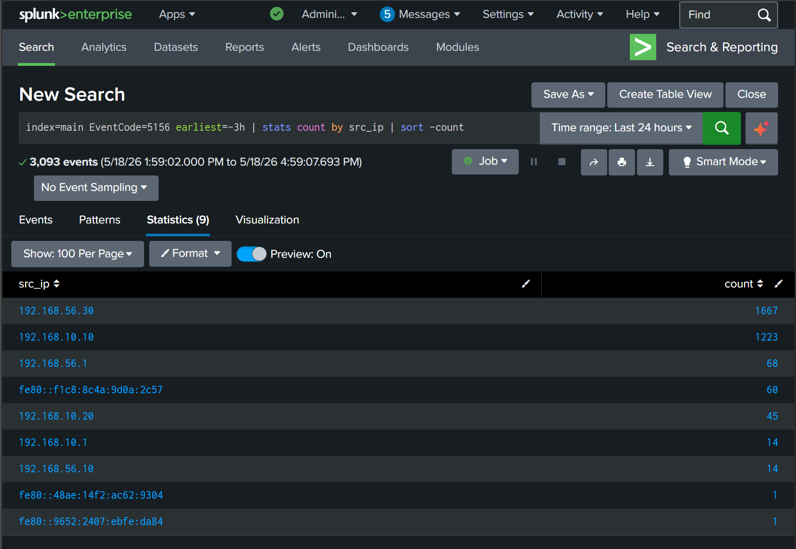

# Detection 02 — Nmap Reconnaissance (Event ID 5156)

## Detection Metadata

| Field | Detail |
| --- | --- |
| Detection ID | DET-02 |
| Date | 18 May 2026 |
| Author | Adedeji Adetayo |
| Status | Active |
| MITRE Technique | T1046 — Network Service Discovery |
| Linked Simulation | [SIM-02 — Nmap Reconnaissance](../../03-attack-simulations/sim-02-nmap-reconnaissance/README.md) |
| Linked Incident Report | [IR-002 — Nmap Reconnaissance](../../05-incident-reports/IR-002-nmap-reconnaissance/README.md) |

---

## Overview

This detection identifies network port scanning activity by monitoring for a single source IP generating an abnormally high number of inbound connection events across multiple destination ports within a short timeframe. Port scanning is typically the reconnaissance phase of an attack where an adversary maps open services before deciding how to proceed.

It was built and validated against the Nmap reconnaissance simulation documented in SIM-02.

---

## MITRE ATT&CK Mapping

| Field | Detail |
| --- | --- |
| Tactic | Discovery |
| Technique | Network Service Discovery |
| Technique ID | T1046 |
| Reference | https://attack.mitre.org/techniques/T1046/ |

---

## Data Source Requirements

For this detection to function the following must be configured on the target endpoint:

| Requirement | Detail |
| --- | --- |
| Windows Filtering Platform auditing | Audit Filtering Platform Connection must be enabled under Security Settings — Advanced Audit Policy — System. Without this Event ID 5156 will not be written to the Windows Security log and the detection will produce no results. |
| Splunk Universal Forwarder | Must be installed and running on the target endpoint and forwarding Windows Security logs to Splunk |
| Splunk Index | Logs must be landing in the main index |

The audit policy was enabled on NEXACORE-WS01 using the following command before the simulation was run:

```
auditpol /set /subcategory:"Filtering Platform Connection" /success:enable /failure:enable
```

---

## Detection Logic

A legitimate machine on a network connects to specific well-known ports on other machines as part of normal operations. What is not normal is a single external IP generating dozens of connection events across multiple destination ports within seconds. That pattern is the fingerprint of automated port scanning.

This detection surfaces that pattern by grouping all Event ID 5156 connection events by source IP and counting them. A source IP generating significantly more connection events than normal infrastructure machines warrants investigation.

---

## Threshold Detection Query

This query groups all inbound connection events by source IP and sorts by the highest count. During a port scan the attacker IP will generate significantly more connection events than normal machines, making it stand out immediately in the results.

```
index=main EventCode=5156 earliest=-24h | stats count by src_ip | sort -count
```

| Part | Meaning |
| --- | --- |
| index=main | Opens the main log storage bucket |
| EventCode=5156 | Windows Filtering Platform event recording an inbound connection permitted by the firewall |
| earliest=-24h | Scopes the search to the last 24 hours |
| stats count by src_ip | Groups all connection events by source IP and counts them |
| sort -count | Brings the highest counts to the top for faster triage |

During SIM-02 validation 192.168.10.20 generated 45 connection events within seconds, standing out clearly against normal infrastructure traffic from known internal IPs.



---

## Port Distribution Query

Once a suspicious source IP is identified the next step is to examine which ports it was probing. A machine connecting to many different ports on the same target within seconds is consistent with automated port scanning. This query shows the port distribution for all source IPs grouped by destination port.

```
index=main EventCode=5156 earliest=-24h | stats count by src_ip, dest_port | sort -count | head 20
```

During SIM-02 validation 192.168.10.20 hit port 445 thirty-one times, port 135 three times and port 139 three times. The concentration of probes on port 445 reflects Nmap sending multiple packets to fingerprint the SMB service version.

| Destination Port | Service | Hit Count |
| --- | --- | --- |
| 445 | Microsoft SMB | 31 |
| 135 | Microsoft RPC | 3 |
| 139 | Microsoft NetBIOS | 3 |


---

## False Positive Analysis

| Scenario | How To Distinguish From Attack |
| --- | --- |
| Vulnerability scanner running on the network | The source IP will be a known internal security tool. Cross-reference with the asset inventory to confirm. |
| Network monitoring tool generating connection events | Similar pattern but source is a known internal IP associated with a monitoring platform. |
| Software update or patch management system | Connects to specific known ports rather than a broad range of ports across multiple services. |

Port scanning from an unknown or external IP with no legitimate business reason should always be treated as suspicious regardless of whether the ports scanned are sensitive.

---

## Limitations

- This detection requires Windows Filtering Platform auditing to be enabled on the target endpoint. If the audit policy is not configured Event ID 5156 will not be generated and the detection will produce no results.
- High volume environments with many machines communicating frequently may generate large numbers of 5156 events, making it harder to identify scanning activity without additional filtering.
- Slow port scans that spread connection attempts over a long time window may not stand out against normal baseline traffic.

---

## References

- [Attack Simulation SIM-02](../../03-attack-simulations/sim-02-nmap-reconnaissance/README.md)
- [Incident Report IR-002](../../05-incident-reports/IR-002-nmap-reconnaissance/README.md)
- [MITRE ATT&CK T1046](https://attack.mitre.org/techniques/T1046/)
- [Microsoft Event ID 5156](https://learn.microsoft.com/en-us/windows/security/threat-protection/auditing/event-5156)
