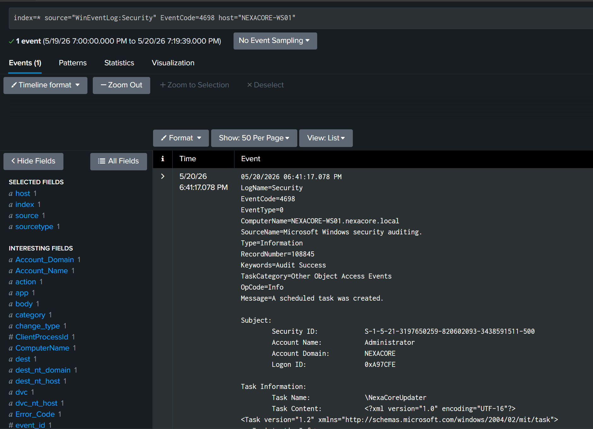
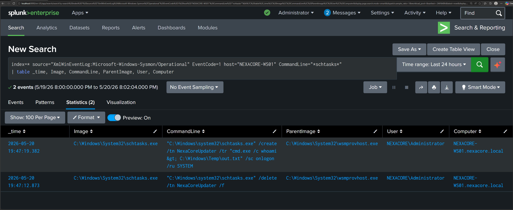

# Detection Report 04 — Persistence via Scheduled Task

## Detection Metadata

| Field | Detail |
|---|---|
| Detection ID | DET-04 |
| Date | 20 May 2026 |
| Author | Adedeji Adetayo |
| Status | Complete |
| MITRE Technique | T1053.005 — Scheduled Task/Job: Scheduled Task |
| Linked Simulation | SIM-04 — Persistence via Scheduled Task |
| Linked Incident Report | IR-004 — Persistence via Scheduled Task |

---

## Objective

The objective of this detection was to identify evidence of scheduled task creation used for persistence on NEXACORE-WS01 using Splunk. The detection covers task registration captured by Windows Security Event ID 4698 and the schtasks.exe process creation captured by Sysmon Event ID 1, with particular focus on identifying the parent process wsmprovhost.exe as confirmation that persistence was planted from within a remote WinRM session.

---

## Environment

| Role | Machine | IP Address | OS |
|---|---|---|---|
| Attacker | Kali Linux | 192.168.10.20 | Kali Linux 2025.4 |
| Target | NEXACORE-WS01 | 192.168.10.10 | Windows Server 2019 |
| Domain Controller | NexaCore-DC01 | 192.168.10.1 | Windows Server 2019 |
| SIEM | Splunk Enterprise | 192.168.56.1 | Host Machine |

---

## MITRE ATT&CK Mapping

| Field | Detail |
|---|---|
| Tactic | Persistence |
| Technique | Scheduled Task/Job: Scheduled Task |
| Sub-technique | T1053.005 |
| Reference | https://attack.mitre.org/techniques/T1053/005/ |

---

## Detection Sources

| Log Source | Event ID | Description |
|---|---|---|
| Windows Security Log | 4698 | Scheduled task created — captures full task definition including embedded command |
| Sysmon Operational Log | 1 | Process creation — captures schtasks.exe execution with parent process context |

---

## Detection 1 — Scheduled Task Creation via Windows Security Log

Windows Event ID 4698 was generated when the attacker registered the NexaCoreUpdater scheduled task on NEXACORE-WS01. This event captured the full task definition including the task name, the author, the trigger configuration, and the embedded command. Event ID 4698 requires the Other Object Access Events audit subcategory to be set to Success.

    index=* source="WinEventLog:Security" EventCode=4698
    | table _time, ComputerName, Account_Name, Account_Domain, TaskName, Message
    | sort -_time

---

## Detection 2 — schtasks.exe Process Creation via Sysmon

Sysmon Event ID 1 captured the execution of schtasks.exe at the process level. This event recorded the full command line used to create the task, the user context, and critically the parent process that spawned schtasks.exe. The parent process is the key field that determines whether the activity is legitimate or malicious.

    index=* source="XmlWinEventLog:Microsoft-Windows-Sysmon/Operational" EventCode=1 CommandLine="*schtasks*"
    | table _time, Image, CommandLine, ParentImage, User, Computer
    | sort -_time

---

## Detection 3 — Scheduled Task Created from WinRM Session (High Fidelity)

The highest confidence signal in this detection is schtasks.exe being spawned by wsmprovhost.exe. wsmprovhost.exe is the Windows Remote Management host process. Its presence as the parent of schtasks.exe confirms that the scheduled task was created from inside a remote WinRM session. This combination is not expected in normal administrative activity and should be treated as an immediate alert.

    index=* source="XmlWinEventLog:Microsoft-Windows-Sysmon/Operational" EventCode=1 CommandLine="*schtasks*" ParentImage="*wsmprovhost*"
    | table _time, Image, CommandLine, ParentImage, User, Computer
    | sort -_time

---

## Attack Timeline

| Time | Event | Evidence |
|---|---|---|
| 18:41:17 | Scheduled task NexaCoreUpdater created on NEXACORE-WS01 | Event ID 4698 |
| 18:47:12 | schtasks.exe used to delete previous task version | Sysmon Event ID 1 |
| 18:47:19 | schtasks.exe used to register NexaCoreUpdater with SYSTEM privileges | Sysmon Event ID 1 |

---

## Key Indicators of Compromise

| Indicator | Value |
|---|---|
| Task Name | NexaCoreUpdater |
| Created By | NEXACORE\Administrator |
| Target Machine | NEXACORE-WS01 |
| Parent Process | wsmprovhost.exe |
| Trigger | LogonTrigger — executes on every user logon |
| Payload | cmd.exe /c whoami > C:\Windows\Temp\out.txt |
| Timestamp | 2026-05-20T18:47:19 |

---

## Analyst Notes

The attack was detected across two independent log sources confirming scheduled task persistence. No single event in isolation proves malicious activity. The combination of Event ID 4698 recording a task named NexaCoreUpdater with an embedded cmd.exe command, and Sysmon Event ID 1 showing schtasks.exe spawned by wsmprovhost.exe, together constitute conclusive evidence of persistence planted from within a remote session.

A legitimate administrator creating a scheduled task would typically do so through the Task Scheduler GUI spawning mmc.exe as the parent process, or through a known management tool during a scheduled maintenance window. The wsmprovhost.exe parent process combined with a task name designed to mimic legitimate Windows components is the distinguishing characteristic of this attack.

---

## Recommendations

- Enable and alert on Windows Event ID 4698 for all endpoints
- Alert on schtasks.exe spawned by wsmprovhost.exe, powershell.exe, or cmd.exe outside of authorised maintenance windows
- Restrict WinRM access to authorised management IP addresses only using Windows Firewall rules
- Audit scheduled tasks regularly for tasks with embedded commands pointing to temporary directories
- Apply least privilege principles to limit which accounts can create SYSTEM-level scheduled tasks
- Enable the Other Object Access Events audit subcategory on all endpoints to ensure Event ID 4698 is captured

---

## References

- Simulation: SIM-04 — Persistence via Scheduled Task
- Incident report: IR-004 — Persistence via Scheduled Task
- MITRE ATT&CK T1053.005: https://attack.mitre.org/techniques/T1053/005/
