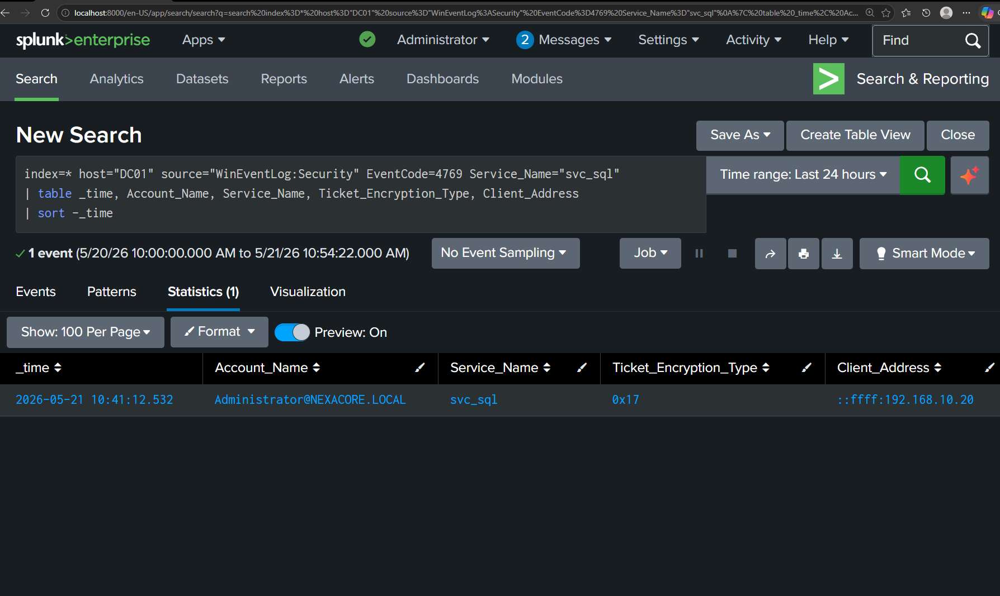

# Detection Report 05 — Kerberoasting

## Detection Metadata

| Field | Detail |
|---|---|
| Detection ID | DET-05 |
| Date | 21 May 2026 |
| Author | Adedeji Adetayo |
| Status | Complete |
| MITRE Technique | T1558.003 — Steal or Forge Kerberos Tickets: Kerberoasting |
| Linked Simulation | SIM-05 — Kerberoasting |
| Linked Incident Report | IR-005 — Kerberoasting |

---

## Objective

The objective of this detection was to identify evidence of Kerberoasting activity against NexaCore-DC01 using Splunk. The detection focuses on Windows Event ID 4769 with Ticket Encryption Type 0x17 (RC4-HMAC) as the primary indicator, with particular attention to service ticket requests targeting accounts with Service Principal Names registered. RC4 encryption type is the signature signal of Kerberoasting because modern Active Directory environments default to AES encryption and RC4 ticket requests are abnormal in legitimate user activity.

---

## Environment

| Role | Machine | IP Address | OS |
|---|---|---|---|
| Attacker | Kali Linux | 192.168.10.20 | Kali Linux 2025.4 |
| Target | NEXACORE-WS01 | 192.168.10.10 | Windows Server 2019 |
| Domain Controller | NexaCore-DC01 | 192.168.10.1 | Windows Server 2019 |
| SIEM | Splunk Enterprise | 192.168.56.1 | Host Machine |

---

## MITRE ATT&CK Mapping

| Field | Detail |
|---|---|
| Tactic | Credential Access |
| Technique | Steal or Forge Kerberos Tickets: Kerberoasting |
| Sub-technique | T1558.003 |
| Reference | https://attack.mitre.org/techniques/T1558/003/ |

---

## Detection Sources

| Log Source | Event ID | Description |
|---|---|---|
| Windows Security Log (DC) | 4769 | Kerberos Service Ticket requested — captures account, service requested, encryption type, and source address |

---

## Detection 1 — RC4 Encrypted Service Ticket Requests

The strongest single indicator of Kerberoasting is a Kerberos service ticket request encrypted with RC4-HMAC (Ticket Encryption Type 0x17). Modern Windows defaults to AES encryption (0x12) for service tickets. RC4 requests are either from legacy systems or from attackers explicitly requesting RC4 to ease offline cracking. Any RC4 ticket request warrants investigation.

    index=* source="WinEventLog:Security" EventCode=4769 Ticket_Encryption_Type="0x17"
    | table _time, Account_Name, Service_Name, Ticket_Encryption_Type, Client_Address
    | sort -_time

---

## Detection 2 — Bulk Service Ticket Requests from Single Source

A defining characteristic of Kerberoasting is bulk enumeration. Attackers request tickets for every service account with an SPN in rapid succession, often producing dozens of Event ID 4769 entries within seconds. Normal users request tickets for specific services they need, spread across normal working hours. This query identifies accounts requesting more than five RC4 tickets from the same source — a strong behavioural signal of Kerberoasting.

    index=* source="WinEventLog:Security" EventCode=4769 Ticket_Encryption_Type="0x17"
    | stats count by Account_Name, Client_Address
    | where count > 5
    | sort -count

---

## Detection 3 — Service Account Tickets Requested for Known Service Accounts

This query focuses on RC4 ticket requests specifically targeting accounts with the svc_ naming convention. In environments where service accounts follow a naming standard, attackers requesting tickets for these accounts is highly abnormal. Normal users do not request Kerberos tickets directly for service accounts — they interact with the services those accounts run.

    index=* source="WinEventLog:Security" EventCode=4769 Service_Name="svc_*" Ticket_Encryption_Type="0x17"
    | table _time, Account_Name, Service_Name, Ticket_Encryption_Type, Client_Address
    | sort -_time

---

## Attack Timeline

| Time | Event | Evidence |
|---|---|---|
| 10:41:12 | Administrator account requested Kerberos service ticket for svc_sql with RC4 encryption from Kali Linux | Event ID 4769 |
| 10:41:13 | Ticket hash extracted to kerberoast-hashes.txt on attacker machine | Out-of-band evidence |
| 10:51:20 | Offline cracking of ticket hash begins on Kali Linux using hashcat mode 13100 | Out-of-band evidence |
| 10:51:29 | Plain text password Password123! recovered for svc_sql in 9 seconds | Out-of-band evidence |

---

## Key Indicators of Compromise

| Indicator | Value |
|---|---|
| Source Account | Administrator@NEXACORE.LOCAL |
| Source IP | 192.168.10.20 (Kali Linux) |
| Target Service Account | svc_sql |
| Service Principal Name | MSSQLSvc/nexacore-sql01.nexacore.local:1433 |
| Ticket Encryption Type | 0x17 (RC4-HMAC) |
| Cracked Password | Password123! |
| Cracking Tool | hashcat mode 13100 |
| Time to Crack | 9 seconds |

---

## Analyst Notes

Kerberoasting is one of the most difficult attacks to detect because the malicious activity from the Domain Controller perspective is indistinguishable from legitimate Kerberos functionality. The DC is doing exactly what it is designed to do — issue service tickets to authenticated users on request.

The detection succeeded because three independent signals converged in a single Event ID 4769 entry. First, the Ticket Encryption Type was 0x17 (RC4-HMAC), which is abnormal in a modern Active Directory environment that defaults to AES. Second, the service requested was a service account (svc_sql), not a typical user service interaction. Third, the request originated from the Kali Linux attacker machine which has no legitimate need to authenticate against SQL Server services.

The offline cracking phase produced no evidence on the Domain Controller because it happened entirely on the attacker machine. This is by design — the entire purpose of Kerberoasting is to move the credential cracking off the network where it cannot be detected. The 9 second crack time demonstrates how quickly weak service account passwords fall to modern hardware against common wordlists.

A legitimate administrator or user does not request Kerberos tickets for service accounts directly. They interact with the services those accounts run, which triggers Kerberos authentication transparently using their own user context. The pattern of an Administrator account requesting a ticket explicitly targeting svc_sql from an external Linux host is the distinguishing characteristic of this attack.

---

## Recommendations

- Configure all service accounts to use AES encryption only by enabling the msDS-SupportedEncryptionTypes attribute to remove RC4 support
- Enforce strong unique passwords on all service accounts with a minimum length of 25 characters
- Migrate service accounts to Group Managed Service Accounts (gMSA) which provide automatic password rotation and complexity
- Alert on Event ID 4769 with Ticket Encryption Type 0x17 across all Domain Controllers
- Alert on accounts requesting more than 5 service tickets within a 1 minute window
- Audit all accounts with SPNs registered and remove SPNs from accounts that do not require them
- Implement Just-In-Time access for service account usage rather than continuous availability
- Monitor for service ticket requests originating from non-Windows hosts which is unusual in most environments

---

## References

- Simulation: SIM-05 — Kerberoasting
- Incident report: IR-005 — Kerberoasting
- MITRE ATT&CK T1558.003: https://attack.mitre.org/techniques/T1558/003/
