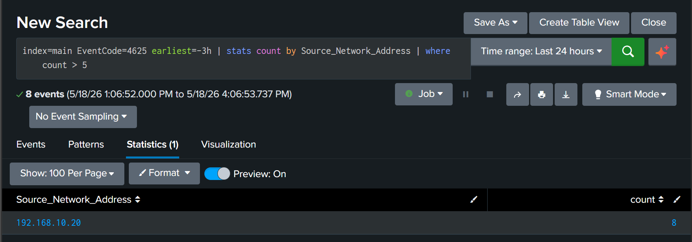
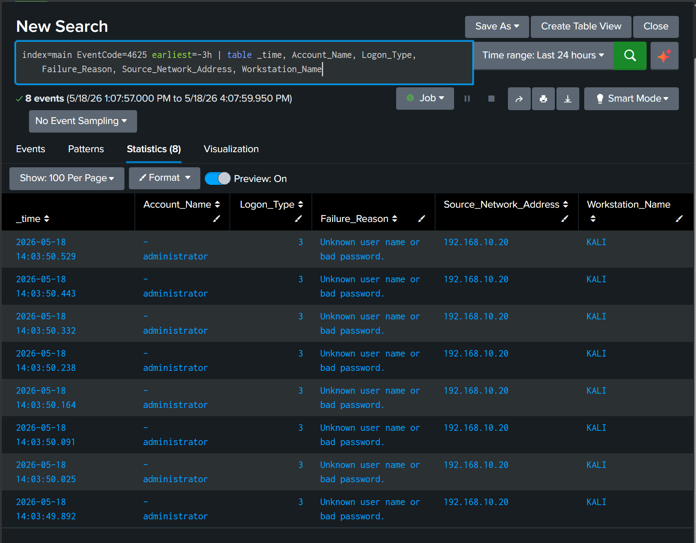

# Incident Report — IR-001: SMB Brute Force Attack

## Incident Metadata

| Field | Detail |
| --- | --- |
| Incident ID | IR-001 |
| Date | 18 May 2026 |
| Analyst | Adedeji Adetayo |
| Severity | High |
| Status | Resolved |
| MITRE ATT&CK | T1110.001 — Password Guessing |
| Linked Simulation | [SIM-01 — SMB Brute Force](../../03-attack-simulations/sim-01-smb-brute-force/README.md) |
| Linked Detection | [DET-01 — SMB Brute Force](../../04-detections/detection-01-brute-force/README.md) |

---

## Executive Summary

On 18 May 2026 an unauthorised machine attempted to break into the NexaCore workstation NEXACORE-WS01 by repeatedly guessing the administrator password over the network. All 8 attempts failed and no accounts or systems were compromised. The attack was caught automatically by Splunk, the source of the attack was identified and the incident was fully investigated and resolved.

---

## Incident Details

| Field | Detail |
| --- | --- |
| Incident ID | IR-001 |
| Date and Time | 18 May 2026, 14:03:49 to 14:03:50 |
| Attack Type | SMB Brute Force |
| MITRE ATT&CK | T1110.001 — Password Guessing |
| Attacker IP | 192.168.10.20 |
| Attacker Machine | KALI |
| Target Machine | NEXACORE-WS01 |
| Target Account | administrator |
| Total Attempts | 8 |
| Successful Logins | 0 |
| Systems Compromised | None |

---

## Timeline of Events

| Time | Event |
| --- | --- |
| 14:03:49.892 | First failed login attempt recorded on NEXACORE-WS01 from 192.168.10.20 |
| 14:03:50.025 | Second failed attempt |
| 14:03:50.091 | Third failed attempt |
| 14:03:50.164 | Fourth failed attempt |
| 14:03:50.238 | Fifth failed attempt |
| 14:03:50.332 | Sixth failed attempt |
| 14:03:50.443 | Seventh failed attempt |
| 14:03:50.529 | Eighth and final failed attempt |
| Post-attack | All 8 events forwarded to Splunk for analysis |
| Post-attack | Attack detected and alert triggered |
| Post-attack | Source identified, investigation completed, incident resolved |

---

## Affected Systems

| Machine | Role | Impact |
| --- | --- | --- |
| NEXACORE-WS01 | Primary target endpoint | Targeted but not compromised |
| NexaCore-DC01 | Domain Controller | Authentication requests forwarded, no compromise |
| Splunk Enterprise | SIEM | Successfully detected the attack |

---

## Attack Description

The attacker used a tool called smbclient on a Kali Linux machine to repeatedly attempt to log into the administrator account on NEXACORE-WS01. SMB (Server Message Block) is a Windows protocol that allows machines on a network to share files and resources. It runs on port 445 and is a common target for attackers because it is enabled by default on most Windows machines.

The attacker cycled through a list of commonly used weak passwords one by one, completing all 8 attempts in under 1 second. This speed indicates the process was automated rather than a person manually typing passwords.

The attack was made possible by two security gaps. Windows was not configured to lock the account after repeated failed attempts, meaning the attacker could try as many passwords as needed without consequence. Port 445 was also accessible from the attacker machine without any restriction, giving unrestricted access to the login service.

---

## Detection

The attack was detected by Splunk, a security monitoring platform that collects and analyses logs from machines across the network. Windows records every failed login attempt as a security event called Event ID 4625. When the same machine generates more than 5 of these failed login events within 15 minutes, Splunk raises an alert.

The following query was used to identify the attack:

```
index=main EventCode=4625 earliest=-15m | stats count by Source_Network_Address | where count > 5
```

The query returned the attacker machine at 192.168.10.20 with a count of 8 failed attempts, exceeding the threshold of 5 and confirming automated brute force activity.



---

## Investigation Findings

All 8 failed login records were examined in Splunk. The following query was used to extract the key fields from each event and build a complete picture of the attack:

```
index=main EventCode=4625 earliest=-3h | table _time, Account_Name, Logon_Type, Failure_Reason, Source_Network_Address, Workstation_Name
```

The following information was extracted from each record:

| Field | Value | Significance |
| --- | --- | --- |
| Account_Name | administrator | The highest privilege account was targeted, giving full system access if compromised |
| Logon_Type | 3 — Network | The attempt came remotely over the network, not from someone physically at the machine |
| Failure_Reason | Unknown user name or bad password | Wrong password on every attempt, consistent with automated password guessing |
| Source_Network_Address | 192.168.10.20 | The IP address of the attacking machine |
| Workstation_Name | KALI | The name of the attacking machine |

A check was also run to confirm whether any of the login attempts succeeded. No successful logins were recorded from 192.168.10.20 at any point before, during or after the attack. The administrator account was not compromised.



---

## Root Cause

Two misconfigurations on NEXACORE-WS01 allowed the attack to proceed without interruption.

**No account lockout policy:** Windows was configured to permit unlimited failed login attempts. A lockout policy set to 5 failed attempts within 10 minutes would have blocked the attack after the fifth attempt, preventing further guessing.

**Unrestricted SMB access:** Port 445 was reachable from the attacker machine without any restriction. Limiting access to only machines that genuinely need it would have prevented the connection from being established in the first place.

---

## Remediation Actions Taken

**Splunk alert configured:** An automated alert named NexaCore — SMB Brute Force Detection was created in Splunk. It runs every 5 minutes and fires automatically when any machine generates more than 5 failed login attempts within 15 minutes. Once triggered the alert suppresses duplicate notifications for 10 minutes to avoid flooding the analyst with repeated alerts for the same incident.

**Account lockout policy recommended:** Windows Group Policy should be configured to lock accounts after 5 failed login attempts within 10 minutes with a 30 minute lockout duration. This directly prevents brute force attacks from succeeding even if the attacker has a large password list.

**Firewall restriction recommended:** Access to port 445 on NEXACORE-WS01 should be restricted to only machines that have a legitimate reason to connect to it.

**Administrator account hardening recommended:** The built-in administrator account should be renamed to a non-obvious name. This removes a predictable target since attackers commonly try the administrator account first because it exists on every Windows machine by default.

---

## Lessons Learned

This incident confirmed that a failed attack still reveals important security gaps. The attacker made 8 attempts without any automated interruption because no lockout policy was in place. In a real environment with a larger password list the attack could have succeeded before being detected.

Splunk detection performed as expected. The failed logins were identified automatically, the source was traced and the investigation was completed without ambiguity. This confirms the value of centralised log monitoring and automated alerting in a SOC environment.

---

## References

- [Attack Simulation SIM-01](../../03-attack-simulations/sim-01-smb-brute-force/README.md)
- [Detection DET-01](../../04-detections/detection-01-brute-force/README.md)
- [MITRE ATT&CK T1110.001](https://attack.mitre.org/techniques/T1110/001/)
- [Microsoft Event ID 4625](https://learn.microsoft.com/en-us/windows/security/threat-protection/auditing/event-4625)
- [Microsoft Event ID 4624](https://learn.microsoft.com/en-us/windows/security/threat-protection/auditing/event-4624)
