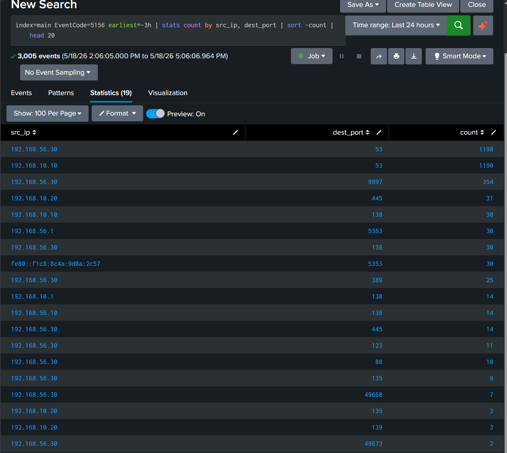

# Incident Report — IR-002: Nmap Reconnaissance

## Incident Metadata

| Field | Detail |
| --- | --- |
| Incident ID | IR-002 |
| Date | 18 May 2026 |
| Analyst | Adedeji Adetayo |
| Severity | Medium |
| Status | Resolved |
| MITRE ATT&CK | T1046 — Network Service Discovery |
| Linked Simulation | [SIM-02 — Nmap Reconnaissance](../../03-attack-simulations/sim-02-nmap-reconnaissance/README.md) |
| Linked Detection | [DET-02 — Nmap Reconnaissance](../../04-detections/detection-02-nmap-reconnaissance/README.md) |

---

## Executive Summary

On 18 May 2026 an unauthorised machine at 192.168.10.20 performed a network port scan against the NexaCore workstation NEXACORE-WS01 using Nmap. The scan targeted the first 1000 ports and completed in under 10 seconds. Three open ports were discovered. No data was accessed and no systems were compromised. The scan was detected through Splunk monitoring using Windows Filtering Platform Event ID 5156 connection logs, the source was identified and the incident was investigated and resolved.

---

## Incident Details

| Field | Detail |
| --- | --- |
| Incident ID | IR-002 |
| Date and Time | 18 May 2026, 16:49:10 to 16:49:21 UTC |
| Attack Type | Network Port Scan |
| MITRE ATT&CK | T1046 — Network Service Discovery |
| Attacker IP | 192.168.10.20 |
| Attacker Machine | KALI |
| Target Machine | NEXACORE-WS01 |
| Target IP | 192.168.10.10 |
| Ports Scanned | 1 to 1000 |
| Open Ports Found | 135, 139, 445 |
| Total Connection Events | 37 |
| Systems Compromised | None |

---

## Timeline of Events

| Time (UTC) | Event |
| --- | --- |
| 16:49:10.135 | First inbound connection event recorded on NEXACORE-WS01 from 192.168.10.20 |
| 16:49:10.148 | Second connection event |
| 16:49:10.155 | Third connection event |
| 16:49:11.853 | Fourth connection event |
| 16:49:17.353 | Continued scanning activity across multiple ports |
| 16:49:21 | Final connection event recorded — scan complete |
| Post-scan | All 37 Event ID 5156 entries forwarded to Splunk via Universal Forwarder |
| Post-scan | Scanning pattern detected through DET-02 threshold detection |
| Post-scan | Source IP identified, investigation completed, incident resolved |

---

## Affected Systems

| Machine | Role | Impact |
| --- | --- | --- |
| NEXACORE-WS01 | Primary target endpoint | Scanned but not compromised |
| NexaCore-DC01 | Domain Controller | Not targeted |
| Splunk Enterprise | SIEM | Successfully detected the scan |

---

## Attack Description

The attacker used Nmap version 7.99 running on Kali Linux to scan NEXACORE-WS01 for open ports and running services. Nmap (Network Mapper) is a free open source tool used for network discovery and security auditing. When used with the `-sV` flag it probes each open port and attempts to identify the exact service and version running on it.

The scan targeted all ports from 1 to 1000 and completed in 9.36 seconds. This speed is characteristic of automated scanning rather than manual probing. The Windows Filtering Platform on NEXACORE-WS01 recorded every inbound connection permitted by the firewall as an Event ID 5156 entry, generating 37 log entries during the scan window.

---

## Detection

The scan was detected in Splunk through the DET-02 detection which monitors Windows Filtering Platform connection events for unusual inbound connection activity. The detection groups all connection events by source IP and surfaces any IP generating significantly more connections than normal infrastructure machines.

The following query was used to identify the scanning activity:

```
index=main EventCode=5156 earliest=-24h | stats count by src_ip | sort -count
```

The query returned 192.168.10.20 with 37 connection events, standing out clearly against normal infrastructure traffic from known internal IPs. The concentration of events within a 10 second window confirmed automated scanning activity.

The following screenshot shows the detection query result with 192.168.10.20 standing out among all source IPs:


---

## Investigation Findings

The port distribution was examined to determine which services were probed and how many times each port was hit. The following query was used to break down the connection events by source IP and destination port:

```
index=main EventCode=5156 earliest=-24h | stats count by src_ip, dest_port | sort -count | head 20
```

The results confirmed that 192.168.10.20 focused the majority of its connection attempts on port 445, the SMB service, which is consistent with Nmap performing service version detection on a Windows target.

| Port | Service | Connection Count | Significance |
| --- | --- | --- | --- |
| 445 | Microsoft SMB | 31 | Primary target — SMB is commonly exploited for lateral movement and credential attacks |
| 135 | Microsoft RPC | 3 | Remote procedure call service used for Windows management |
| 139 | Microsoft NetBIOS | 3 | Legacy Windows networking service |

The concentration of probes on port 445 is significant. This is the same port targeted in IR-001 where a brute force attack was launched against the administrator account over SMB. The reconnaissance documented in this report directly preceded that attack, forming a realistic attack chain from discovery to exploitation.

The following screenshot shows the port distribution for all source IPs, with 192.168.10.20 visible hitting ports 445, 135 and 139:



---

## Root Cause

The scan was possible due to two gaps in the network security configuration.

**Unrestricted network access:** Port 445 and other Windows services on NEXACORE-WS01 were reachable from the attacker machine without any firewall restriction. In a properly segmented network an unknown machine would not be able to reach internal workstation ports.

**No network-level scan detection:** No automated alert was configured to detect port scanning activity before this incident. Detection relied on post-scan log analysis rather than real-time alerting.

---

## Remediation Actions Taken

**Splunk detection configured:** The DET-02 detection is now active in Splunk, monitoring Event ID 5156 connection logs and surfacing any source IP generating an abnormal volume of inbound connections.

**Firewall restriction recommended:** Access to Windows services including ports 135, 139 and 445 on NEXACORE-WS01 should be restricted to only machines that have a legitimate business reason to connect to them. An unknown Kali Linux machine should have no access to these ports.

**Network segmentation recommended:** The attacker machine at 192.168.10.20 was able to reach the internal workstation network freely. Proper network segmentation would isolate untrusted machines and prevent unrestricted access to internal endpoints.

---

## Lessons Learned

Reconnaissance does not cause immediate damage but it provides an attacker with a map of the environment that directly enables the next phase of an attack. In this case the scan revealed port 445 open on NEXACORE-WS01, which the attacker then targeted in a brute force attack documented in IR-001.

Detecting reconnaissance early gives a defender the opportunity to investigate and respond before exploitation begins. The DET-02 detection now provides automated visibility into scanning activity, closing the gap that allowed this reconnaissance to go undetected in real time.

---

## References

- [Attack Simulation SIM-02](../../03-attack-simulations/sim-02-nmap-reconnaissance/README.md)
- [Detection DET-02](../../04-detections/detection-02-nmap-reconnaissance/README.md)
- [Related Incident IR-001](../../05-incident-reports/IR-001-smb-brute-force/README.md)
- [MITRE ATT&CK T1046](https://attack.mitre.org/techniques/T1046/)
- [Microsoft Event ID 5156](https://learn.microsoft.com/en-us/windows/security/threat-protection/auditing/event-5156)
