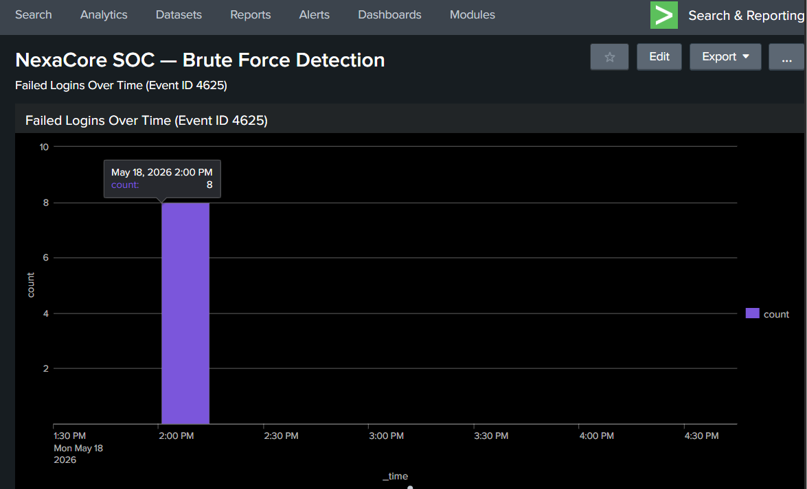
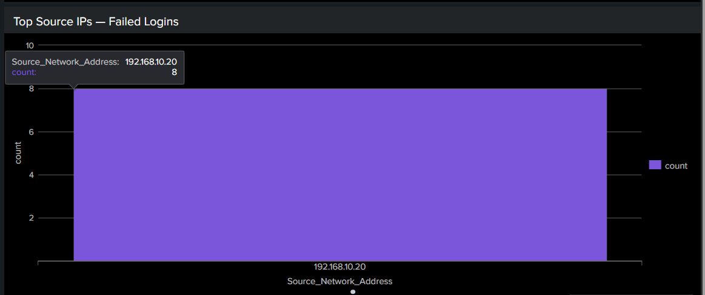
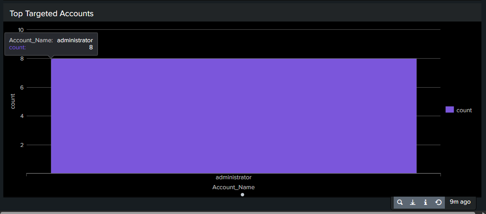

# Dashboard 01 — Brute Force Detection

## Dashboard Metadata

| Field | Detail |
| --- | --- |
| Dashboard ID | DASH-01 |
| Date | 18 May 2026 |
| Author | Adedeji Adetayo |
| Status | Active |
| Linked Detection | [DET-01 — SMB Brute Force](../../04-detections/detection-01-brute-force/README.md) |
| Linked Incident Report | [IR-001 — SMB Brute Force](../../05-incident-reports/IR-001-smb-brute-force/README.md) |

---

## Overview

This dashboard provides a real-time view of failed login activity across the NexaCore environment. It is designed to give a SOC analyst an at-a-glance picture of brute force activity without needing to run manual queries. The dashboard covers a rolling 3-hour window and refreshes automatically.

Each panel answers a specific question an analyst would ask when investigating a potential brute force attack: when did the failures happen, where did they come from and which accounts were targeted.

---

## Dashboard Panels

### Panel 1 — Failed Logins Over Time (Event ID 4625)

This panel shows failed login attempts grouped into 15-minute intervals over the last 3 hours. During normal operation the chart should show a flat baseline close to zero. A sharp spike indicates a burst of failed login activity that warrants investigation. The height of the spike corresponds to the number of failures within that 15-minute window.

```
index=main EventCode=4625 | timechart span=15m count
```

The panel captured a single spike at 2:00 PM on 18 May 2026 corresponding to the 8 failed login attempts from the SIM-01 brute force simulation. The baseline before and after is completely flat.



---

### Panel 2 — Top Source IPs Generating Failed Logins

This panel ranks the IP addresses responsible for failed logins by total count. In a healthy environment this panel should show low counts spread across multiple IPs reflecting genuine user mistakes. A single IP dominating the chart with a high count is a strong indicator of automated brute force activity originating from that machine.

```
index=main EventCode=4625 | stats count by Source_Network_Address | sort -count
```

The panel shows 192.168.10.20 as the sole source of failed logins, consistent with the Kali Linux attacker machine used in the SIM-01 simulation.



---

### Panel 3 — Top Targeted Accounts

This panel shows which accounts have been targeted by failed login attempts, ranked by count. Attackers commonly target the administrator account because it exists on every Windows machine by default and carries the highest level of access. Seeing a single high-privilege account at the top of this chart alongside a spike in Panel 1 and a dominant source IP in Panel 2 is a strong combined signal of a coordinated brute force attack.

```
index=main EventCode=4625 | stats count by Account_Name | search Account_Name!="-" | sort -count
```

The panel shows administrator as the only targeted account, consistent with the SIM-01 simulation where all 8 attempts were directed at the administrator account.



---

## References

- [Detection DET-01](../../04-detections/detection-01-brute-force/README.md)
- [Incident Report IR-001](../../05-incident-reports/IR-001-smb-brute-force/README.md)
- [Attack Simulation SIM-01](../../03-attack-simulations/sim-01-smb-brute-force/README.md)
- [MITRE ATT&CK T1110.001](https://attack.mitre.org/techniques/T1110/001/)
