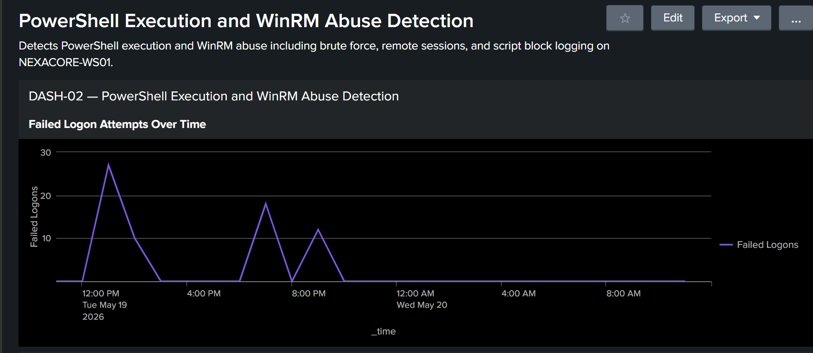
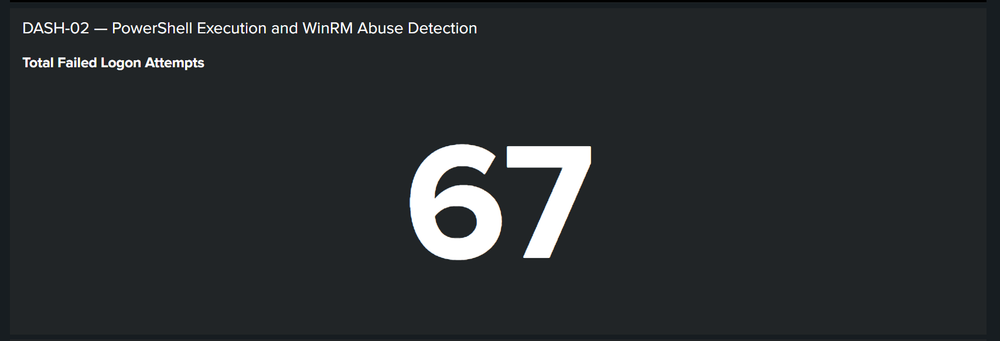
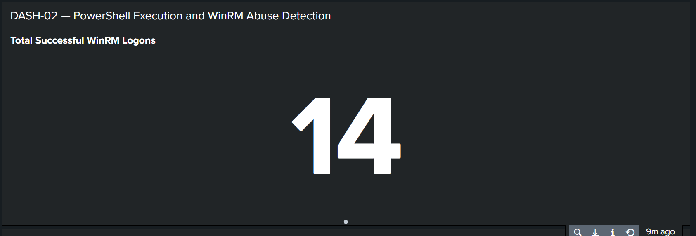
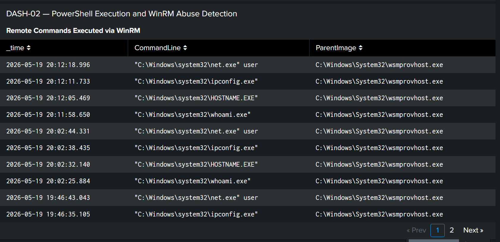
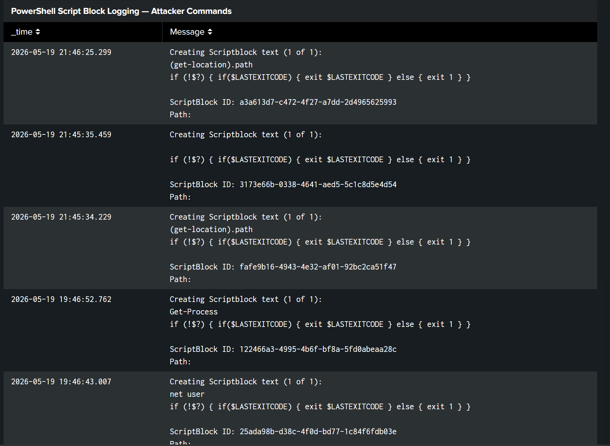

# Dashboard 02 — PowerShell Execution and WinRM Abuse Detection

## Dashboard Metadata

| Field | Detail |
|---|---|
| Dashboard ID | DASH-02 |
| Date | 19 May 2026 |
| Author | Adedeji Adetayo |
| Status | Complete |
| Linked Simulation | [SIM-03 — PowerShell Execution via Evil-WinRM](../../03-attack-simulations/sim-03-powershell-execution-evil-winrm/) |
| Linked Detection | [DET-03 — PowerShell Execution via Evil-WinRM](../../04-detections/detection-03-powershell-execution-evil-winrm/) |
| Linked Incident Report | [IR-003 — PowerShell Execution via Evil-WinRM](../../05-incident-reports/IR-003-powershell-execution-evil-winrm/) |

---

## Objective

This dashboard provides real time visibility into PowerShell execution and WinRM abuse on NEXACORE-WS01. It covers the full attack chain from brute force credential discovery through to remote PowerShell execution and post-exploitation reconnaissance. The dashboard enables SOC analysts to identify, correlate and respond to WinRM-based attacks quickly using evidence from four independent log sources.

---

## Dashboard Panels

### Panel 1 — Failed Logon Attempts Over Time

Visualises Event ID 4625 failed logon attempts over time as a line chart grouped into one hour buckets. A spike in this panel indicates active brute force activity against the Administrator account on NEXACORE-WS01.

    index=main host="NEXACORE-WS01" source="WinEventLog:Security" EventCode=4625
    | timechart count as "Failed Logons" span=1h

---

### Panel 2 — Total Failed Logon Attempts

Displays the total count of failed logon attempts as a single value. Provides an at-a-glance indicator of brute force volume during the monitored time period.

    index=main host="NEXACORE-WS01" source="WinEventLog:Security" EventCode=4625
    | stats count as "Total Failed Logons"

---

### Panel 3 — Total Successful WinRM Logons

Displays the total count of successful Administrator network logons as a single value. A non-zero value combined with high failed logon counts confirms a brute force attack succeeded in obtaining valid credentials.

    index=main host="NEXACORE-WS01" source="WinEventLog:Security" EventCode=4624 Account_Name="Administrator" Logon_Type=3
    | stats count as "Total Successful Logons"

---

### Panel 4 — Remote Commands Executed via WinRM

Lists all processes spawned by wsmprovhost.exe captured by Sysmon Event ID 1. This panel confirms remote PowerShell execution via WinRM and shows the exact commands the attacker ran inside the session.

    index=main host="NEXACORE-WS01" source="WinEventLog:Microsoft-Windows-Sysmon/Operational" EventCode=1 ParentImage="*wsmprovhost*"
    | table _time, CommandLine, ParentImage
    | sort -_time

---

### Panel 5 — PowerShell Script Block Logging

Lists all PowerShell commands captured by Windows Script Block Logging as Event ID 4104. This panel shows the exact content of every command executed inside the remote PowerShell session, providing forensic evidence of attacker activity.

    index=main host="NEXACORE-WS01" source="WinEventLog:Microsoft-Windows-PowerShell/Operational" EventCode=4104
    | table _time, Message
    | sort -_time

---

## References

- Simulation: SIM-03 — PowerShell Execution via Evil-WinRM
- Detection: DET-03 — PowerShell Execution via Evil-WinRM
- Incident Report: IR-003 — PowerShell Execution via Evil-WinRM
- MITRE ATT&CK T1059.001: https://attack.mitre.org/techniques/T1059/001/
- MITRE ATT&CK T1021.006: https://attack.mitre.org/techniques/T1021/006/
