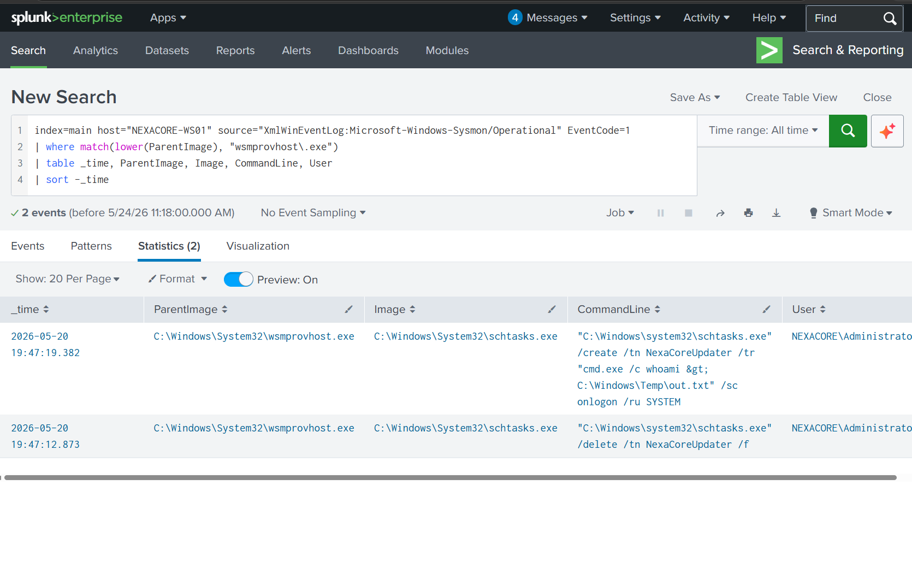
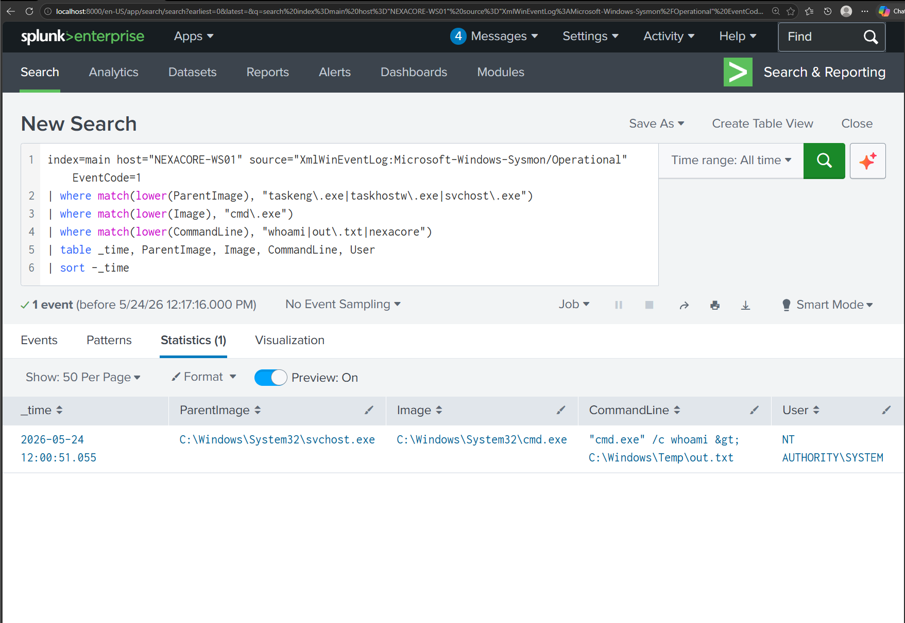

# Hunt-01: LOLBin Abuse via Scheduled Task Persistence

## Hunt Metadata

| Field | Detail |
|---|---|
| Hunt ID | HUNT-01 |
| Hunt Name | LOLBin Abuse via Scheduled Task Persistence |
| Analyst | [Your Name] |
| Date | 2026-05-24 |
| Status | Complete |
| Outcome | Confirmed Malicious Activity + Detection Gap Identified |

---

## Hypothesis

If an attacker operated on NEXACORE-WS01 via a remote session, they likely used legitimate Windows binaries (LOLBins) to perform actions such as creating persistence. A LOLBin is suspicious not because of what it is, but because of what spawned it. This hunt targeted unusual parent-child process relationships involving known LOLBins.

---

## Environment

| Component | Detail |
|---|---|
| Target Host | NEXACORE-WS01 |
| Domain | nexacore.local |
| SIEM | Splunk Enterprise |
| Log Sources | Sysmon EventCode 1 (Process Create), Sysmon EventCode 11 (File Create) |
| Sysmon Version | v15.20 |

---

## MITRE ATT&CK Mapping

| Tactic | Technique | ID |
|---|---|---|
| Execution | Command and Scripting Interpreter | T1059 |
| Persistence | Scheduled Task/Job | T1053.005 |
| Privilege Escalation | Scheduled Task running as SYSTEM | T1053.005 |
| Defence Evasion | Living Off the Land Binaries | T1218 |

---

## Hunt Methodology

1. Form hypothesis — attacker used LOLBins via remote session
2. Define data — Sysmon EventCode 1 parent-child relationships
3. Hunt — run queries against collected logs
4. Investigate — classify each finding as malicious, suspicious, or benign
5. Document — record findings and evidence
6. Convert — identify detection gaps and improvement actions

---

## Detection Sources

| Source | Event Code | Purpose |
|---|---|---|
| XmlWinEventLog:Microsoft-Windows-Sysmon/Operational | 1 | Process creation — parent-child relationships |
| XmlWinEventLog:Microsoft-Windows-Sysmon/Operational | 11 | File creation — payload drops |

---

## Hunt Queries

### Query A — Suspicious Parent Spawning LOLBin (EventCode 1)

**Objective:** Identify remote session processes spawning shells or LOLBins on NEXACORE-WS01.

**Why it matters:** Legitimate administrators spawn shells from explorer.exe. When wsmprovhost.exe (WinRM host) spawns a LOLBin, it indicates an attacker operating through a remote session.

```
index=main host="NEXACORE-WS01" source="XmlWinEventLog:Microsoft-Windows-Sysmon/Operational" EventCode=1
| where match(lower(ParentImage), "wsmprovhost\.exe|winword\.exe")
| where match(lower(Image), "powershell\.exe|cmd\.exe|schtasks\.exe")
| table _time, ParentImage, Image, CommandLine, User
| sort -_time
```

**Result:** 2 events returned. wsmprovhost.exe spawned schtasks.exe on 2026-05-20.



---

### Query B — Task Scheduler Executing Payload (EventCode 1)

**Objective:** Confirm whether the scheduled task executed after creation.

**Why it matters:** Task creation and task execution are separate events. A task can be created and sit dormant for days. Execution confirmation requires a separate query targeting Task Scheduler as the parent.

```
index=main host="NEXACORE-WS01" source="XmlWinEventLog:Microsoft-Windows-Sysmon/Operational" EventCode=1
| where match(lower(ParentImage), "taskeng\.exe|taskhostw\.exe|svchost\.exe")
| where match(lower(Image), "cmd\.exe|powershell\.exe|wscript\.exe|cscript\.exe")
| table _time, ParentImage, Image, CommandLine, User
| sort -_time
```

**Result:** 1 event returned. svchost.exe spawned cmd.exe on 2026-05-24 running as NT AUTHORITY\SYSTEM.



---

### Query C — File Creation in Suspicious Paths (EventCode 11)

**Objective:** Identify files dropped to attacker-favoured locations.

**Why it matters:** Attackers commonly drop payloads or write output to world-writable paths. EventCode 11 captures file creation by process.

```
index=main host="NEXACORE-WS01" source="XmlWinEventLog:Microsoft-Windows-Sysmon/Operational" EventCode=11
| where like(lower(TargetFilename), "%\\temp\\%") OR like(lower(TargetFilename), "%\\public\\%") OR like(lower(TargetFilename), "%\\programdata\\%")
| table _time, Image, TargetFilename
| sort -_time
```

**Result:** 45 events returned. out.txt was not present. Detection gap confirmed — Sysmon does not capture .txt file creation by default.

---

## Attack Timeline

| Time | Event | Source |
|---|---|---|
| 2026-05-20 19:47:12 | wsmprovhost.exe spawned schtasks.exe — deleted existing task | Sysmon EventCode 1 |
| 2026-05-20 19:47:19 | wsmprovhost.exe spawned schtasks.exe — created NexaCoreUpdater task as SYSTEM onlogon | Sysmon EventCode 1 |
| 2026-05-24 12:00:51 | svchost.exe spawned cmd.exe — task executed whoami as SYSTEM | Sysmon EventCode 1 |
| 2026-05-24 12:00:51 | out.txt written to C:\Windows\Temp\ — confirmed via PowerShell | Get-Content (not Sysmon) |

---

## Key Indicators of Compromise

| Indicator | Type | Description |
|---|---|---|
| wsmprovhost.exe → schtasks.exe | Process relationship | Remote session spawning task scheduler |
| NexaCoreUpdater | Scheduled task name | Masquerading as legitimate update task |
| /sc onlogon /ru SYSTEM | Task configuration | Persistence with highest privilege |
| C:\Windows\Temp\out.txt | File | Attacker recon output written to disk |
| NT AUTHORITY\SYSTEM | Account | Task executing with full system privilege |

---

## Findings

### Finding 1 — LOLBin Abuse Confirmed (Critical)

wsmprovhost.exe spawned schtasks.exe during an Evil-WinRM remote session on 2026-05-20. The attacker used a legitimate Windows binary to create persistence — a classic LOLBin technique that bypasses signature-based detection.

### Finding 2 — Persistence Survived 4 Days Undetected (Critical)

The scheduled task NexaCoreUpdater persisted on NEXACORE-WS01 from 2026-05-20 to 2026-05-24 without triggering any alert. On 2026-05-24, the task executed as NT AUTHORITY\SYSTEM upon user logon, confirming successful persistence and privilege.

### Finding 3 — Detection Gap Identified (Medium)

EventCode 1 showed cmd.exe running whoami and redirecting output to C:\Windows\Temp\out.txt. EventCode 11 returned no results for this file. Sysmon does not capture .txt file creation by default because the FileCreate rule uses onmatch: include and .txt is not in the include list. File existence was confirmed only by directly reading the file via PowerShell on the endpoint.

---

## Analyst Notes

- Task creation and task execution must always be investigated separately
- wsmprovhost.exe as a parent process is always worth investigating — it only exists during active WinRM sessions
- onmatch: include in Sysmon means only matching events are logged — gaps exist for file types not in the include list
- This hunt found active attacker persistence that had been sitting on the machine for 4 days with no alert

---

## Recommendations

| Priority | Action |
|---|---|
| High | Create a detection rule for wsmprovhost.exe spawning any LOLBin |
| High | Create a detection rule for Task Scheduler spawning cmd.exe or powershell.exe |
| Medium | Review Sysmon FileCreate include rules — consider adding monitoring for files written to C:\Windows\Temp\ by non-system processes |
| Low | Implement scheduled task auditing via Windows Security Event ID 4698 |

---

## References

- MITRE ATT&CK T1053.005 — Scheduled Task/Job
- MITRE ATT&CK T1218 — System Binary Proxy Execution
- Sysmon v15.20 — Sysinternals
- Hunt conducted on NexaCore SOC Homelab
