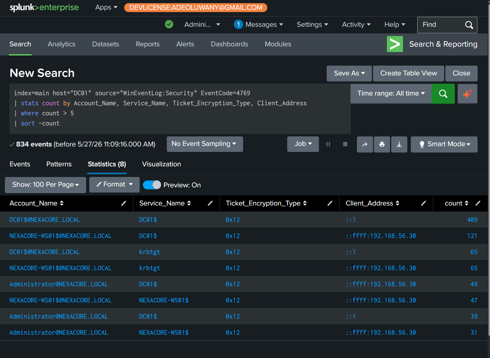
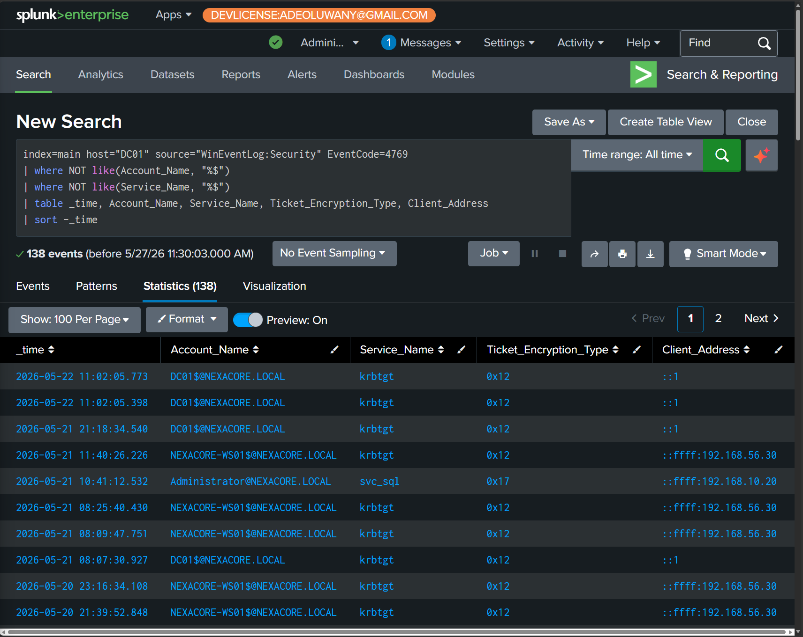

# Hunt-02: Kerberoasting Artefact Hunt

## Hunt Metadata

| Field | Detail |
|---|---|
| Hunt ID | HUNT-02 |
| Hunt Name | Kerberoasting Artefact Hunt |
| Analyst | Adedeji Adetayo |
| Date | 2026-05-27 |
| Status | Complete |
| Outcome | Confirmed Malicious Activity — RC4 Kerberoasting Detected |

---

## Hypothesis

If an attacker performed Kerberoasting on the NexaCore domain, Windows Security Event ID 4769 on DC01 will show Kerberos service ticket requests using RC4 encryption (type 0x17) targeting user or service accounts that do not end with $. Normal domain activity uses AES encryption (0x12). Any RC4 request for a non-machine account is suspicious and warrants investigation.

---

## Environment

| Component | Detail |
|---|---|
| Target Host | NexaCore-DC01 |
| Domain | nexacore.local |
| SIEM | Splunk Enterprise |
| Log Source | Windows Security Event Log — Event ID 4769 |
| Splunk Host | DC01 |

---

## MITRE ATT&CK Mapping

| Tactic | Technique | ID |
|---|---|---|
| Credential Access | Steal or Forge Kerberos Tickets: Kerberoasting | T1558.003 |

---

## Hunt Methodology

1. Form hypothesis — attacker requested RC4 encrypted service tickets for offline cracking
2. Define data — Windows Security Event ID 4769 on DC01
3. Hunt — three queries covering RC4 detection, bulk enumeration, and baseline analysis
4. Investigate — classify each finding as malicious, suspicious, or benign
5. Document — record findings and evidence
6. Convert — build correlation rule CR-03 from hunt findings

---

## Detection Sources

| Source | Event ID | Purpose |
|---|---|---|
| WinEventLog:Security | 4769 | Kerberos service ticket requests — captures account, service, encryption type, source IP |

---

## Hunt Queries

### Query 1 — RC4 Encrypted Service Ticket Request

**Objective:** Identify Kerberos service ticket requests using RC4 encryption targeting non-machine accounts.

**Why it matters:** Modern Active Directory defaults to AES encryption. RC4 requests are either from legacy systems or from attackers explicitly requesting weaker encryption to speed up offline password cracking. A single RC4 request against a service account is high confidence Kerberoasting.

```
index=main host="DC01" source="WinEventLog:Security" EventCode=4769 Ticket_Encryption_Type="0x17"
| where NOT like(Account_Name, "%$")
| table _time, Account_Name, Service_Name, Ticket_Encryption_Type, Client_Address
| sort -_time
```

**Result:** 1 event returned. Administrator@NEXACORE.LOCAL requested an RC4 encrypted ticket for svc_sql from 192.168.10.20 (Kali Linux).


---

### Query 2 — Bulk TGS Enumeration Detection

**Objective:** Identify accounts requesting service tickets at high volume which indicates an attacker enumerating multiple service accounts.

**Why it matters:** Automated Kerberoasting tools request tickets for every service account with an SPN registered. High volume requests from a single source in a short time window is a strong indicator of mass enumeration.

```
index=main host="DC01" source="WinEventLog:Security" EventCode=4769
| stats count by Account_Name, Service_Name, Ticket_Encryption_Type, Client_Address
| where count > 5
| sort -count
```

**Result:** 8 groups returned. All used AES encryption (0x12). All were machine accounts performing legitimate domain authentication. No suspicious bulk enumeration detected. This establishes the normal baseline for the environment.



---

### Query 3 — Non-Machine Account Service Ticket Baseline

**Objective:** View all service ticket requests where both the requesting account and the target service are non-machine accounts. Provides a clean hunting view to spot anomalies manually.

**Why it matters:** Removing machine-to-machine Kerberos traffic exposes human and service account interactions. Attackers target service accounts because they often have weak passwords and are less monitored than user accounts.

```
index=main host="DC01" source="WinEventLog:Security" EventCode=4769
| where NOT like(Account_Name, "%$")
| where NOT like(Service_Name, "%$")
| table _time, Account_Name, Service_Name, Ticket_Encryption_Type, Client_Address
| sort -_time
```

**Result:** 138 events returned. One row stood out — Administrator@NEXACORE.LOCAL requesting svc_sql with encryption type 0x17 from 192.168.10.20. Every other row showed 0x12 encryption. The attacker row was immediately visible against the legitimate baseline.



---

## Attack Timeline

| Time | Event | Source |
|---|---|---|
| 2026-05-21 10:41:12 | Administrator@NEXACORE.LOCAL requested RC4 service ticket for svc_sql from Kali Linux | Event ID 4769 |
| 2026-05-21 10:41:12 | Ticket hash extracted offline for cracking | Out of band — SIM-05 evidence |
| 2026-05-21 10:51:29 | Password123! recovered for svc_sql in 9 seconds using hashcat | Out of band — SIM-05 evidence |

---

## Key Indicators of Compromise

| Indicator | Type | Description |
|---|---|---|
| Ticket_Encryption_Type = 0x17 | Encryption anomaly | RC4 requested instead of default AES |
| svc_sql | Target account | Service account with SPN targeted for offline cracking |
| 192.168.10.20 | Source IP | Kali Linux attacker machine |
| Administrator@NEXACORE.LOCAL | Requesting account | Domain admin account used to request ticket |

---

## Findings

### Finding 1 — Kerberoasting Confirmed (Critical)

A single Event ID 4769 captured Administrator@NEXACORE.LOCAL requesting an RC4 encrypted Kerberos service ticket for svc_sql from 192.168.10.20 at 10:41:12 on 2026-05-21. The RC4 encryption type, service account target, and Linux source address together confirm this was a Kerberoasting attack. The cracked password Password123! was recovered in 9 seconds demonstrating the risk of weak service account passwords.

### Finding 2 — Baseline Established (Informational)

Query 2 and Query 3 established that normal domain Kerberos activity uses AES encryption exclusively. All legitimate requests came from known Windows hosts. This baseline makes future RC4 anomalies immediately detectable by contrast.

---

## Analyst Notes

- Kerberoasting leaves minimal evidence — only one Event ID 4769 entry per targeted account
- The DC issues the ticket legitimately — it cannot distinguish a Kerberoasting request from a real service access
- Detection relies entirely on the encryption type anomaly and source IP analysis
- AES Kerberoasting (requesting 0x12 tickets for offline cracking) is an emerging evasion technique that bypasses 0x17 detection — monitor for unusual service account access patterns regardless of encryption type
- A 9 second crack time on Password123! demonstrates why service account password policy is critical

---

## Recommendations

| Priority | Action |
|---|---|
| Critical | Enforce minimum 25 character passwords on all service accounts |
| High | Migrate service accounts to Group Managed Service Accounts (gMSA) for automatic password rotation |
| High | Create correlation rule CR-03 to alert on Event ID 4769 with Ticket_Encryption_Type 0x17 |
| Medium | Remove SPNs from accounts that do not require them |
| Medium | Alert on accounts requesting more than 5 service tickets within a 1 minute window |
| Low | Consider disabling RC4 encryption entirely on domain controllers |

---

## References

- MITRE ATT&CK T1558.003 — Kerberoasting
- SIM-05 — Kerberoasting Attack Simulation
- DET-05 — Kerberoasting Detection
- IR-005 — Kerberoasting Incident Report
- Hunt conducted on NexaCore SOC Homelab
