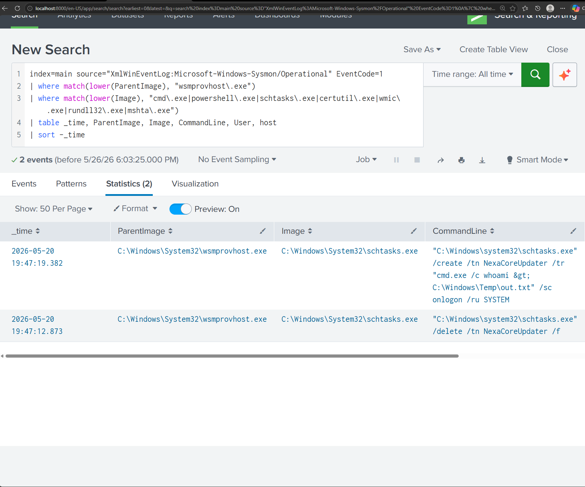

# CR-01: WinRM Session Spawning LOLBin

## Rule Metadata

| Rule ID | CR-01 |
| Rule Name | WinRM Session Spawning LOLBin |
| Created | 2026-05-26 |
| Status | Active |
| Severity | High |
| Source Hunt | HUNT-01 — LOLBin Abuse via Scheduled Task Persistence |

---

## Objective

Detect any instance of wsmprovhost.exe spawning a known Living Off the Land Binary (LOLBin). wsmprovhost.exe is the WinRM provider host process — it only exists during active remote PowerShell sessions. Any shell or LOLBin spawned by this process indicates an attacker executing commands through a remote session.

---

## MITRE ATT&CK Mapping

| Tactic | Technique | ID |
|---|---|---|
| Execution | Command and Scripting Interpreter | T1059 |
| Lateral Movement | Remote Services: Windows Remote Management | T1021.006 |
| Defence Evasion | System Binary Proxy Execution | T1218 |

---

## Detection Logic

```
index=main source="XmlWinEventLog:Microsoft-Windows-Sysmon/Operational" EventCode=1
| where match(lower(ParentImage), "wsmprovhost\.exe")
| where match(lower(Image), "cmd\.exe|powershell\.exe|schtasks\.exe|certutil\.exe|wmic\.exe|rundll32\.exe|mshta\.exe")
| table _time, ParentImage, Image, CommandLine, User, host
| sort -_time
```

---

## Why This Rule Exists

This rule was derived from HUNT-01 findings. During the hunt, wsmprovhost.exe was observed spawning schtasks.exe to create a scheduled persistence task running as NT AUTHORITY\SYSTEM. No alert existed for this behaviour at the time of the hunt. The task survived on the endpoint for four days undetected before being discovered through proactive hunting.

---

## Detection Source

| Source | Event Code | Field Used |
|---|---|---|
| XmlWinEventLog:Microsoft-Windows-Sysmon/Operational | 1 | ParentImage, Image, CommandLine |

---

## Alert Configuration

| Field | Value |
|---|---|
| Schedule | Every 1 hour |
| Time Window | Last 1 hour |
| Trigger Condition | Results greater than 0 |
| Severity | High |

> Note: Scheduled alerting requires Splunk Enterprise or Developer license. Rule logic validated on Splunk Free. Alert configuration pending developer license installation.

---

## Evidence — Rule Validation

The rule was validated against real attacker activity generated during SIM-04. wsmprovhost.exe spawned schtasks.exe with a persistence command running as SYSTEM.



---

## True Positive Indicators

| Indicator | Significance |
|---|---|
| wsmprovhost.exe as ParentImage | Active WinRM remote session |
| schtasks.exe as Image | Persistence mechanism being created |
| /ru SYSTEM in CommandLine | Task configured for highest privilege |
| NT AUTHORITY\SYSTEM as User | Full system access |

---

## False Positive Considerations

Low false positive rate. wsmprovhost.exe spawning LOLBins has no legitimate administrative justification. Legitimate remote administration via WinRM would spawn approved management tools, not shells or LOLBins.

---

## Analyst Response

When this rule fires:

1. Identify the CommandLine — what was the attacker trying to do?
2. Identify the User — which account was the remote session running under?
3. Check for scheduled tasks created around the same time — Event ID 4698
4. Check for lateral movement from the same source IP
5. Isolate the endpoint if confirmed malicious

---

## References

- HUNT-01 LOLBin Abuse Hunt Documentation
- MITRE ATT&CK T1021.006 — Windows Remote Management
- MITRE ATT&CK T1218 — System Binary Proxy Execution
