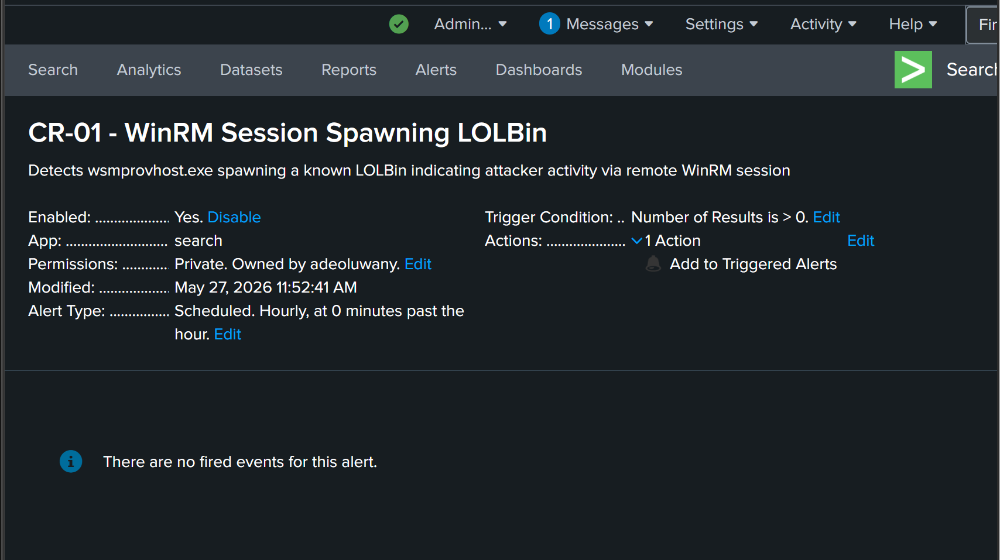

# CR-01: WinRM Session Spawning LOLBin

## Rule Metadata

| Field | Detail |
|---|---|
| Rule ID | CR-01 |
| Rule Name | WinRM Session Spawning LOLBin |
| Analyst | Adedeji Adetayo |
| Created | 2026-05-26 |
| Status | Active |
| Severity | High |
| Source Hunt | HUNT-01 — LOLBin Abuse via Scheduled Task Persistence |

---

## Objective

Detect any instance of wsmprovhost.exe spawning a known Living Off the Land Binary (LOLBin). wsmprovhost.exe is the WinRM provider host process — it only exists during active remote PowerShell sessions. Any shell or LOLBin spawned by this process indicates an attacker executing commands through a remote session.

---

## MITRE ATT&CK Mapping

| Tactic | Technique | ID |
|---|---|---|
| Execution | Command and Scripting Interpreter | T1059 |
| Lateral Movement | Remote Services: Windows Remote Management | T1021.006 |
| Defence Evasion | System Binary Proxy Execution | T1218 |

---

## Why This Rule Exists

This rule was derived from HUNT-01 findings. During a proactive threat hunt on NEXACORE-WS01, wsmprovhost.exe was observed spawning schtasks.exe to create a scheduled persistence task running as NT AUTHORITY\SYSTEM. No alert existed for this behaviour at the time of the hunt. The malicious scheduled task survived on the endpoint for four days undetected before being discovered. This rule ensures the same behaviour is automatically detected going forward.

---

## Detection Logic

```
index=main source="XmlWinEventLog:Microsoft-Windows-Sysmon/Operational" EventCode=1
| where match(lower(ParentImage), "wsmprovhost\.exe")
| where match(lower(Image), "cmd\.exe|powershell\.exe|schtasks\.exe|certutil\.exe|wmic\.exe|rundll32\.exe|mshta\.exe")
| table _time, ParentImage, Image, CommandLine, User, host
| sort -_time
```

---

## Detection Source

| Source | Event Code | Fields Used |
|---|---|---|
| XmlWinEventLog:Microsoft-Windows-Sysmon/Operational | 1 | ParentImage, Image, CommandLine, User, host |

---

## Alert Configuration

This rule is configured as a scheduled alert in Splunk Enterprise running on the NexaCore SOC Homelab.

| Field | Value |
|---|---|
| Schedule | Every 1 hour |
| Time Window | Last 1 hour |
| Trigger Condition | Number of results greater than 0 |
| Trigger | Once per scheduled run |
| Action | Add to Triggered Alerts |
| Severity | High |



---

## Rule Validation

The rule was validated against real attacker activity generated during SIM-04. wsmprovhost.exe spawned schtasks.exe with a full persistence command creating a scheduled task running as NT AUTHORITY\SYSTEM. The rule returned the correct event confirming detection logic is working as expected.


---

## True Positive Indicators

| Indicator | Significance |
|---|---|
| wsmprovhost.exe as ParentImage | Active WinRM remote session in progress |
| schtasks.exe as Image | Persistence mechanism being created remotely |
| /ru SYSTEM in CommandLine | Task configured for highest privilege |
| NT AUTHORITY\SYSTEM as User | Full system access obtained |

---

## False Positive Considerations

Low false positive rate. wsmprovhost.exe spawning LOLBins has no legitimate administrative justification. Legitimate remote administration via WinRM spawns approved management tools not interactive shells or task schedulers. Any match on this rule should be treated as high priority until proven otherwise.

---

## Analyst Response

When this rule fires:

1. Read the CommandLine — identify exactly what command the attacker ran
2. Identify the User — which account was the remote session operating under
3. Check the host field — which endpoint was targeted
4. Search for scheduled tasks created at the same timestamp — Sysmon EventCode 1 with schtasks.exe and /create in CommandLine
5. Search for the original Evil-WinRM connection — look for network logon Event ID 4624 Logon Type 3 around the same time
6. Determine if the task still exists on the endpoint — check Windows Task Scheduler
7. Isolate the endpoint if confirmed malicious

---

## References

- HUNT-01 — LOLBin Abuse via Scheduled Task Persistence
- MITRE ATT&CK T1021.006 — Windows Remote Management
- MITRE ATT&CK T1218 — System Binary Proxy Execution
- MITRE ATT&CK T1059 — Command and Scripting Interpreter
