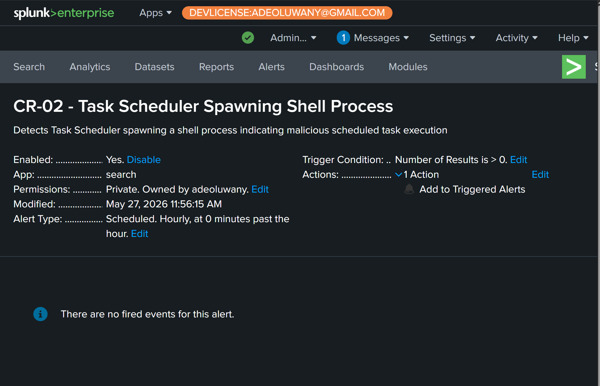

# CR-02: Task Scheduler Spawning Shell Process

## Rule Metadata

| Field | Detail |
|---|---|
| Rule ID | CR-02 |
| Rule Name | Task Scheduler Spawning Shell Process |
| Analyst | Adedeji Adetayo |
| Created | 2026-05-26 |
| Status | Active |
| Severity | High |
| Source Hunt | HUNT-01 — LOLBin Abuse via Scheduled Task Persistence |

---

## Objective

Detect any instance of Windows Task Scheduler spawning a shell process. Legitimate scheduled tasks rarely spawn interactive shells directly. When Task Scheduler spawns cmd.exe or powershell.exe, it indicates either a malicious scheduled task executing a payload or an attacker-created persistence mechanism firing on the endpoint.

---

## MITRE ATT&CK Mapping

| Tactic | Technique | ID |
|---|---|---|
| Persistence | Scheduled Task/Job: Scheduled Task | T1053.005 |
| Execution | Command and Scripting Interpreter | T1059 |
| Privilege Escalation | Scheduled Task running as SYSTEM | T1053.005 |

---

## Why This Rule Exists

This rule was derived from HUNT-01 findings. During a proactive threat hunt on NEXACORE-WS01, a scheduled task named NexaCoreUpdater was discovered executing cmd.exe as NT AUTHORITY\SYSTEM four days after it was created by an attacker via Evil-WinRM. The task ran whoami and wrote output to C:\Windows\Temp\out.txt with no alert firing during creation or execution. This rule ensures Task Scheduler spawning shells is automatically detected going forward.

---

## Detection Logic

```
index=main source="XmlWinEventLog:Microsoft-Windows-Sysmon/Operational" EventCode=1
| where match(lower(ParentImage), "taskeng\.exe|taskhostw\.exe|svchost\.exe")
| where like(lower(Image), "%\\cmd.exe") OR like(lower(Image), "%\\powershell.exe") OR like(lower(Image), "%\\wscript.exe") OR like(lower(Image), "%\\cscript.exe")
| table _time, ParentImage, Image, CommandLine, User, host
| sort -_time
```

---

## Detection Source

| Source | Event Code | Fields Used |
|---|---|---|
| XmlWinEventLog:Microsoft-Windows-Sysmon/Operational | 1 | ParentImage, Image, CommandLine, User, host |

---

## Alert Tuning

During rule development an initial version using match() with cmd\.exe generated 37 false positives. The cause was substring matching — dsregcmd.exe, a legitimate Windows device registration tool that runs as a scheduled task under SYSTEM, matched the cmd\.exe pattern because the string cmd.exe appears at the end of dsregcmd.exe.

The rule was corrected to use like() with a path separator prefix — `%\\cmd.exe` — which requires a backslash immediately before the filename. This ensures only exact binary matches are returned. The correction reduced results from 37 false positives to 2 confirmed true positives.

This tuning exercise demonstrates the importance of precise pattern matching in production detection rules.

---

## Alert Configuration

This rule is configured as a scheduled alert in Splunk Enterprise running on the NexaCore SOC Homelab.

| Field | Value |
|---|---|
| Schedule | Every 1 hour |
| Time Window | Last 1 hour |
| Trigger Condition | Number of results greater than 0 |
| Trigger | Once per scheduled run |
| Action | Add to Triggered Alerts |
| Severity | High |



---

## Rule Validation

The rule was validated against real attacker activity from SIM-04. svchost.exe spawned cmd.exe running whoami as NT AUTHORITY\SYSTEM — the attacker-created persistence task executing on user logon four days after it was planted. The rule returned 2 confirmed true positive events with zero false positives after tuning.


---

## True Positive Indicators

| Indicator | Significance |
|---|---|
| svchost.exe or taskhostw.exe as ParentImage | Task Scheduler service launching a process |
| cmd.exe or powershell.exe as Image | Interactive shell spawned by scheduled task |
| NT AUTHORITY\SYSTEM as User | Task configured with highest privilege |
| Unrecognised CommandLine content | Attacker payload executing |

---

## False Positive Considerations

Medium false positive rate on svchost.exe due to its broad usage across Windows services. Analysts should verify the CommandLine content before escalating. Legitimate scheduled tasks that spawn shells will have documented administrative purposes and recognisable command lines. Any undocumented shell execution from Task Scheduler warrants full investigation.

Known excluded false positive: dsregcmd.exe — Windows device registration tool excluded via path-specific matching during rule tuning.

---

## Analyst Response

When this rule fires:

1. Read the CommandLine — identify exactly what the task was instructed to run
2. Check the User — SYSTEM privilege significantly increases severity
3. Check the host field — identify which endpoint triggered the alert
4. Search for the task creation event — Sysmon EventCode 1 with schtasks.exe and /create in CommandLine at an earlier timestamp on the same host
5. Check the time gap between task creation and execution — gaps of hours or days indicate dormant attacker persistence
6. Search for the remote session that created the task — look for wsmprovhost.exe activity around the task creation timestamp
7. Determine if the task still exists — check Windows Task Scheduler on the endpoint
8. Isolate the endpoint if confirmed malicious

---

## References

- HUNT-01 — LOLBin Abuse via Scheduled Task Persistence
- CR-01 — WinRM Session Spawning LOLBin
- MITRE ATT&CK T1053.005 — Scheduled Task
- MITRE ATT&CK T1059 — Command and Scripting Interpreter
