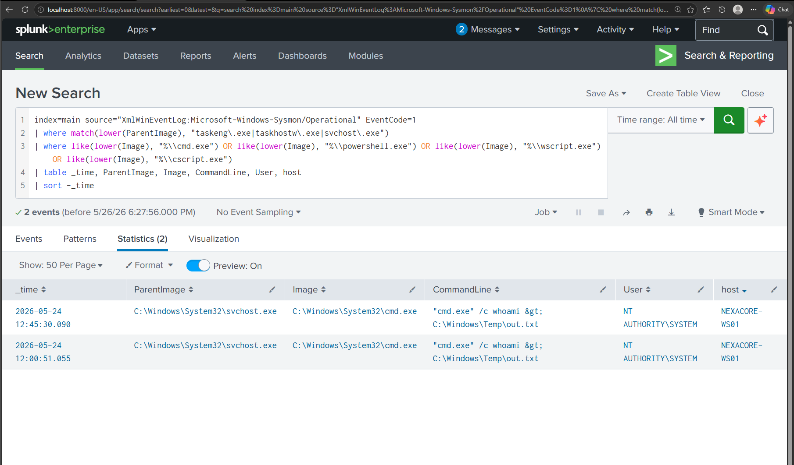

# CR-02: Task Scheduler Spawning Shell Process

## Rule Metadata

| Field | Detail |
|---|---|
| Rule ID | CR-02 |
| Rule Name | Task Scheduler Spawning Shell Process |
| Analyst | Adedeji Adetayo |
| Created | 2026-05-26 |
| Status | Active |
| Severity | High |
| Source Hunt | HUNT-01 — LOLBin Abuse via Scheduled Task Persistence |

---

## Objective

Detect any instance of Windows Task Scheduler spawning a shell process. Legitimate scheduled tasks rarely spawn interactive shells directly. When Task Scheduler spawns cmd.exe or powershell.exe, it indicates either a malicious scheduled task executing a payload or an attacker-created persistence mechanism firing.

---

## MITRE ATT&CK Mapping

| Tactic | Technique | ID |
|---|---|---|
| Persistence | Scheduled Task/Job: Scheduled Task | T1053.005 |
| Execution | Command and Scripting Interpreter | T1059 |
| Privilege Escalation | Scheduled Task running as SYSTEM | T1053.005 |

---

## Detection Logic

```
index=main source="XmlWinEventLog:Microsoft-Windows-Sysmon/Operational" EventCode=1
| where match(lower(ParentImage), "taskeng\.exe|taskhostw\.exe|svchost\.exe")
| where like(lower(Image), "%\\cmd.exe") OR like(lower(Image), "%\\powershell.exe") OR like(lower(Image), "%\\wscript.exe") OR like(lower(Image), "%\\cscript.exe")
| table _time, ParentImage, Image, CommandLine, User, host
| sort -_time
```

---

## Why This Rule Exists

Derived from HUNT-01 findings. During the hunt, a scheduled task named NexaCoreUpdater was discovered executing cmd.exe as NT AUTHORITY\SYSTEM four days after it was created by an attacker via Evil-WinRM. The task ran whoami and wrote output to C:\Windows\Temp\out.txt. No alert existed for this behaviour. This rule ensures Task Scheduler spawning shells is detected automatically going forward.

---

## Alert Tuning Note

An initial version of this rule using match() with cmd\.exe generated 37 false positives due to substring matching against dsregcmd.exe — a legitimate Windows device registration tool that runs as a scheduled task under SYSTEM. The rule was corrected to use like() with a path separator prefix to ensure exact filename matching. This reduced results from 37 to 2 confirmed true positives.

---

## Detection Source

| Source | Event Code | Field Used |
|---|---|---|
| XmlWinEventLog:Microsoft-Windows-Sysmon/Operational | 1 | ParentImage, Image, CommandLine |

---

## Alert Configuration

| Field | Value |
|---|---|
| Schedule | Every 1 hour |
| Time Window | Last 1 hour |
| Trigger Condition | Results greater than 0 |
| Severity | High |

> Note: Scheduled alerting requires Splunk Enterprise or Developer license. Rule logic validated on Splunk Free. Alert configuration pending developer license installation.

---

## Evidence — Rule Validation

The rule was validated against real attacker activity from SIM-04. svchost.exe spawned cmd.exe running whoami as NT AUTHORITY\SYSTEM — the persistence task executing on user logon.



---

## True Positive Indicators

| Indicator | Significance |
|---|---|
| svchost.exe or taskhostw.exe as ParentImage | Task Scheduler service launching a process |
| cmd.exe or powershell.exe as Image | Shell spawned by scheduled task |
| NT AUTHORITY\SYSTEM as User | Task configured with highest privilege |
| Suspicious CommandLine content | Attacker payload executing |

---

## False Positive Considerations

Medium false positive rate on svchost.exe due to its broad usage across Windows services. Analysts should verify the CommandLine content. Legitimate scheduled tasks spawning shells will have documented administrative purposes. Any undocumented shell execution from Task Scheduler warrants investigation.

dsregcmd.exe was identified as a known false positive source during rule development and excluded via path-specific matching.

---

## Analyst Response

When this rule fires:

1. Read the CommandLine — identify what the task was instructed to run
2. Check the User — SYSTEM privilege increases severity
3. Search for the task creation event — Sysmon EventCode 1 with schtasks.exe and /create
4. Check when the task was created versus when it executed — long gaps indicate dormant persistence
5. Search for the original remote session that created the task — look for wsmprovhost.exe activity
6. Isolate the endpoint if confirmed malicious

---

## References

- HUNT-01 LOLBin Abuse Hunt Documentation
- CR-01 WinRM Session Spawning LOLBin
- MITRE ATT&CK T1053.005 — Scheduled Task
- MITRE ATT&CK T1059 — Command and Scripting Interpreter
