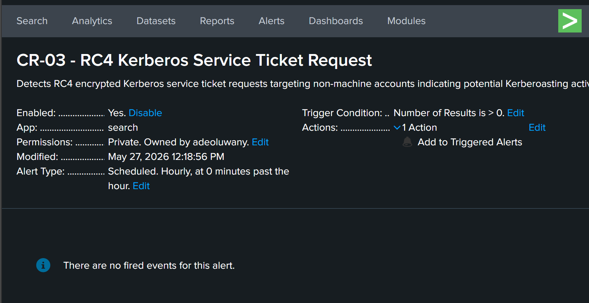
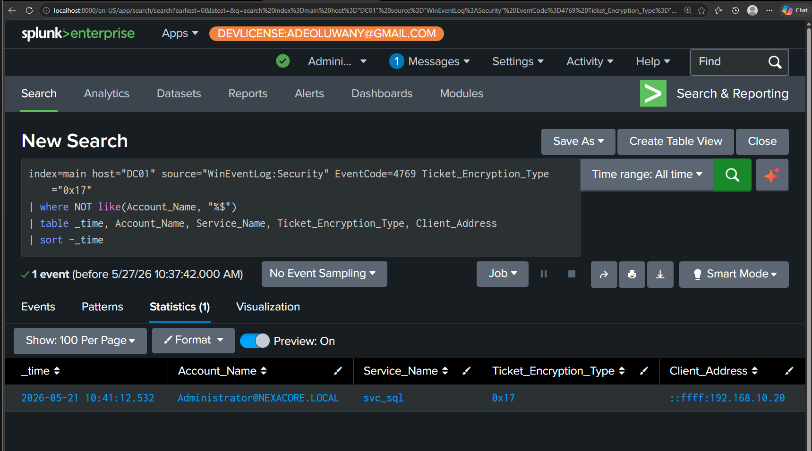

# CR-03: RC4 Kerberos Service Ticket Request

## Rule Metadata

| Field | Detail |
|---|---|
| Rule ID | CR-03 |
| Rule Name | RC4 Kerberos Service Ticket Request |
| Analyst | Adedeji Adetayo |
| Created | 2026-05-27 |
| Status | Active |
| Severity | High |
| Source Hunt | HUNT-02 — Kerberoasting Artefact Hunt |

---

## Objective

Detect Kerberos service ticket requests using RC4 encryption targeting non-machine accounts. Modern Active Directory environments default to AES encryption for service tickets. An RC4 encrypted ticket request targeting a user or service account is a high confidence indicator of Kerberoasting — an offline credential theft technique where the attacker requests an encrypted ticket and cracks it offline to recover the service account password.

---

## MITRE ATT&CK Mapping

| Tactic | Technique | ID |
|---|---|---|
| Credential Access | Steal or Forge Kerberos Tickets: Kerberoasting | T1558.003 |

---

## Why This Rule Exists

This rule was derived from HUNT-02 findings. During a proactive threat hunt on DC01, a single Event ID 4769 was found showing Administrator@NEXACORE.LOCAL requesting an RC4 encrypted service ticket for svc_sql from 192.168.10.20 — the Kali Linux attacker machine. The cracked password Password123! was recovered in 9 seconds using hashcat. No alert existed for this behaviour at the time of the simulation. This rule ensures RC4 Kerberoasting requests are automatically detected going forward.

---

## Detection Logic

```
index=main host="DC01" source="WinEventLog:Security" EventCode=4769 Ticket_Encryption_Type="0x17"
| where NOT like(Account_Name, "%$")
| table _time, Account_Name, Service_Name, Ticket_Encryption_Type, Client_Address
| sort -_time
```

---

## Detection Source

| Source | Event Code | Fields Used |
|---|---|---|
| WinEventLog:Security | 4769 | Account_Name, Service_Name, Ticket_Encryption_Type, Client_Address |

---

## Alert Configuration

This rule is configured as a scheduled alert in Splunk Enterprise running on the NexaCore SOC Homelab.

| Field | Value |
|---|---|
| Schedule | Every 1 hour |
| Time Window | Last 1 hour |
| Trigger Condition | Number of results greater than 0 |
| Trigger | Once per scheduled run |
| Action | Add to Triggered Alerts |
| Severity | High |



---

## Rule Validation

The rule was validated against real attacker activity from SIM-05. Administrator@NEXACORE.LOCAL requested an RC4 encrypted service ticket for svc_sql from 192.168.10.20 at 10:41:12 on 2026-05-21. The rule returned 1 confirmed true positive confirming detection logic is working correctly.



---

## True Positive Indicators

| Indicator | Significance |
|---|---|
| Ticket_Encryption_Type = 0x17 | RC4 encryption requested instead of default AES |
| Account_Name not ending in $ | Human or service account targeted — not a machine account |
| Service account as Service_Name | High value target for offline cracking |
| Non-Windows Client_Address | Linux or external host requesting Kerberos tickets is unusual |

---

## False Positive Considerations

Low false positive rate. RC4 Kerberos requests in modern Active Directory environments are rare and abnormal. Legitimate causes include legacy systems that do not support AES encryption. Analysts should check whether the requesting host is a known legacy system before escalating. If the source is a Linux machine or an unrecognised IP, treat as high priority.

---

## Known Evasion Technique

AES Kerberoasting is an emerging technique where attackers request AES encrypted tickets (0x12) instead of RC4 to blend in with normal traffic. This rule will not detect AES Kerberoasting. Analysts should monitor for unusual service account access patterns regardless of encryption type, particularly requests from non-standard source addresses.

---

## Analyst Response

When this rule fires:

1. Identify the Account_Name — which account made the request
2. Identify the Service_Name — which service account was targeted
3. Check the Client_Address — where did the request originate
4. Determine if the Client_Address is a known legitimate host
5. Check for additional 4769 events from the same source around the same time — multiple requests indicate bulk enumeration
6. Assume the service account password is compromised — initiate password reset immediately
7. Search for lateral movement using the compromised service account credentials
8. Isolate the source host if confirmed malicious

---

## References

- HUNT-02 — Kerberoasting Artefact Hunt
- SIM-05 — Kerberoasting Attack Simulation
- DET-05 — Kerberoasting Detection
- MITRE ATT&CK T1558.003 — Kerberoasting
