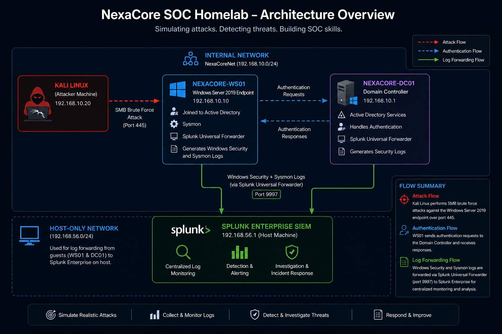

# NexaCore SOC Homelab

[](01-lab-architecture/screenshots/nexacore-architecture-diagram.png)

[](https://www.splunk.com)
[](https://www.microsoft.com/en-us/windows-server)
[](https://www.kali.org)
[](https://www.virtualbox.org)
[](https://attack.mitre.org)
[](https://learn.microsoft.com/en-us/sysinternals/downloads/sysmon)

---

## Lab Overview

The NexaCore SOC Homelab is a fully functional security operations environment built on VirtualBox. It simulates a small enterprise network with a Domain Controller, a target Windows endpoint, and a Kali Linux attacker machine.

Splunk Enterprise serves as the central SIEM, collecting logs from all machines and providing real time visibility into attack activity. The lab follows a complete SOC workflow: build the environment, simulate attacks, detect them in Splunk, investigate the evidence, and document findings in structured incident reports.

---

## Attack, Detection, Incident Report and Dashboard Coverage

| Attack Simulation | Detection | Incident Report | Dashboard | MITRE Technique | Status |
| --- | --- | --- | --- | --- | --- |
| [SMB Brute Force](03-attack-simulations/sim-01-smb-brute-force/README.md) | [DET-01](04-detections/detection-01-brute-force/README.md) | [IR-001](05-incident-reports/IR-001-smb-brute-force/README.md) | [DASH-01](06-dashboards/dashboard-01-brute-force-detection/README.md) | T1110.001 — Password Guessing | Completed |
| [Nmap Reconnaissance](03-attack-simulations/sim-02-nmap-reconnaissance/README.md) | [DET-02](04-detections/detection-02-nmap-reconnaissance/README.md) | [IR-002](05-incident-reports/IR-002-nmap-reconnaissance/README.md) | N/A | T1046 — Network Service Discovery | Completed |
| [PowerShell Execution via Evil-WinRM](03-attack-simulations/sim-03-powershell-execution-evil-winrm/README.md) | [DET-03](04-detections/detection-03-powershell-execution-evil-winrm/README.md) | [IR-003](05-incident-reports/IR-003-powershell-execution-evil-winrm/README.md) | [DASH-02](06-dashboards/dashboard-02-powershell-execution-winrm-abuse/README.md) | T1059.001 — PowerShell | Completed |
| [Persistence via Scheduled Task](03-attack-simulations/sim-04-persistence-scheduled-task/README.md) | [DET-04](04-detections/detection-04-persistence-scheduled-task/README.md) | [IR-004](05-incident-reports/IR-004-persistence-scheduled-task/README.md) | N/A | T1053.005 — Scheduled Task/Job: Scheduled Task | Completed |

---

## Lab Architecture

| Machine | Role | OS | RAM | Adapter 1 | Adapter 2 | Internal IP |
| --- | --- | --- | --- | --- | --- | --- |
| Host Laptop | Splunk SIEM | Windows 10 | 4GB allocated | N/A | N/A | 192.168.56.1 |
| NEXACORE-WS01 | Target Endpoint | Windows Server 2019 | 3GB | Host-Only | Internal Network | 192.168.10.10 |
| NexaCore-DC01 | Domain Controller | Windows Server 2019 | 4GB | Host-Only | Internal Network | 192.168.10.1 |
| Kali Linux | Attacker | Kali Linux 2025.4 | 2GB | NAT | Internal Network | 192.168.10.20 |

---

## Tools and Technologies

- Splunk Enterprise
- Splunk Universal Forwarder
- Sysmon
- Kali Linux
- Windows Server 2019
- VirtualBox

---

## Detection Workflow

Every attack simulation in this lab follows the same structured SOC workflow:

```
Attack Simulation
       |
       | Kali Linux executes attack against target endpoint
       |
       v
Log Generation
       |
       | Sysmon and Windows Security logs capture activity
       |
       v
Log Forwarding
       |
       | Splunk Universal Forwarder ships logs to Splunk (port 9997)
       |
       v
Detection
       |
       | SPL queries identify suspicious patterns in Splunk
       |
       v
Investigation
       |
       | Analyst examines event fields to build attack timeline
       |
       v
Incident Report
       |
       | Findings documented with evidence, MITRE mapping and remediation
```

---

## Lab Documentation

| Section | Description | Link |
| --- | --- | --- |
| Lab Architecture | Network design, VM roles and IP addressing | [View](01-lab-architecture) |
| Infrastructure | Host specs, VM configuration, Sysmon and Splunk setup | [View](02-infrastructure) |
| Attack Simulations | Simulated attacks with full evidence chain | [View](03-attack-simulations) |
| Detections | SPL queries and detection logic | [View](04-detections) |
| Incident Reports | Full IR reports for each simulated attack | [View](05-incident-reports) |
| Dashboards | Splunk dashboards for real time threat monitoring | [View](06-dashboards) |

---

## Status

Project currently under active development with ongoing attack simulations, detection engineering, and incident response scenarios.
