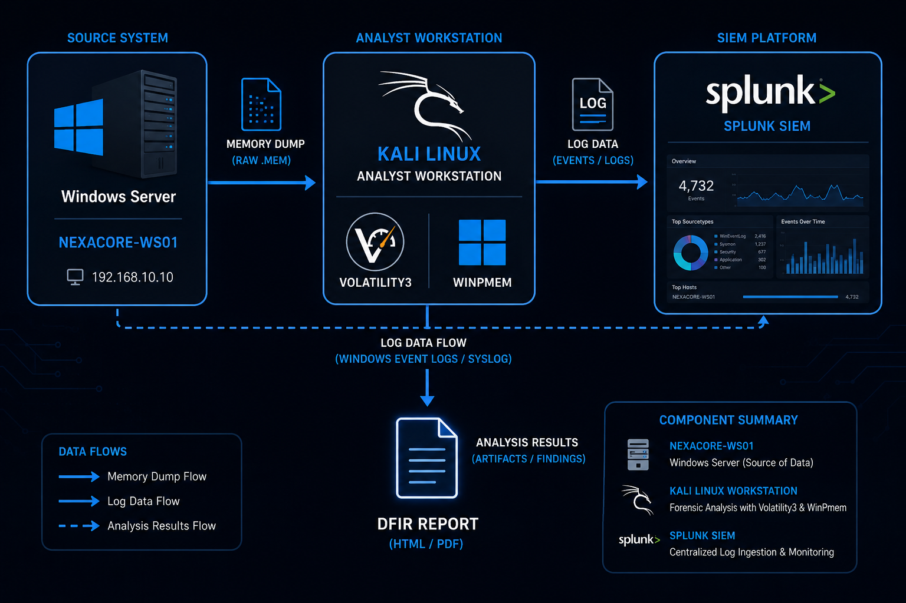
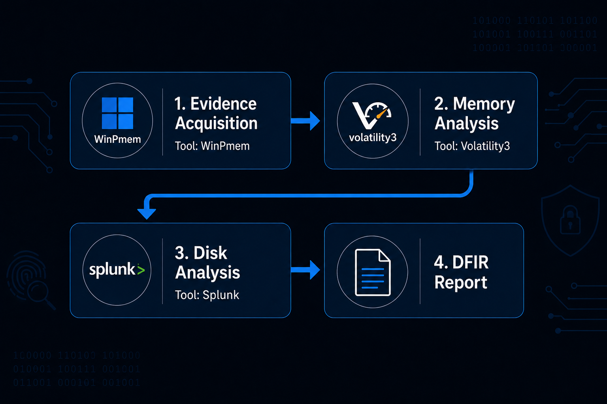

# 🔍 DFIR Investigations

---

## Overview

This project documents real-world Digital Forensics and Incident Response investigations conducted on the NexaCore SOC homelab. Each case simulates a genuine compromise scenario — from the moment of attack through live memory acquisition, forensic analysis, and formal reporting.

Every investigation follows industry-standard methodology defined by NIST SP 800-86 and NIST SP 800-61, with adversary techniques mapped to the MITRE ATT&CK framework. The goal is to demonstrate not just the ability to detect attacks — but the ability to investigate them forensically and produce professional-grade findings.

---

## Investigation Architecture

---

## Investigation Workflow

---

## What This Project Demonstrates

| Skill | How It Is Demonstrated |
|---|---|
| Live Memory Acquisition | WinPmem capturing RAM from a live compromised Windows endpoint |
| Memory Forensics | Volatility3 recovering attacker commands, suspicious memory regions, and network connections from RAM |
| Fileless Attack Investigation | Recovering base64 encoded payloads from memory that never touched disk |
| Disk Forensics | Windows Security event log analysis in Splunk, scheduled task investigation |
| Formal Reporting | Professional DFIR report with MITRE ATT&CK mapping, timeline, and remediation |
| Chain of Custody | Evidence acquisition documentation following NIST SP 800-86 |

---

## Investigation Phases

Every case in this project follows the same four-phase investigation structure:

**Phase 1 — Evidence Acquisition**
Live memory is captured from the compromised endpoint using WinPmem while the attack is in progress. Acquisition details and chain of custody are documented before any analysis begins.

**Phase 2 — Memory Analysis**
The memory dump is analysed offline using Volatility3 on Kali Linux. Plugins are run systematically to identify running processes, command history, network connections, and suspicious memory regions consistent with fileless execution.

**Phase 3 — Disk Analysis**
Windows Security event logs are queried in Splunk to identify permanent artefacts left on disk — account creation events, privilege escalation, and scheduled task activity. Direct endpoint queries confirm findings.

**Phase 4 — DFIR Report**
A formal investigation report is produced documenting the full incident timeline, all findings with evidence, containment actions, eradication steps, and recommendations.

---

## Tools and Technologies

| Tool | Version | Purpose |
|---|---|---|
| WinPmem | v1.0-rc2 | Live memory acquisition from Windows endpoints |
| Volatility3 | v2.28.0 | Memory dump analysis and forensic artefact extraction |
| Splunk Enterprise | v9.x | Windows Security event log analysis and correlation |
| Sysmon | v15.20 | Endpoint telemetry and process monitoring |
| Kali Linux | 2025.4 | Analyst workstation for forensic analysis |

---

## Frameworks

| Framework | How It Is Applied |
|---|---|
| NIST SP 800-86 | Forensic investigation methodology — acquisition, analysis, reporting |
| NIST SP 800-61 Rev 2 | Incident response lifecycle — detection, containment, eradication, recovery |
| MITRE ATT&CK | Adversary technique mapping for every finding in every case |

---

## Cases

| Case ID | Acquisition | Memory Analysis | Disk Analysis | Report | Status |
|---|---|---|---|---|---|
| DFIR-CASE-01 | [🔍 Phase 1](case-01-nexacore-compromise/01-acquisition/README.md) | [🧠 Phase 2](case-01-nexacore-compromise/02-memory-analysis/README.md) | [💾 Phase 3](case-01-nexacore-compromise/03-disk-analysis/README.md) | [📄 Report](case-01-nexacore-compromise/04-dfir-report/README.md) | ✅ Complete |

---

## Key Findings Across All Cases

| Finding | Case | Severity |
|---|---|---|
| Base64 encoded PowerShell payload recovered from memory | DFIR-CASE-01 | 🔴 Critical |
| Backdoor user cybervault created with Administrator privileges | DFIR-CASE-01 | 🔴 Critical |
| Scheduled task NexaCoreUpdater persisted undetected for 10 days | DFIR-CASE-01 | 🔴 Critical |
| PAGE_EXECUTE_READWRITE memory region in PowerShell — fileless execution | DFIR-CASE-01 | 🟠 High |
| WinRM port 5985 open — remote access attack vector active | DFIR-CASE-01 | 🟠 High |

---

## References

- NIST SP 800-86 — Guide to Integrating Forensic Techniques into Incident Response — https://nvlpubs.nist.gov/nistpubs/SpecialPublications/NIST.SP.800-86.pdf
- NIST SP 800-61 Rev 2 — Computer Security Incident Handling Guide — https://nvlpubs.nist.gov/nistpubs/SpecialPublications/NIST.SP.800-61r2.pdf
- Volatility3 Documentation — https://volatility3.readthedocs.io
- WinPmem — https://github.com/Velocidex/WinPmem
- MITRE ATT&CK — https://attack.mitre.org
