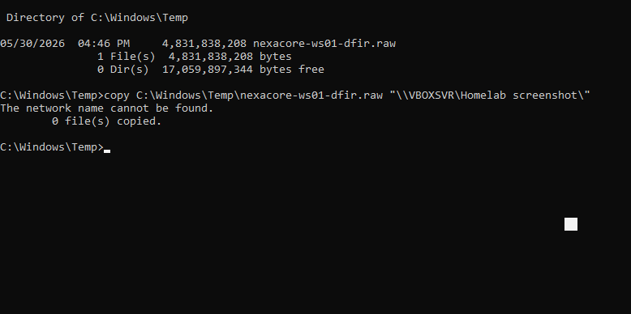

# Phase 01 — Evidence Acquisition

## Acquisition Metadata

| Field | Detail |
|---|---|
| Case ID | DFIR-CASE-01 |
| Analyst | Adedeji Adetayo |
| Date | 2026-05-30 |
| Time | 16:46:00 UTC |
| Target Host | NEXACORE-WS01 |
| Target IP | 192.168.10.10 |
| Acquisition Tool | WinPmem v1.0-rc2 |
| Output File | nexacore-ws01-dfir.raw |
| File Size | 4,831,838,208 bytes |
| Duration | 1 minute 37 seconds |

---

## Objective

Capture a live memory image from NEXACORE-WS01 while a fileless PowerShell attack was in progress. The acquisition was performed to preserve volatile evidence that would be lost upon system shutdown or attacker disconnection.

---

## Why Memory Was Captured First

Memory forensics follows the order of volatility — evidence that disappears fastest is collected first. RAM is the most volatile evidence source. The following attacker artefacts existed only in memory at the time of capture:

- The base64 encoded PowerShell command in the console buffer
- The PowerShell process with suspicious executable memory regions
- Active network connections showing open attack vectors
- The `$sysinfo` reconnaissance variable stored in the PowerShell session

If the system had been powered off or the PowerShell session closed before acquisition, all of this evidence would have been permanently lost.

---

## Acquisition Tool

**WinPmem v1.0-rc2** was used for memory acquisition. WinPmem is an open source Windows memory acquisition tool developed by Velocidex. It works by installing a signed kernel driver that provides direct access to physical memory, reading all memory pages, and writing them to a raw image file.

Download: https://github.com/Velocidex/WinPmem/releases

---

## Acquisition Steps

**Step 1 — Transfer WinPmem to target**

WinPmem was downloaded on the analyst host laptop and transferred to NEXACORE-WS01 via VirtualBox shared folder. The tool was placed at:

```
C:\Windows\Temp\go-winpmem_amd64_1.0-rc2_signed.exe
```

**Step 2 — Open elevated Command Prompt**

Command Prompt was opened as Administrator on NEXACORE-WS01 to ensure the kernel driver could be installed.

**Step 3 — Run acquisition**

```cmd
cd C:\Windows\Temp
go-winpmem_amd64_1.0-rc2_signed.exe acquire nexacore-ws01-dfir.raw
```

**Step 4 — Verify acquisition**

```cmd
dir C:\Windows\Temp\nexacore-ws01-dfir.raw
```

Output confirmed file size of 4,831,838,208 bytes.

**Step 5 — Transfer to analyst workstation**

The memory image was transferred from NEXACORE-WS01 to the Kali Linux analyst workstation via VirtualBox shared folder and copied to `~/dfir/nexacore-ws01-dfir.raw`.

---

## Acquisition Output

```
Writing driver to C:\Users\ADMINI~1\AppData\Local\Temp\1809596346.sys
Creating service winpmem
Installed service winpmem
Started service winpmem
Setting sparse output file nexacore-ws01-dfir.raw
Copying 917229 pages from 0x103000
Copying 131072 pages from 0x100000000
Completed imaging in 1m37.948478s
Stopped service winpmem
Removing driver
```



---

## Chain of Custody

| Item | Detail |
|---|---|
| Evidence collected by | Adedeji Adetayo |
| Collection method | WinPmem live memory acquisition |
| Collection time | 2026-05-30 16:46:00 |
| File name | nexacore-ws01-dfir.raw |
| File size | 4,831,838,208 bytes |
| Storage location | ~/dfir/ on Kali Linux analyst workstation |
| Integrity | File size verified post-transfer |

---

## References

- NIST SP 800-86 — Guide to Integrating Forensic Techniques into Incident Response
- WinPmem — https://github.com/Velocidex/WinPmem
