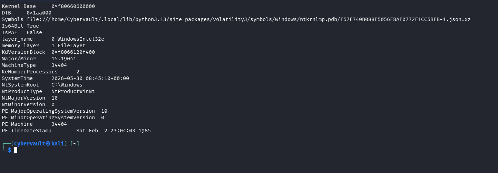
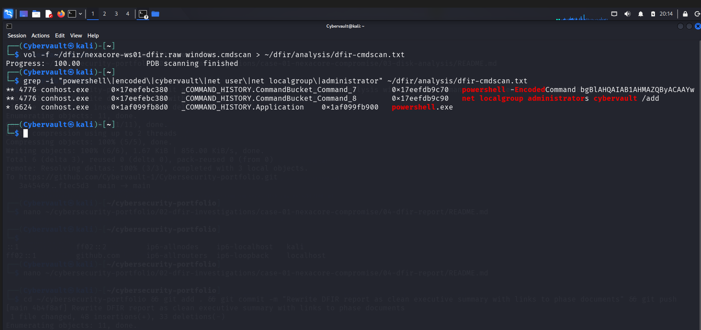
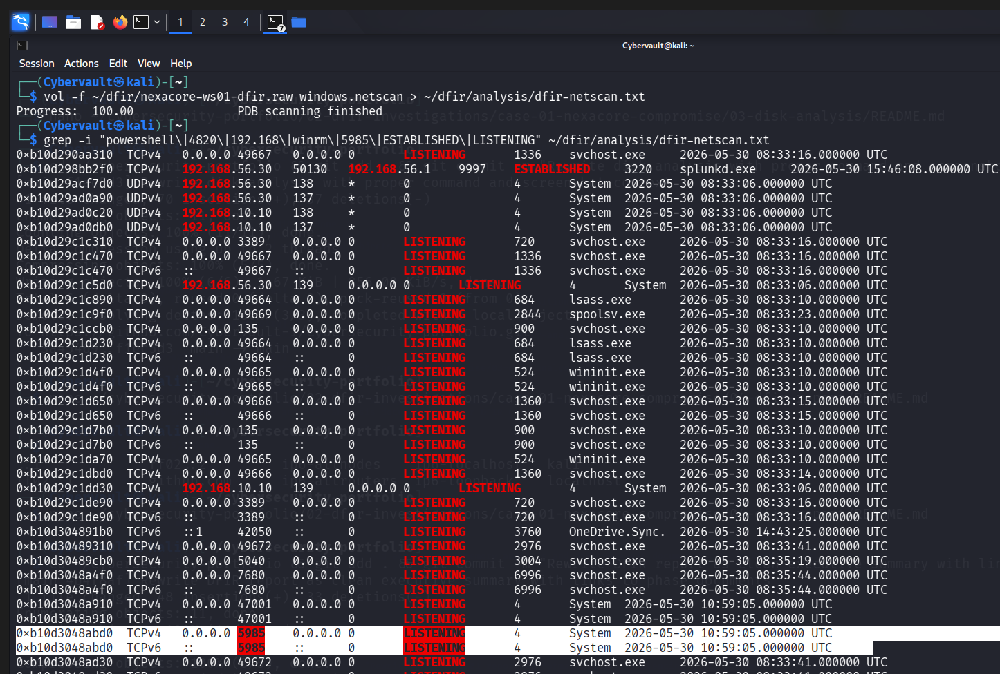
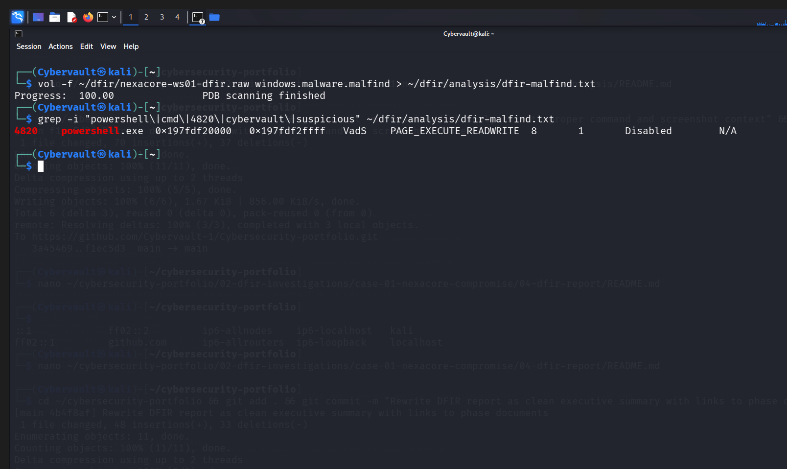

# Phase 02 — Memory Analysis

## Analysis Metadata

| Field | Detail |
|---|---|
| Case ID | DFIR-CASE-01 |
| Analyst | Adedeji Adetayo |
| Date | 2026-05-30 |
| Analysis Tool | Volatility3 Framework v2.28.0 |
| Memory Image | nexacore-ws01-dfir.raw |
| Image Size | 4,831,838,208 bytes |
| OS Identified | Windows 10 Build 19041 |
| Capture Time | 2026-05-30 08:45:10 UTC |

---

## Objective

Analyse the memory dump captured from NEXACORE-WS01 to identify attacker artefacts, suspicious processes, malicious commands, and active network connections that existed in RAM at the time of capture.

---

## Tool

Volatility3 Framework v2.28.0 was used for all memory analysis. It was installed on the Kali Linux analyst workstation and pointed at the raw memory image file captured by WinPmem.

```
pip3 install volatility3 --break-system-packages
```

---

## Step 1 — System Identification

Before running any analysis plugin, the OS version and build number were confirmed to ensure Volatility3 loaded the correct symbol file.

**Command:**
```
vol -f ~/dfir/nexacore-ws01-dfir.raw windows.info
```

**Key Output:**

| Field | Value |
|---|---|
| OS | Windows 10 |
| Build | 19041 |
| Architecture | 64-bit |
| Processors | 2 |
| System Time | 2026-05-30 08:45:10 UTC |
| System Root | C:\Windows |

**What This Shows:**
Volatility3 successfully identified the memory image as Windows 10 build 19041 and loaded the correct symbol file. The system time confirms the exact moment the memory was captured.



---

## Step 2 — Process List

**Command:**
```
vol -f ~/dfir/nexacore-ws01-dfir.raw windows.pslist
```

**Key Output:**

| PID | Process | Significance |
|---|---|---|
| 4820 | powershell.exe | Active PowerShell session — investigation target |
| 3356 | Sysmon64.exe | Endpoint monitoring active |
| 3220 | splunkd.exe | Log forwarding active |
| 1736 | svchost.exe -s WinRM | WinRM service running — attack vector open |
| 7644 | cmd.exe | Command Prompt used during attack |

**What This Shows:**
PowerShell was actively running at time of capture. The WinRM service was confirmed active confirming the remote access attack vector remains open on this endpoint.

---

## Step 3 — Process Tree

**Command:**
```
vol -f ~/dfir/nexacore-ws01-dfir.raw windows.pstree
```

**Key Output:**
```
664  services.exe
└── 1736  svchost.exe  -k NetworkService -p -s WinRM
└── 3220  splunkd.exe
└── 3356  Sysmon64.exe
1844  explorer.exe
└── 7644  cmd.exe
    └── 6040  go-winpmem_amd64  (forensic acquisition tool)
```

**What This Shows:**
The process tree confirmed a normal Windows hierarchy with no process masquerading. The WinRM service is hosted by svchost.exe under services.exe as expected. The cmd.exe and WinPmem acquisition chain is visible — this is the analyst forensic footprint.

---

## Step 4 — Command Line Arguments

**Command:**
```
vol -f ~/dfir/nexacore-ws01-dfir.raw windows.cmdline
```

**Key Output:**
```
4820  powershell.exe  "C:\Windows\System32\WindowsPowerShell\v1.0\powershell.exe"
7644  cmd.exe         "C:\Windows\system32\cmd.exe"
3056  cmd.exe         "C:\Windows\system32\cmd.exe"
3752  cmd.exe         "C:\Windows\system32\cmd.exe"
```

**What This Shows:**
Three cmd.exe instances were found. The command lines show basic invocation without arguments — meaning malicious commands were typed interactively inside the shell. The PowerShell process shows no arguments because it was an interactive session with the `$sysinfo` variable loaded in memory.

---

## Step 5 — Command History (Critical Finding)

**Command:**
```
vol -f ~/dfir/nexacore-ws01-dfir.raw windows.cmdscan
```

**Key Output:**
```
PID   Process      Command
4776  conhost.exe  powershell -EncodedCommand bgBlAHQAIAB1AHMAZQByACAAYwB5AGIAZQByAHYAYQB1AGwAdAAgAFAAYQBzAHMAdwBvAHIAZAAkADEAMgAzACEAIAAvAGEAZABkAA==
4776  conhost.exe  net localgroup administrators cybervault /add
6624  conhost.exe  powershell.exe
```

**Decoded Payload:**
```
net user cybervault Password$123! /add
```

**What This Shows:**
The console history buffer of conhost.exe PID 4776 contained the full attacker command sequence. The encoded PowerShell command was recovered from memory even though the process had already completed and exited. This is the core evidence of the fileless attack — the payload was hidden using base64 encoding to evade detection.



---

## Step 6 — Network Connections

**Command:**
```
vol -f ~/dfir/nexacore-ws01-dfir.raw windows.netscan
```

**Key Output:**
```
Protocol  Local Address          Foreign Address       State        PID   Process
TCPv4     0.0.0.0:5985           0.0.0.0:0             LISTENING    4     System
TCPv4     0.0.0.0:445            0.0.0.0:0             LISTENING    4     System
TCPv4     192.168.56.30:50130    192.168.56.1:9997     ESTABLISHED  3220  splunkd.exe
```

**What This Shows:**
Port 5985 (WinRM) is actively listening on all interfaces — confirming the remote access attack vector remains open. Port 445 (SMB) is also listening. The only established connection is the Splunk Universal Forwarder shipping logs to the SIEM. No active attacker connection was found because the attack was executed locally rather than via a live remote session at time of capture.



---

## Step 7 — Suspicious Memory Regions (Critical Finding)

**Command:**
```
vol -f ~/dfir/nexacore-ws01-dfir.raw windows.malware.malfind
```

**Key Output:**
```
PID   Process         Address         Protection              Type
4820  powershell.exe  0x197fdf20000   PAGE_EXECUTE_READWRITE  VaDs
```

**What This Shows:**
A memory region in PowerShell PID 4820 was flagged with `PAGE_EXECUTE_READWRITE` protection on a dynamically allocated region not backed by any file on disk. Legitimate code loaded from disk carries `PAGE_EXECUTE_READ` only. The combination of write and execute permissions on a non-file-backed region is a strong indicator of fileless code execution in memory.



---

## Step 8 — Password Hash Extraction

**Command:**
```
vol -f ~/dfir/nexacore-ws01-dfir.raw windows.registry.hashdump
```

**Result:**
```
WARNING: Hbootkey is not valid
```

**What This Shows:**
The SAM registry hive was not fully loaded into active memory at time of capture. Password hash extraction was not possible from this memory image. The SAM hive was located at address `0x860802fc8000` but marked as Disabled in the registry hivelist.

---

## Memory Analysis Summary

| Step | Plugin | Finding | Severity |
|---|---|---|---|
| 1 | windows.info | Windows 10 build 19041 confirmed | Informational |
| 2 | windows.pslist | PowerShell PID 4820 and WinRM service active | High |
| 3 | windows.pstree | Normal process hierarchy — no masquerading | Informational |
| 4 | windows.cmdline | Three cmd.exe instances identified | Medium |
| 5 | windows.cmdscan | Encoded PowerShell command and privilege escalation recovered | Critical |
| 6 | windows.netscan | WinRM port 5985 and SMB port 445 listening | High |
| 7 | windows.malware.malfind | PAGE_EXECUTE_READWRITE region in PowerShell | High |
| 8 | windows.registry.hashdump | Failed — SAM hive not active in memory | Informational |

---

## References

- NIST SP 800-86 — Guide to Integrating Forensic Techniques into Incident Response
- Volatility3 Documentation — https://volatility3.readthedocs.io
- MITRE ATT&CK T1059.001 — PowerShell
- MITRE ATT&CK T1027 — Obfuscated Files or Information
