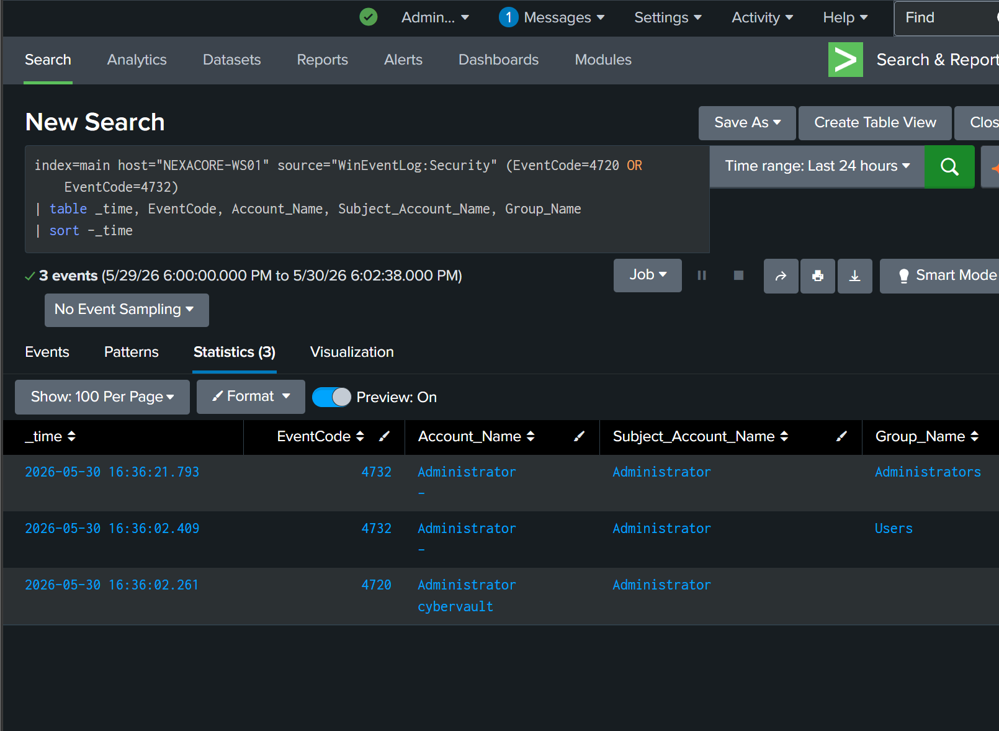
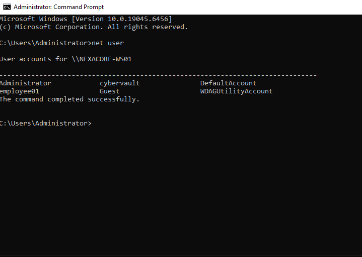
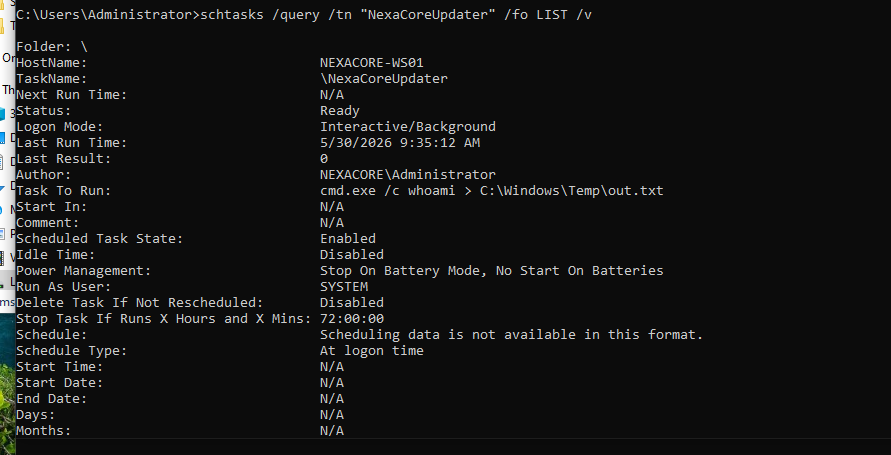

# Phase 03 — Disk Analysis

## Analysis Metadata

| Field | Detail |
|---|---|
| Case ID | DFIR-CASE-01 |
| Analyst | Adedeji Adetayo |
| Date | 2026-05-30 |
| Target Host | NEXACORE-WS01 |
| Tools Used | Splunk Enterprise, Windows Task Scheduler, Windows Command Prompt |
| Log Source | WinEventLog:Security |

---

## Objective

Identify persistent artefacts left on disk by the attacker that survive system reboots. Memory forensics captured what was happening at the moment of acquisition. Disk analysis confirms what was permanently written to the system — user accounts, scheduled tasks, and event log entries.

---

## Why Disk Analysis Follows Memory Analysis

Memory forensics reveals the attack in progress. Disk analysis confirms the lasting impact. Together they answer two critical questions:

- **Memory** — what did the attacker do and how did they do it
- **Disk** — what did the attacker leave behind permanently

A fileless attack does not write malware to disk but the results of the attack — new user accounts, scheduled tasks, event log entries — are permanently recorded on disk.

---

## Finding 1 — Backdoor Account Creation Confirmed In Windows Event Logs

### Investigation Method

Splunk was queried against Windows Security Event Logs forwarded from NEXACORE-WS01 via the Splunk Universal Forwarder.

```
index=main host="NEXACORE-WS01" source="WinEventLog:Security" (EventCode=4720 OR EventCode=4732)
| table _time, EventCode, Account_Name, Subject_Account_Name, Group_Name
| sort -_time
```

### Event ID Reference

| Event ID | Description |
|---|---|
| 4720 | A user account was created |
| 4732 | A member was added to a security-enabled local group |

### Results

Three events returned confirming the complete account creation sequence:

| Time | Event ID | Account | Group | Performed By |
|---|---|---|---|---|
| 2026-05-30 16:36:02 | 4720 | cybervault | N/A | Administrator |
| 2026-05-30 16:36:02 | 4732 | cybervault | Users | Administrator |
| 2026-05-30 16:36:21 | 4732 | cybervault | Administrators | Administrator |

### Interpretation

The three events occurred within 19 seconds of each other confirming an automated or scripted account creation. The Administrator account was used to create `cybervault` and immediately escalate it to the Administrators group. This matches exactly the decoded payload recovered during memory analysis:

```
net user cybervault Password$123! /add
net localgroup administrators cybervault /add
```



---

## Finding 2 — Backdoor Account Confirmed On Endpoint

### Investigation Method

Direct query of local user accounts on NEXACORE-WS01:

```cmd
net user
```

### Result

```
User accounts for \\NEXACORE-WS01:
Administrator    cybervault    DefaultAccount
employee01       Guest         WDAGUtilityAccount
```

The `cybervault` account is confirmed as a permanent local user on NEXACORE-WS01. It persists on disk in the SAM database and will survive system reboots.



---

## Finding 3 — NexaCoreUpdater Scheduled Task Confirmed Active

### Investigation Method

Direct query of Task Scheduler on NEXACORE-WS01:

```cmd
schtasks /query /tn "NexaCoreUpdater" /fo LIST /v
```

### Result

```
HostName:       NEXACORE-WS01
TaskName:       \NexaCoreUpdater
Status:         Ready
Logon Mode:     Interactive/Background
Last Run Time:  2026-05-30 09:35:12
Last Result:    0
Author:         NEXACORE\Administrator
Task To Run:    cmd.exe /c whoami > C:\Windows\Temp\out.txt
Run As User:    SYSTEM
Schedule Type:  At logon time
```

### Interpretation

This scheduled task was created on 2026-05-20 via an Evil-WinRM remote session as confirmed by Sysmon EventCode 1 logs showing `wsmprovhost.exe` spawning `schtasks.exe`. Key observations:

- **Run As User: SYSTEM** — highest privilege level on the machine
- **Schedule Type: At logon time** — executes at every user logon
- **Last Run Time: 2026-05-30 09:35:12** — executed this morning before this investigation began
- **Status: Ready** — will execute again at next logon
- **Age: 10 days** — persisted from May 20 to May 30 without detection

The task output file `C:\Windows\Temp\out.txt` was confirmed to exist on disk containing the string `nt authority\system` — proof of successful SYSTEM-level execution.



---

## Disk Analysis Summary

| Finding | Source | Severity |
|---|---|---|
| cybervault user account created | Event ID 4720 | Critical |
| cybervault added to Administrators group | Event ID 4732 | Critical |
| cybervault account confirmed on endpoint | net user | Critical |
| NexaCoreUpdater scheduled task active | schtasks query | Critical |
| Task running as SYSTEM at logon | Task Scheduler | Critical |
| Task persisted 10 days undetected | Task creation vs investigation date | Critical |

---

## Key Indicators of Compromise

| Indicator | Type | Description |
|---|---|---|
| cybervault | Local user account | Backdoor account with Administrator privileges |
| NexaCoreUpdater | Scheduled task | Persistence mechanism running as SYSTEM at logon |
| C:\Windows\Temp\out.txt | File | Attacker recon output confirming SYSTEM execution |
| cmd.exe /c whoami | Command | Reconnaissance command executed as SYSTEM |

---

## References

- NIST SP 800-86 — Guide to Integrating Forensic Techniques into Incident Response
- NIST SP 800-61 Rev 2 — Computer Security Incident Handling Guide
- MITRE ATT&CK T1053.005 — Scheduled Task
- MITRE ATT&CK T1136.001 — Create Account: Local Account
- MITRE ATT&CK T1078.003 — Valid Accounts: Local Accounts
