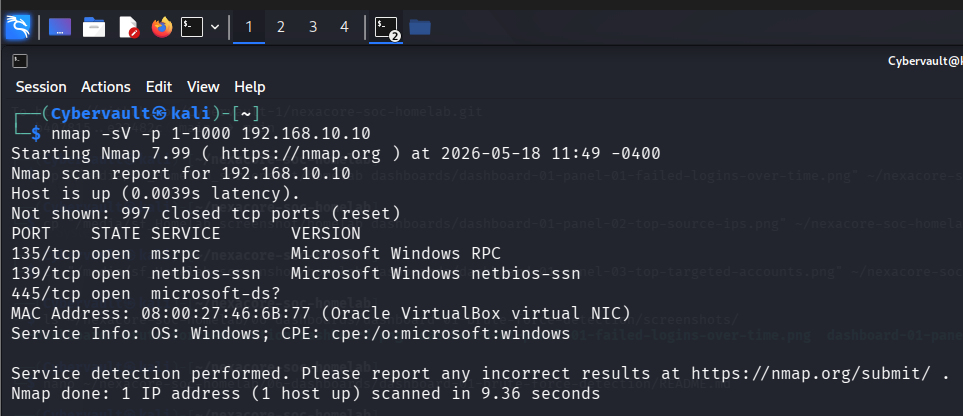

# Attack Simulation 02 — Nmap Reconnaissance

## Simulation Metadata

| Field | Detail |
| --- | --- |
| Simulation ID | SIM-02 |
| Date | 18 May 2026 |
| Author | Adedeji Adetayo |
| Status | Complete |
| MITRE Technique | T1046 — Network Service Discovery |
| Linked Detection | [DET-02 — Nmap Reconnaissance](../../04-detections/detection-02-nmap-reconnaissance/README.md) |
| Linked Incident Report | [IR-002 — Nmap Reconnaissance](../../05-incident-reports/IR-002-nmap-reconnaissance/README.md) |

---

## Objective

The objective of this simulation was to perform a network port scan against NEXACORE-WS01 from Kali Linux using Nmap, and to verify that the scan generates detectable evidence in Splunk through Windows Filtering Platform Event ID 5156 connection events.

This simulation replicates the reconnaissance phase of a real attack. Before launching any exploit, an attacker first scans the target to discover open ports and running services. This intelligence reveals which attack paths are available. In this environment discovering port 445 open directly connects to SIM-01, where the same port was targeted in a brute force attack, forming a realistic attack chain.

---

## Environment

| Role | Machine | IP Address | OS |
| --- | --- | --- | --- |
| Attacker | Kali Linux | 192.168.10.20 | Kali Linux 2024.4 |
| Target | NEXACORE-WS01 | 192.168.10.10 | Windows Server 2019 |
| Domain Controller | NexaCore-DC01 | 192.168.10.1 | Windows Server 2019 |
| SIEM | Splunk Enterprise | 192.168.56.1 | Host Machine |

---

## MITRE ATT&CK Mapping

| Field | Detail |
| --- | --- |
| Tactic | Discovery |
| Technique | Network Service Discovery |
| Technique ID | T1046 |
| Reference | https://attack.mitre.org/techniques/T1046/ |

---

## Prerequisites — Security Configuration That Enabled Detection

The following configuration was applied to NEXACORE-WS01 before the simulation to ensure the scan activity would be captured in the Windows Security log and forwarded to Splunk.

| Configuration | Detail |
| --- | --- |
| Windows Filtering Platform auditing enabled | The command `auditpol /set /subcategory:"Filtering Platform Connection" /success:enable /failure:enable` was run on NEXACORE-WS01. This instructs Windows to write Event ID 5156 to the Security log every time the firewall permits an inbound connection. Without this setting Nmap scan traffic would pass through silently with no log evidence. |
| Splunk Universal Forwarder running | The forwarder was confirmed running and shipping Windows Security logs to Splunk before the scan was launched. |

The following screenshot confirms that the Filtering Platform Connection audit policy was successfully enabled on NEXACORE-WS01 before the simulation was run.


---

## Attack Flow Architecture

```
Kali Linux (192.168.10.20)
        |
        | Nmap port scan over Internal Network (ports 1-1000)
        |
        v
NEXACORE-WS01 (192.168.10.10)
        |
        | Windows Filtering Platform logs inbound connections
        | as Event ID 5156 in the Windows Security log
        |
        | Splunk Universal Forwarder ships logs (port 9997)
        |
        v
Splunk Enterprise (192.168.56.1) — centralized log monitoring
```

---

## Tools Used

| Tool | Version | Purpose |
| --- | --- | --- |
| Nmap | 7.99 | Scan NEXACORE-WS01 for open ports and identify running services |

---

## Attack Steps

### Step 1 — Run the Nmap service version scan

The following command was run from Kali Linux to scan NEXACORE-WS01 for open ports across the first 1000 ports and identify the service running on each open port.

```
nmap -sV -p 1-1000 192.168.10.10
```

The `-sV` flag instructs Nmap to probe each open port and identify the exact service and version running on it. The `-p 1-1000` flag limits the scan to the first 1000 ports. Nmap completed the scan in 9.36 seconds.

Nmap discovered three open ports on NEXACORE-WS01:

| Port | State | Service |
| --- | --- | --- |
| 135/tcp | Open | Microsoft Windows RPC |
| 139/tcp | Open | Microsoft Windows NetBIOS |
| 445/tcp | Open | Microsoft SMB |

Port 445 being open is significant. This is the same port targeted in SIM-01 — SMB Brute Force. A real attacker discovering port 445 open would immediately consider brute force or lateral movement techniques against the SMB service. This connects the two simulations into a realistic attack chain where reconnaissance leads directly into a credential attack.



---

## Outcome

The Nmap scan completed successfully and identified three open ports on NEXACORE-WS01. The scan generated 45 Event ID 5156 entries in the Windows Security log, all originating from 192.168.10.20. These events were forwarded to Splunk via the Universal Forwarder and are available for detection and analysis.

---

## References

- Detection writeup: [DET-02 — Nmap Reconnaissance](../../04-detections/detection-02-nmap-reconnaissance/README.md)
- Incident report: [IR-002 — Nmap Reconnaissance](../../05-incident-reports/IR-002-nmap-reconnaissance/README.md)
- MITRE ATT&CK T1046: https://attack.mitre.org/techniques/T1046/
- Nmap official documentation: https://nmap.org/docs.html
