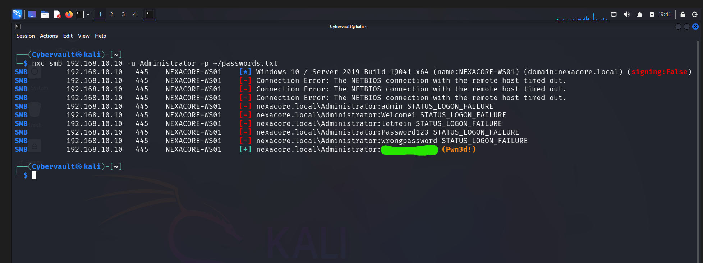
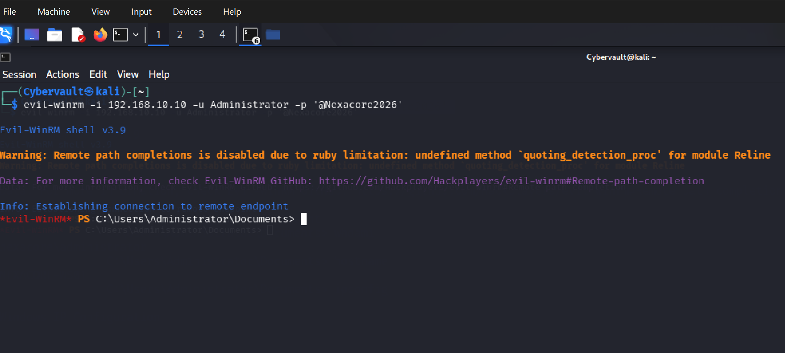
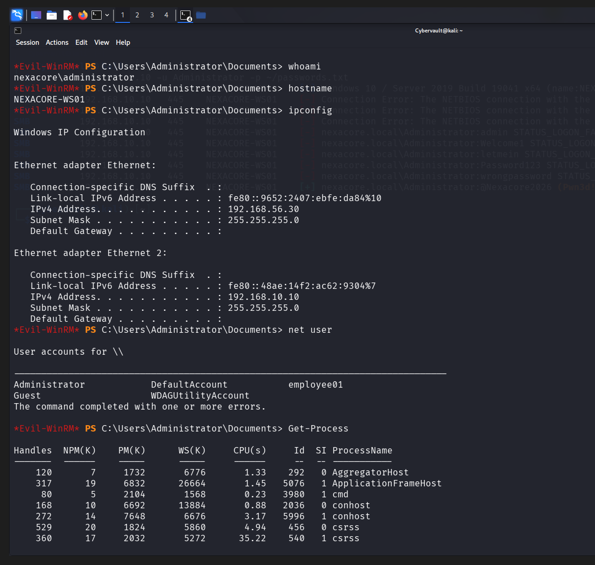

# Attack Simulation 03 — PowerShell Execution via Evil-WinRM

## Simulation Metadata

| Field | Detail |
|---|---|
| Simulation ID | SIM-03 |
| Date | 19 May 2026 |
| Author | Adedeji Adetayo |
| Status | Complete |
| MITRE Technique | T1059.001 — PowerShell |
| Linked Detection | DET-03 — PowerShell Execution via Evil-WinRM |
| Linked Incident Report | IR-003 — PowerShell Execution via Evil-WinRM |

---

## Objective

The objective of this simulation was to demonstrate how an attacker leverages credentials obtained via SMB brute force to establish a remote PowerShell session on NEXACORE-WS01 using Evil-WinRM. The simulation generates detectable evidence in Splunk via Windows Event ID 4624, PowerShell Script Block Logging Event ID 4104, and Sysmon Event ID 1, confirming remote command execution through the Windows Remote Management protocol.

---

## Environment

| Role | Machine | IP Address | OS |
|---|---|---|---|
| Attacker | Kali Linux | 192.168.10.20 | Kali Linux 2025.4 |
| Target | NEXACORE-WS01 | 192.168.10.10 | Windows Server 2019 |
| Domain Controller | NexaCore-DC01 | 192.168.10.1 | Windows Server 2019 |
| SIEM | Splunk Enterprise | 192.168.56.1 | Host Machine |

---

## MITRE ATT&CK Mapping

| Field | Detail |
|---|---|
| Tactic | Execution, Lateral Movement, Discovery |
| Technique | Command and Scripting Interpreter: PowerShell |
| Sub-technique | T1059.001 |
| Reference | https://attack.mitre.org/techniques/T1059/001/ |

---

## Prerequisites — Security Gaps That Allowed This Attack

| Gap | Detail |
|---|---|
| WinRM enabled and exposed | Port 5985 was left open and accessible on NEXACORE-WS01 with no network restriction, allowing any authenticated user to establish a remote PowerShell session |
| No account lockout policy | The Administrator account had no lockout policy configured, allowing unlimited authentication attempts during the SMB brute force in SIM-01 |
| Weak Administrator password | The Administrator password was present in a small wordlist, making it discoverable via brute force |
| No WinRM access restriction | WinRM was not restricted to specific IP addresses or admin accounts, allowing the attacker to connect from any machine on the network |

---

## Attack Flow Architecture

​```
Kali Linux (192.168.10.20)
    |
    | SMB brute force via NetExec (port 445)
    | Discovers valid Administrator credential
    |
    | Evil-WinRM connection (port 5985)
    v
NEXACORE-WS01 (192.168.10.10)
    |
    | wsmprovhost.exe spawns remote PowerShell session
    | Attacker runs whoami, hostname, ipconfig,
    | net user, Get-Process
    |
    | Windows Security Log — Event ID 4624 (network logon)
    | PowerShell Operational Log — Event ID 4104 (script block)
    | Sysmon Operational Log — Event ID 1 (process creation)
    v
Splunk Enterprise (192.168.56.1) — centralised log monitoring
​```

---

## Tools Used

| Tool | Version | Purpose |
|---|---|---|
| NetExec | Latest | Verify Administrator credential via SMB brute force |
| Evil-WinRM | v3.9 | Establish remote PowerShell session via WinRM port 5985 |

---

## Attack Preparation

To simulate a realistic brute force scenario where the attacker eventually discovers the correct credential, the Administrator password was appended to the wordlist before launching the attack.

​```bash
echo '<password>' >> ~/passwords.txt
​```

This ensured the wordlist contained the correct password alongside common weak passwords, reflecting a real world scenario where an attacker uses an enriched wordlist built from prior intelligence about the target organisation. The attack itself begins once the brute force is launched.

---

## Attack Steps

### Step 1 — Verify Credential via SMB Brute Force

Credentials were verified using NetExec against the SMB service on NEXACORE-WS01. NetExec cycled through the wordlist attempting authentication for each password until the correct credential was identified.

​```bash
nxc smb 192.168.10.10 -u Administrator -p ~/passwords.txt
​```

Expected output: All incorrect passwords return STATUS_LOGON_FAILURE. The correct password returns a [+] result with (Pwn3d!) confirming Administrator access with local administrator privileges.



---

### Step 2 — Establish Remote PowerShell Session via Evil-WinRM

Using the verified Administrator credential, the attacker connected to WinRM port 5985 on NEXACORE-WS01 using Evil-WinRM, establishing an interactive remote PowerShell session.

​```bash
evil-winrm -i 192.168.10.10 -u Administrator -p '<password>'
​```

Expected output: Evil-WinRM establishes connection and presents an interactive PowerShell prompt running as Administrator on NEXACORE-WS01.



---

### Step 3 — Post-Exploitation Reconnaissance

From within the remote PowerShell session, the attacker executed reconnaissance commands to enumerate the target environment and identify further attack opportunities.

​```powershell
whoami
hostname
ipconfig
net user
Get-Process
​```

| Command | Purpose |
|---|---|
| whoami | Confirmed identity and privilege level |
| hostname | Confirmed target machine name |
| ipconfig | Mapped network interfaces and connected subnets |
| net user | Enumerated all local user accounts |
| Get-Process | Surveyed all running processes on the target |

Expected output: Each command returns system information confirming the attacker is operating as Administrator on NEXACORE-WS01 with full visibility of the environment.



---

## Outcome

The attack succeeded without interruption. The attacker established a fully interactive remote PowerShell session on NEXACORE-WS01 using legitimate Windows Remote Management functionality abused with stolen credentials. All reconnaissance commands executed successfully and returned sensitive system information including network configuration, user accounts, and running processes.

Windows Script Block Logging captured every command executed inside the session as Event ID 4104. Sysmon recorded all spawned processes with wsmprovhost.exe as the parent process as Event ID 1. The network logon was recorded as Event ID 4624 Logon Type 3 with source IP 192.168.10.20 confirming the attacker origin.

In a hardened environment this attack would have been prevented by disabling WinRM where not required, restricting WinRM access to authorised management IP addresses only, and enforcing an account lockout policy to block brute force credential discovery.

---

## References

- Detection write-up: DET-03 — PowerShell Execution via Evil-WinRM
- Incident report: IR-003 — PowerShell Execution via Evil-WinRM
- MITRE ATT&CK T1059.001: https://attack.mitre.org/techniques/T1059/001/
- MITRE ATT&CK T1021.006: https://attack.mitre.org/techniques/T1021/006/
