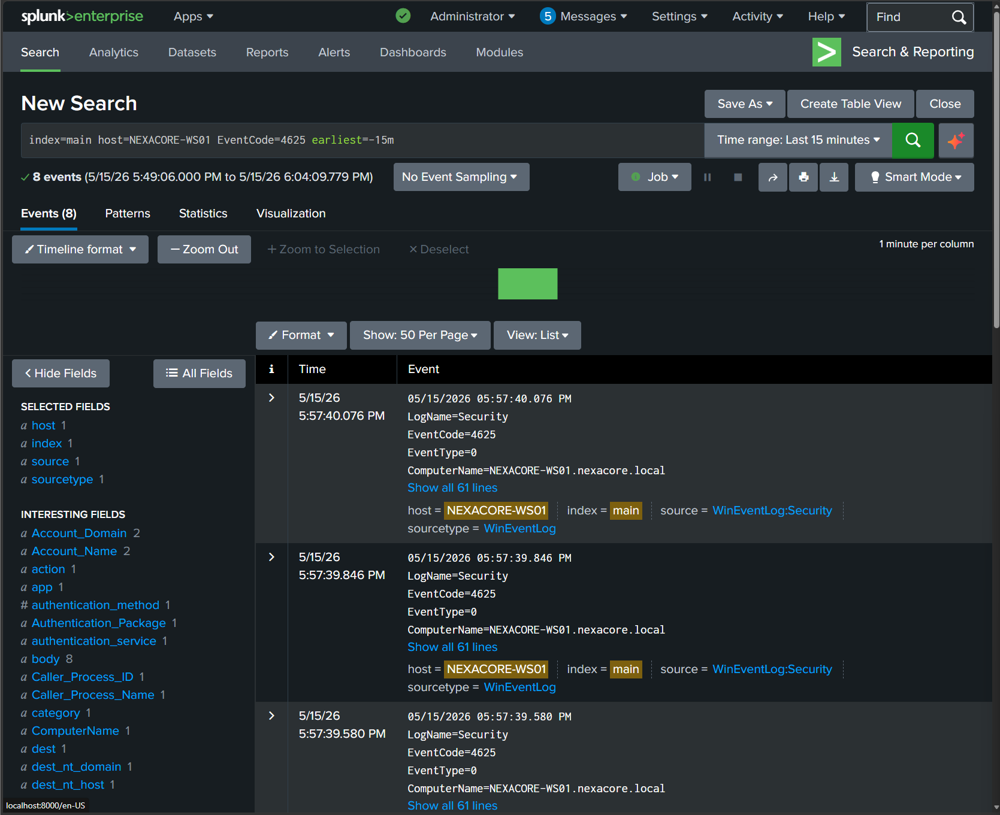
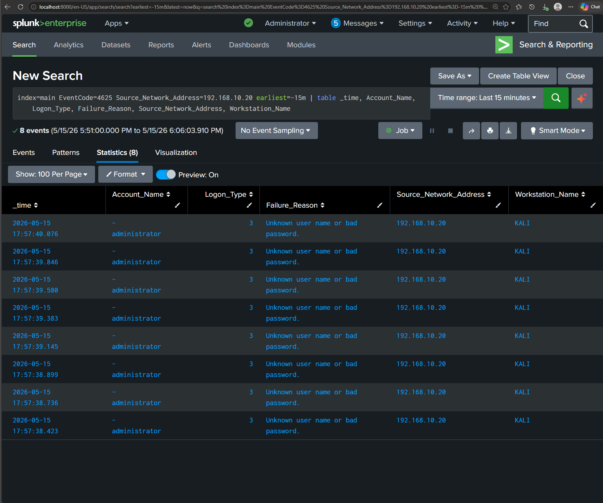

# Detection 01 — SMB Brute Force (Event ID 4625)

## Detection Metadata

| Field | Detail |
| --- | --- |
| Detection ID | DET-01 |
| Date | 18 May 2026 |
| Author | Adedeji Adetayo |
| Status | Active |
| MITRE Technique | T1110.001 — Password Guessing |
| Linked Simulation | [SIM-01 — SMB Brute Force](../../03-attack-simulations/sim-01-smb-brute-force/README.md) |
| Linked Incident Report | [IR-001 — SMB Brute Force](../../05-incident-reports/IR-001-smb-brute-force/README.md) |

---

## Overview

This detection identifies brute force authentication attempts against Windows machines by monitoring for a high volume of failed login events (Event ID 4625) originating from the same source IP within a short timeframe. It was built and validated against the SMB brute force simulation documented in SIM-01.

---

## MITRE ATT&CK Mapping

| Field | Detail |
| --- | --- |
| Tactic | Credential Access |
| Technique | Brute Force |
| Sub-technique | T1110.001 — Password Guessing |
| Reference | https://attack.mitre.org/techniques/T1110/001/ |

---

## Data Source Requirements

For this detection to work the following must be configured on the target endpoint:

| Requirement | Detail |
| --- | --- |
| Windows Security Auditing | Audit Logon Failures must be enabled under Security Settings — Advanced Audit Policy — Logon/Logoff |
| Splunk Universal Forwarder | Must be installed and running on the target endpoint and forwarding Security logs to Splunk |
| Splunk Index | Logs must be landing in the main index |

Without these in place Event ID 4625 will not be generated or will not reach Splunk and the detection will produce no results.

---

## Detection Logic

A single failed login is normal. A user mistyping their password generates one or two Event ID 4625 entries and then successfully logs in. What is not normal is seeing the same source IP generating more than 5 failed logins within a short window with no successful login at any point.

That pattern is what this detection looks for. The moment more than 5 Event ID 4625 events appear from one source IP within 15 minutes, the alert fires and the analyst investigates.

---

## Threshold Detection Query

This query groups failed logins by source IP and only surfaces IPs that have exceeded the threshold of 5 failures. This is the query the Splunk alert runs every 5 minutes.

```
index=main EventCode=4625 earliest=-15m | stats count by Source_Network_Address | where count > 5
```

**What each part does:**

| Part | Meaning |
| --- | --- |
| index=main | Opens the main log storage bucket where all endpoint logs are kept |
| EventCode=4625 | Windows Security event for a failed logon attempt |
| earliest=-15m | Only shows events from the last 15 minutes |
| stats count by Source_Network_Address | Groups failed logins by source IP and counts them |
| where count > 5 | Only returns IPs that have exceeded the threshold |


---

## Timechart — Visual Spike Pattern

This query visualises failed login activity over time grouped by source IP. A legitimate user generates a flat baseline. A brute force attack generates a sharp spike that is immediately visible.

```
index=main EventCode=4625 earliest=-15m | timechart span=1m count by Source_Network_Address
```


---

## Investigation Query

Once the threshold query fires, use this query to build a complete picture of the attack. This is dynamic and will work against any attacker IP, not just the one used in this simulation.

```
index=main EventCode=4625 earliest=-1h | stats count by Source_Network_Address, Account_Name, Workstation_Name | sort -count
```

---

## Key Fields To Examine

| Field | What To Look For |
| --- | --- |
| Account_Name | Is the attacker targeting a privileged account like administrator? |
| Logon_Type | Type 3 means the attempt came remotely over the network |
| Failure_Reason | The same failure reason repeated many times confirms automated activity |
| Source_Network_Address | The attacker IP — use this to block and trace the source |
| Workstation_Name | The attacker machine name — provides a second piece of identifying evidence |


---

## Follow-On Query — Did the Brute Force Succeed?

After confirming brute force activity, the analyst must check whether any of the attempts succeeded. Event ID 4624 is a successful login. If the attacker IP appears in 4624 events the attack succeeded and the incident severity increases immediately.

```
index=main EventCode=4624 earliest=-1h | stats count by Source_Network_Address, Account_Name | sort -count
```

In the SIM-01 simulation 192.168.10.20 did not appear in any Event ID 4624 entries, confirming the brute force failed and no accounts were compromised.


---

## False Positive Analysis

| Scenario | How To Distinguish From Attack |
| --- | --- |
| User genuinely mistyping password | Typically 1 to 3 failures then a successful login. No sustained pattern. |
| Password sync issue on a service account | Failures come from a known internal IP. Check if the account is a service account. |
| Automated script with wrong credentials | Similar pattern to brute force but source is an internal trusted IP. Investigate the script. |

Tune the threshold higher if false positives occur frequently in your environment. In a production SOC start at 10 failures before adjusting down.

---

## Splunk Alert Configuration

A scheduled alert has been configured in Splunk to fire automatically when the threshold is breached.

| Setting | Value |
| --- | --- |
| Title | NexaCore — SMB Brute Force Detection |
| Alert Type | Scheduled |
| Cron Schedule | */5 * * * * (every 5 minutes) |
| Time Range | Last 15 minutes |
| Trigger Condition | Number of results greater than 0 |
| Trigger | For each result |
| Throttle | 10 minutes |
| Severity | High |
| Action | Add to Triggered Alerts |


---

## Detection Results

When this detection was validated against SIM-01 it returned 8 Event ID 4625 events, all originating from 192.168.10.20, all targeting the administrator account, all within a 2 second window. The threshold of 5 was exceeded and the alert would have fired.





---

## Limitations

- This detection covers failed logins across all hosts in the environment but the alert is tuned for NEXACORE-WS01. In a production environment the query would run across all endpoints.
- The detection does not currently correlate 4625 failures with subsequent 4624 successes automatically. That follow-on check is manual.
- Attackers who slow their brute force attempts below the threshold rate will evade this detection.

---

## References

- [Attack Simulation SIM-01](../../03-attack-simulations/sim-01-smb-brute-force/README.md)
- [Incident Report IR-001](../../05-incident-reports/IR-001-smb-brute-force/README.md)
- [MITRE ATT&CK T1110.001](https://attack.mitre.org/techniques/T1110/001/)
- [Microsoft Event ID 4625](https://learn.microsoft.com/en-us/windows/security/threat-protection/auditing/event-4625)
