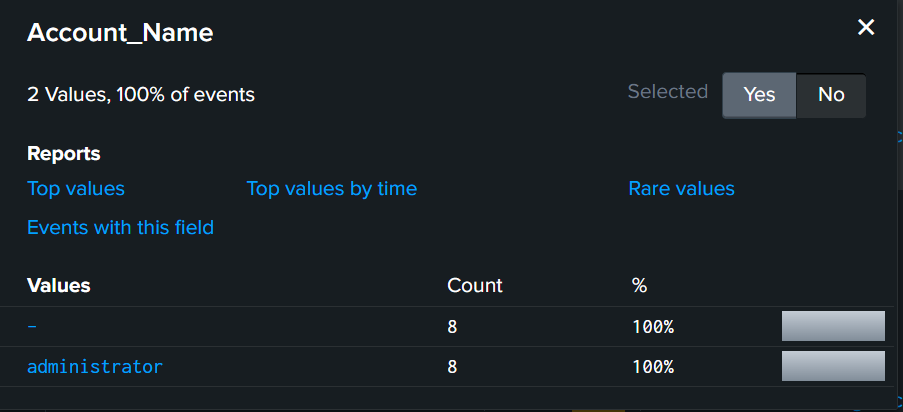
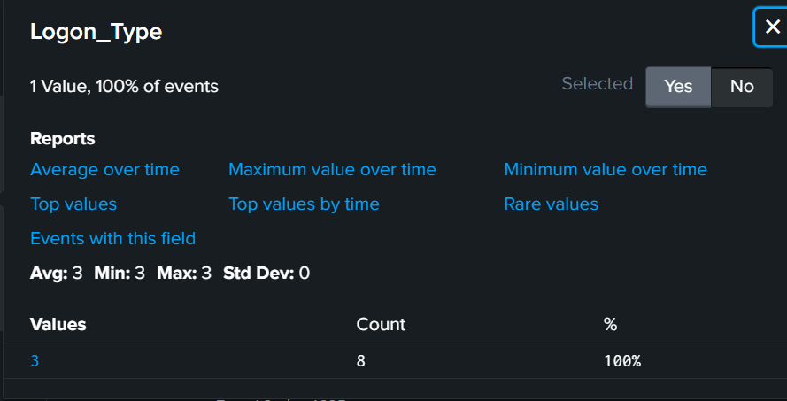
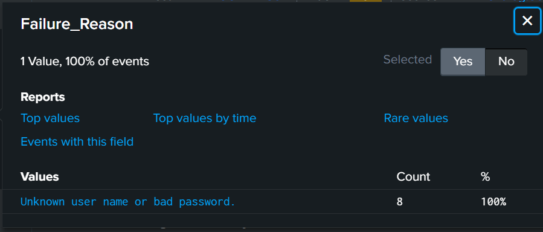
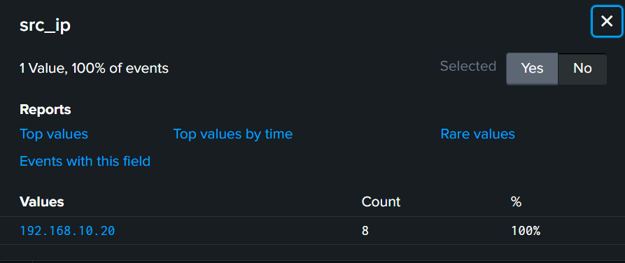
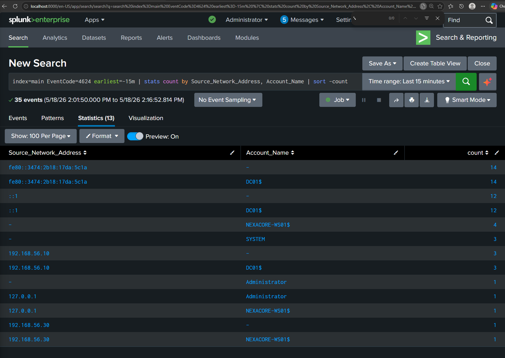
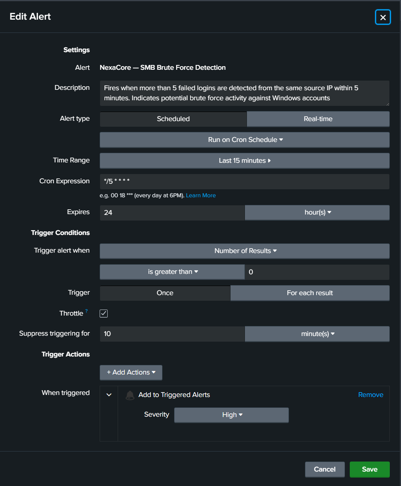

# Detection 01 — SMB Brute Force (Event ID 4625)

## Detection Metadata

| Field | Detail |
| --- | --- |
| Detection ID | DET-01 |
| Date | 18 May 2026 |
| Author | Adedeji Adetayo |
| Status | Active |
| MITRE Technique | T1110.001 — Password Guessing |
| Linked Simulation | [SIM-01 — SMB Brute Force](../../03-attack-simulations/sim-01-smb-brute-force/README.md) |
| Linked Incident Report | [IR-001 — SMB Brute Force](../../05-incident-reports/IR-001-smb-brute-force/README.md) |

---

## Overview

This detection identifies brute force authentication attempts against Windows machines by monitoring for a high volume of failed login events (Event ID 4625) originating from the same source IP within a short timeframe. It was built and validated against the SMB brute force simulation documented in SIM-01.

---

## MITRE ATT&CK Mapping

| Field | Detail |
| --- | --- |
| Tactic | Credential Access |
| Technique | Brute Force |
| Sub-technique | T1110.001 — Password Guessing |
| Reference | https://attack.mitre.org/techniques/T1110/001/ |

---

## Data Source Requirements

For this detection to work the following must be configured on the target endpoint:

| Requirement | Detail |
| --- | --- |
| Windows Security Auditing | Audit Logon Failures must be enabled under Security Settings — Advanced Audit Policy — Logon/Logoff |
| Splunk Universal Forwarder | Must be installed and running on the target endpoint and forwarding Security logs to Splunk |
| Splunk Index | Logs must be landing in the main index |

Without these in place Event ID 4625 will not be generated or will not reach Splunk and the detection will produce no results.

---

## Detection Logic

A single failed login is normal. A user mistyping their password generates one or two Event ID 4625 entries and then successfully logs in. What is not normal is seeing the same source IP generating more than 5 failed logins within a short window with no successful login at any point.

That pattern is what this detection looks for. The moment more than 5 Event ID 4625 events appear from one source IP within 15 minutes the alert fires and the analyst investigates.

---

## Threshold Detection Query

This query groups failed logins by source IP and only surfaces IPs that have exceeded the threshold of 5 failures. This is the query the Splunk alert runs every 5 minutes. Any IP returning a count above 5 is flagged for immediate investigation.

```
index=main EventCode=4625 earliest=-15m | stats count by Source_Network_Address | where count > 5
```

| Part | Meaning |
| --- | --- |
| index=main | Opens the main log storage bucket where all endpoint logs are kept |
| EventCode=4625 | Windows Security event for a failed logon attempt |
| earliest=-15m | Only shows events from the last 15 minutes |
| stats count by Source_Network_Address | Groups failed logins by source IP and counts them |
| where count > 5 | Only returns IPs that have exceeded the threshold |

The query returned 192.168.10.20 with a count of 8, exceeding the threshold of 5 and confirming brute force activity from the Kali Linux attacker machine.


---

## Timechart — Visual Spike Pattern

A timechart helps the analyst see the attack pattern visually. Legitimate failed logins appear as a flat baseline spread randomly over time. A brute force attack generates all its failures within seconds and appears as a sharp isolated spike. This query visualises failed login activity over time grouped by source IP.

```
index=main EventCode=4625 earliest=-15m | timechart span=1m count by Source_Network_Address
```

The chart shows a single spike at 2:03 PM on 18 May 2026 from 192.168.10.20. The baseline before and after is completely flat confirming this was an automated attack and not normal user behaviour.


---

## Investigation Query

Once the threshold query fires use this query to build a complete picture of who was targeted, from where and how many times. This query is dynamic and will surface all source IPs that generated failed logins, not just a hardcoded attacker IP. This ensures the analyst does not miss other active threats in the environment.

```
index=main EventCode=4625 earliest=-1h | stats count by Source_Network_Address, Account_Name, Workstation_Name | sort -count
```

---

## Key Fields To Examine

Each Event ID 4625 entry contains several fields that together build a complete picture of the attack. The following fields were examined across the events captured during the SIM-01 simulation.

---

### Account_Name

The Account_Name field identifies which account the attacker was targeting. Attackers almost always target high privilege accounts like administrator because a successful compromise gives them full control of the machine. Seeing the same account name repeated across all failed login events confirms the attacker had a specific target in mind rather than attempting random accounts.



---

### Logon_Type

The Logon_Type field identifies how the authentication was attempted. A value of 3 means the attempt came remotely over the network. This tells the analyst the attacker was not physically present at the machine. Any sustained series of Logon_Type 3 failures from an unfamiliar IP should be treated as suspicious and investigated immediately.



---

### Failure_Reason

The Failure_Reason field explains why the login failed. Seeing the same reason repeated across all events with no variation and no successful login confirms automated brute force activity. A genuine user mistake rarely exceeds 2 or 3 attempts and is usually followed by a successful login or a password reset request.



---

### Source_Network_Address

The Source_Network_Address field identifies where the attack came from. This is the most important field for response. In a production environment this IP would be immediately blocked at the firewall, traced to its owner and checked against threat intelligence feeds to determine whether it is a known malicious host.



---

### Workstation_Name

The Workstation_Name field provides the name of the machine the attacker used. Combined with the Source_Network_Address this gives the analyst two independent pieces of evidence pointing to the same attacker machine, strengthening the case for escalation and response.


---

## Follow-On Query — Did the Brute Force Succeed?

After confirming brute force activity the analyst must immediately check whether any attempt succeeded. Event ID 4624 is a successful Windows login. If the attacker IP appears in any 4624 events the brute force worked and the incident severity escalates to critical immediately.

This query checks all successful logins in the last hour and groups them by source IP and account name. If the attacker IP appears here containment must begin immediately.

```
index=main EventCode=4624 earliest=-1h | stats count by Source_Network_Address, Account_Name | sort -count
```

In the SIM-01 simulation 192.168.10.20 did not appear in any Event ID 4624 entries confirming the brute force failed completely and no accounts were compromised.



---

## False Positive Analysis

| Scenario | How To Distinguish From Attack |
| --- | --- |
| User genuinely mistyping password | Typically 1 to 3 failures then a successful login. No sustained pattern. |
| Password sync issue on a service account | Failures come from a known internal IP. Check if the account is a service account. |
| Automated script with wrong credentials | Similar pattern to brute force but source is an internal trusted IP. Investigate the script. |

Tune the threshold higher if false positives occur frequently in your environment. In a production SOC start at 10 failures before adjusting down based on observed baseline behaviour.

---

## Splunk Alert Configuration

A scheduled alert has been configured in Splunk to fire automatically when the threshold is breached. The alert runs silently in the background every 5 minutes and only notifies the analyst when a real threshold breach is detected.

| Setting | Value |
| --- | --- |
| Title | NexaCore — SMB Brute Force Detection |
| Alert Type | Scheduled |
| Cron Schedule | */5 * * * * (every 5 minutes) |
| Time Range | Last 15 minutes |
| Trigger Condition | Number of results greater than 0 |
| Trigger | For each result |
| Throttle | 10 minutes |
| Severity | High |
| Action | Add to Triggered Alerts |



---

## Limitations

- This detection covers failed logins across all hosts forwarding to Splunk but requires the Universal Forwarder to be running on the target. If the forwarder goes down events will not reach Splunk and the detection will be blind.
- The detection does not automatically correlate 4625 failures with subsequent 4624 successes. The follow-on check is currently a manual step.
- Attackers who deliberately slow their brute force attempts below the threshold rate will evade this detection. A low and slow attack generating 2 to 3 failures per hour would not trigger the alert.

---

## References

- [Attack Simulation SIM-01](../../03-attack-simulations/sim-01-smb-brute-force/README.md)
- [Incident Report IR-001](../../05-incident-reports/IR-001-smb-brute-force/README.md)
- [MITRE ATT&CK T1110.001](https://attack.mitre.org/techniques/T1110/001/)
- [Microsoft Event ID 4625](https://learn.microsoft.com/en-us/windows/security/threat-protection/auditing/event-4625)
- [Microsoft Event ID 4624](https://learn.microsoft.com/en-us/windows/security/threat-protection/auditing/event-4624)
