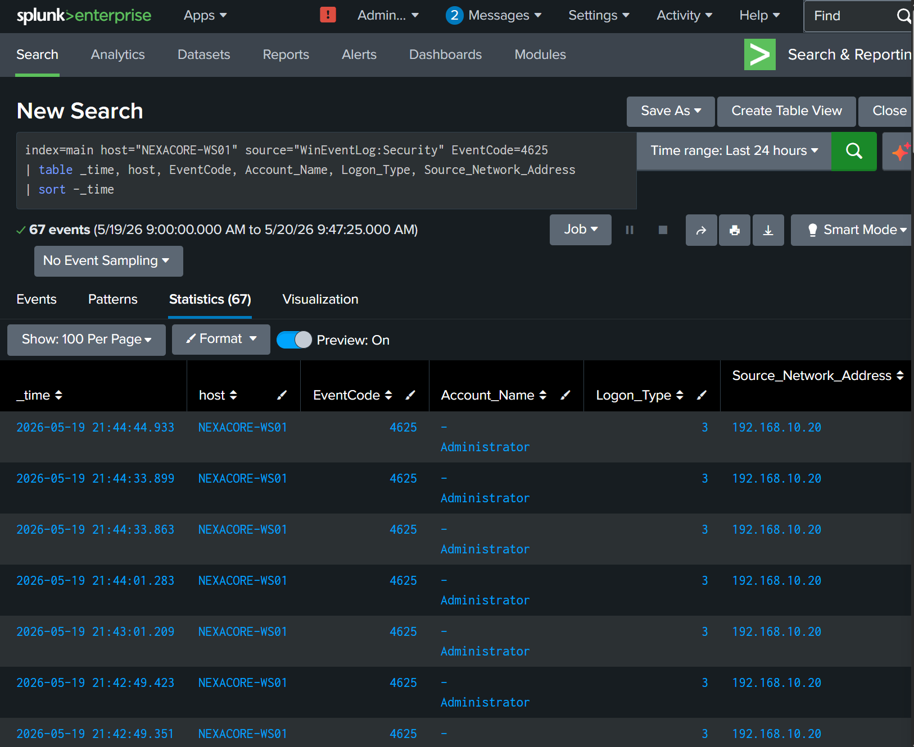
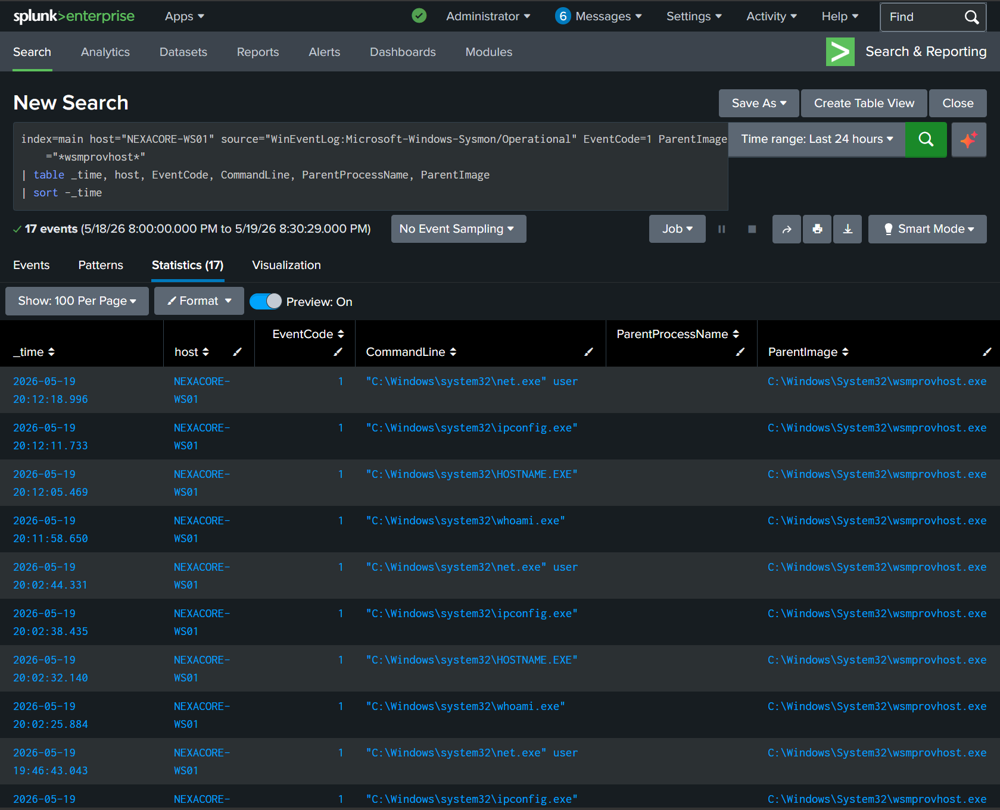
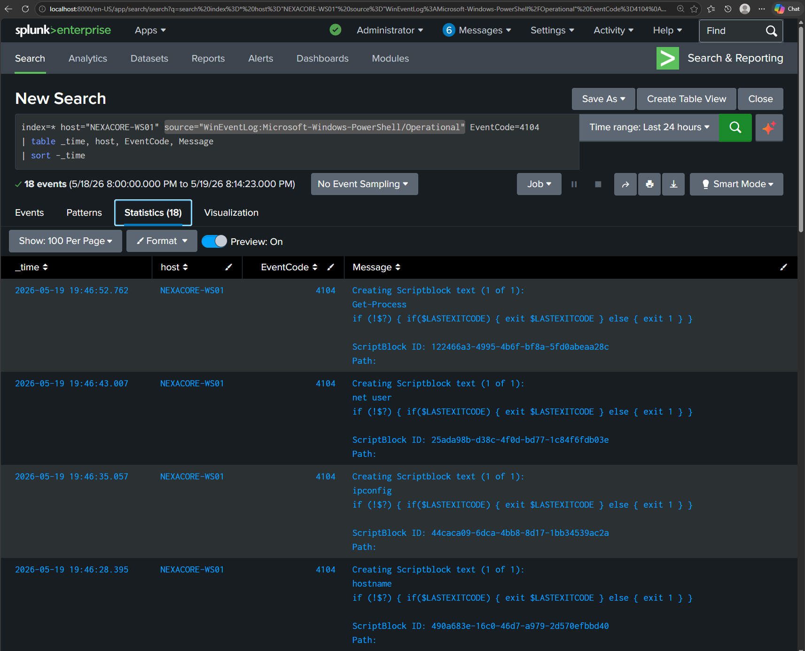

# Detection Report 03 — PowerShell Execution via Evil-WinRM

## Detection Metadata

| Field | Detail |
|---|---|
| Detection ID | DET-03 |
| Date | 19 May 2026 |
| Author | Adedeji Adetayo |
| Status | Complete |
| MITRE Technique | T1059.001 — PowerShell |
| Linked Simulation | SIM-03 — PowerShell Execution via Evil-WinRM |
| Linked Incident Report | IR-003 — PowerShell Execution via Evil-WinRM |

---

## Objective

The objective of this detection was to identify evidence of remote PowerShell execution via Evil-WinRM on NEXACORE-WS01 using Splunk. The detection covers the full attack chain from credential discovery via SMB brute force through to post-exploitation reconnaissance executed inside a remote PowerShell session.

---

## Environment

| Role | Machine | IP Address | OS |
|---|---|---|---|
| Attacker | Kali Linux | 192.168.10.20 | Kali Linux 2025.4 |
| Target | NEXACORE-WS01 | 192.168.10.10 | Windows Server 2019 |
| Domain Controller | NexaCore-DC01 | 192.168.10.1 | Windows Server 2019 |
| SIEM | Splunk Enterprise | 192.168.56.1 | Host Machine |

---

## MITRE ATT&CK Mapping

| Field | Detail |
|---|---|
| Tactic | Execution, Lateral Movement, Discovery |
| Technique | Command and Scripting Interpreter: PowerShell |
| Sub-technique | T1059.001 |
| Reference | https://attack.mitre.org/techniques/T1059/001/ |

---

## Detection Sources

| Log Source | Event ID | Description |
|---|---|---|
| Windows Security Log | 4625 | Failed logon attempts from brute force |
| Windows Security Log | 4624 | Successful network logon by Administrator |
| PowerShell Operational Log | 4104 | Script Block Logging capturing attacker commands |
| Sysmon Operational Log | 1 | Process creation with wsmprovhost.exe as parent |

---

## Detection 1 — SMB Brute Force via Failed Logons

The brute force attack generated 67 failed logon attempts against the Administrator account from 192.168.10.20. Each failed password attempt was captured as Event ID 4625 with Logon Type 3 confirming network authentication attempts.

A high volume of failed logons from a single source IP targeting a privileged account over a short time period is a strong indicator of a brute force attack.

    index=main host="NEXACORE-WS01" source="WinEventLog:Security" EventCode=4625
    | table _time, host, EventCode, Account_Name, Logon_Type, Source_Network_Address
    | sort -_time

---

## Detection 2 — Successful Authentication Following Brute Force

Following the failed attempts, a successful logon was recorded as Event ID 4624 Logon Type 3 from the same source IP 192.168.10.20. The transition from repeated 4625 failures to a 4624 success from the same IP confirms the brute force attack succeeded in discovering valid credentials.

    index=main host="NEXACORE-WS01" source="WinEventLog:Security" EventCode=4624 Account_Name="Administrator" Logon_Type=3 Source_Network_Address="192.168.10.20"
    | table _time, host, EventCode, Account_Name, Logon_Type, Source_Network_Address
    | sort _time

---

## Detection 3 — Remote PowerShell Execution via WinRM

Following successful authentication, the attacker established a remote PowerShell session via Evil-WinRM on port 5985. Sysmon Event ID 1 recorded process creation events with wsmprovhost.exe as the parent process for every command executed. The presence of wsmprovhost.exe as a parent process is a direct indicator of remote WinRM session abuse.

    index=main host="NEXACORE-WS01" source="WinEventLog:Microsoft-Windows-Sysmon/Operational" EventCode=1 ParentImage="*wsmprovhost*"
    | table _time, host, EventCode, CommandLine, ParentProcessName, ParentImage
    | sort -_time

---

## Detection 4 — PowerShell Script Block Logging

Windows Script Block Logging captured every command executed inside the remote PowerShell session as Event ID 4104. The captured commands including whoami, hostname, ipconfig, net user and Get-Process confirm post-exploitation reconnaissance activity was performed by the attacker inside the session.

    index=main host="NEXACORE-WS01" source="WinEventLog:Microsoft-Windows-PowerShell/Operational" EventCode=4104
    | table _time, host, EventCode, Message
    | sort -_time

---

## Attack Timeline

| Time | Event | Evidence |
|---|---|---|
| 13:58:07 | First successful Administrator logon from 192.168.10.20 | Event ID 4624 |
| 19:46:20 | Evil-WinRM session established | Event ID 4624 Logon Type 3 |
| 19:46:28 | Attacker runs hostname inside PowerShell session | Event ID 4104 |
| 19:46:35 | Attacker runs ipconfig | Event ID 4104 |
| 19:46:43 | Attacker runs net user | Event ID 4104 |
| 19:46:52 | Attacker runs Get-Process | Event ID 4104 |
| 20:12:05 | Additional reconnaissance session detected | Sysmon Event ID 1 |

---

## Key Indicators of Compromise

| Indicator | Value |
|---|---|
| Attacker IP | 192.168.10.20 |
| Target Account | Administrator |
| Target Machine | NEXACORE-WS01 |
| Protocol Abused | WinRM port 5985 |
| Parent Process | wsmprovhost.exe |
| Commands Executed | whoami, hostname, ipconfig, net user, Get-Process |

---

## Analyst Notes

The attack was detected across four independent log sources confirming the full kill chain. No single event in isolation proves malicious activity. The combination of repeated 4625 failures followed by a 4624 success from the same IP, wsmprovhost.exe spawning reconnaissance processes, and Script Block Logging capturing attacker commands together constitute conclusive evidence of remote PowerShell execution via Evil-WinRM.

A legitimate administrator performing remote management would not produce this pattern. Authorised WinRM sessions would originate from known management IP addresses, would not be preceded by dozens of failed authentication attempts, and would not involve reconnaissance commands such as whoami and net user.

---

## Recommendations

- Disable WinRM on endpoints where remote management is not required
- Restrict WinRM access to authorised management IP addresses only using Windows Firewall rules
- Enforce account lockout policy to limit brute force credential discovery
- Monitor Event ID 4625 for repeated failures against privileged accounts from single source IPs
- Alert on wsmprovhost.exe spawning child processes outside of authorised maintenance windows
- Enable and monitor PowerShell Script Block Logging across all endpoints

---

## References

- Simulation: SIM-03 — PowerShell Execution via Evil-WinRM
- Incident report: IR-003 — PowerShell Execution via Evil-WinRM
- MITRE ATT&CK T1059.001: https://attack.mitre.org/techniques/T1059/001/
- MITRE ATT&CK T1021.006: https://attack.mitre.org/techniques/T1021/006/
