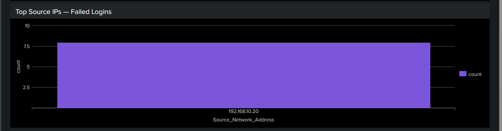
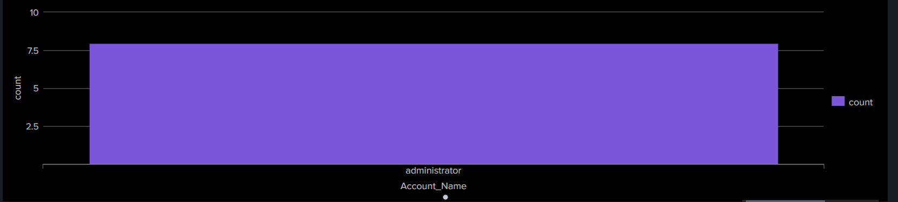

# Dashboard 01 — Brute Force Detection

## Overview

This dashboard monitors failed authentication activity across the NexaCore environment. It provides real-time visibility into brute force attempts targeting Windows accounts and surfaces attacker behaviour patterns that require immediate investigation.

## Dashboard Panels

### Panel 1 — Failed Logins Over Time (Event ID 4625)

Displays failed login attempts grouped by hour across a 24-hour window. A single failed login is noise. Multiple failed logins clustered within a short time window is a signal worth investigating.

**SPL Query:**

```
index=main EventCode=4625 | timechart span=1h count
```


---

### Panel 2 — Top Source IPs Generating Failed Logins

Ranks source IP addresses by total failed login count. A single IP responsible for all failed logins is a strong indicator of brute force activity.

**SPL Query:**

```
index=main EventCode=4625 | stats count by Source_Network_Address | sort -count
```



---

### Panel 3 — Top Targeted Accounts

Shows which accounts are being targeted most frequently. Attackers commonly target high-privilege accounts like administrator because a successful compromise gives them full system access.

**SPL Query:**

```
index=main EventCode=4625 | stats count by Account_Name | search Account_Name!="-" | sort -count
```


