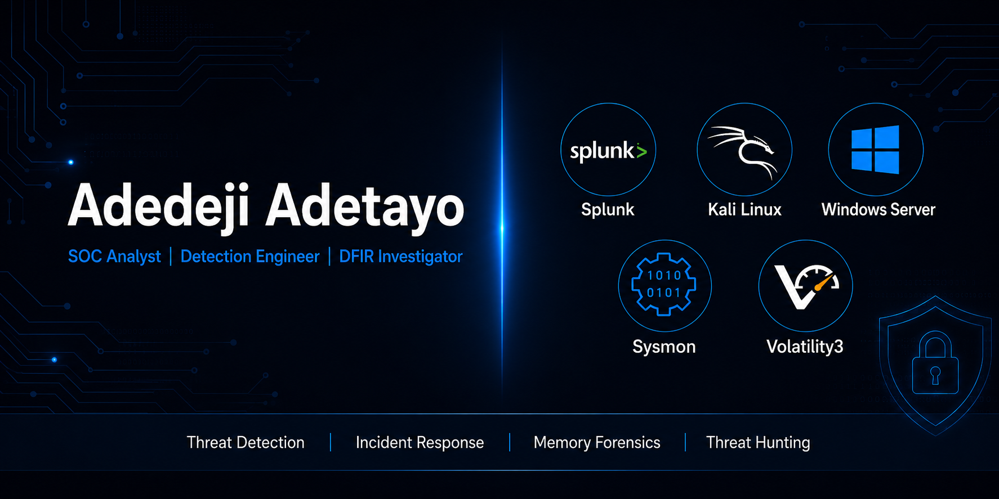

# Adedeji Adetayo — Cybersecurity Portfolio

---

## About Me

I am an entry-level SOC Analyst and Detection Engineer building real-world experience through hands-on cybersecurity projects. Everything in this portfolio was built from scratch — attack simulations, detection engineering, threat hunting, incident response, and digital forensics — documented with real evidence and professional reporting.

I do not just follow tutorials. I build environments, simulate attacks, investigate the evidence, and document findings the way a working analyst would.

| | |
|---|---|
| 📧 Email | Adedejiadetayo33@gmail.com |
| 💼 LinkedIn | [Adetayo Adedeji](https://www.linkedin.com/in/adetayo-adedeji-473816337/) |
| 🎓 Certification | [Google Cybersecurity Professional Certificate](https://coursera.org/verify/professional-cert/6WSDVPZVYGEM) |
| 📍 Location | Lagos, Available for remote roles worldwide |

---

## What I Can Do

| Capability | Tools and Evidence |
|---|---|
| SIEM Monitoring and Detection | Splunk SPL — 15 custom detection queries across 5 attack scenarios |
| Threat Hunting | Volatility3, Splunk — proactive hunts discovering 4-day undetected persistence |
| Incident Response | 5 formal IR reports with containment, eradication, and recovery |
| Memory Forensics | WinPmem, Volatility3 — fileless attack investigation from live memory dumps |
| Detection Engineering | 3 automated Splunk correlation rules with false positive tuning |
| Attack Simulation | Evil-WinRM, Impacket, NetExec, Nmap — 5 MITRE-mapped attack scenarios |
| Active Directory Security | Kerberoasting detection, domain controller log analysis |
| Log Analysis | Windows Security, Sysmon, PowerShell, Linux Syslog |

---

## Projects

| Project | Description | Status |
|---|---|---|
| [NexaCore SOC Homelab](01-nexacore-soc-homelab/) | A fully functional enterprise-style SOC environment simulating five real world attacks across the full kill chain — reconnaissance, initial access, execution, persistence, and credential access — with detection engineering, threat hunting, correlation rules, and incident response documentation in Splunk | Active |
| [DFIR Investigations](02-dfir-investigations/) | Hands-on Digital Forensics and Incident Response investigations following NIST SP 800-86 methodology — covering live memory acquisition with WinPmem, memory forensics with Volatility3, fileless attack investigation, and formal DFIR reporting | Active |

---

## Attack and Detection Coverage

| Attack Simulation | Detection | Incident Report | MITRE Technique | Project |
|---|---|---|---|---|
| SMB Brute Force | ✅ DET-01 | ✅ IR-001 | T1110.001 | NexaCore |
| Nmap Reconnaissance | ✅ DET-02 | ✅ IR-002 | T1046 | NexaCore |
| PowerShell via Evil-WinRM | ✅ DET-03 | ✅ IR-003 | T1059.001 | NexaCore |
| Scheduled Task Persistence | ✅ DET-04 | ✅ IR-004 | T1053.005 | NexaCore |
| Kerberoasting | ✅ DET-05 | ✅ IR-005 | T1558.003 | NexaCore |
| Fileless PowerShell Attack | ✅ Memory Forensics | ✅ DFIR-CASE-01 | T1059.001, T1027 | DFIR |

---

## Threat Hunting and Correlation Rules

| ID | Name | Type | Source | Status |
|---|---|---|---|---|
| HUNT-01 | LOLBin Abuse via Scheduled Task Persistence | Threat Hunt | NexaCore | ✅ Complete |
| HUNT-02 | Kerberoasting Artefact Hunt | Threat Hunt | NexaCore | ✅ Complete |
| CR-01 | WinRM Session Spawning LOLBin | Correlation Rule | HUNT-01 | ✅ Active |
| CR-02 | Task Scheduler Spawning Shell Process | Correlation Rule | HUNT-01 | ✅ Active |
| CR-03 | RC4 Kerberos Service Ticket Request | Correlation Rule | HUNT-02 | ✅ Active |

---

## Certifications

| Certification | Issuer | Year | Verification |
|---|---|---|---|
| Google Cybersecurity Professional Certificate | Google via Coursera | 2026 | [Verify](https://coursera.org/verify/professional-cert/6WSDVPZVYGEM) |
| CompTIA Security+ | CompTIA | In Progress | — |

---

## Technical Skills

**SIEM and Log Analysis**
Splunk Enterprise · Splunk SPL · Windows Event Logs · PowerShell Script Block Logging · Linux Syslog

**Endpoint Detection**
Sysmon · Windows Security Auditing · Process Creation Analysis · Parent-Child Process Monitoring · Sysmon Configuration and Tuning

**Memory Forensics**
WinPmem · Volatility3 · Live Memory Acquisition · Fileless Malware Analysis · Console Buffer Recovery

**Threat Detection and Hunting**
MITRE ATT&CK · Detection Engineering · Proactive Threat Hunting · Correlation Rule Development · Alert Tuning · False Positive Reduction

**Active Directory Security**
Kerberos Authentication · Kerberoasting Detection · Domain Controller Log Analysis · Service Principal Names

**Attack Simulation**
Nmap · NetExec · Evil-WinRM · Impacket · Hashcat · Mimikatz Concepts

**Incident Response**
Timeline Reconstruction · Root Cause Analysis · Containment and Eradication · NIST SP 800-61 Lifecycle

**Digital Forensics**
Evidence Acquisition · Chain of Custody · Memory Analysis · Disk Artefact Analysis · NIST SP 800-86 Methodology

---

## References

- MITRE ATT&CK — https://attack.mitre.org
- NIST SP 800-61 Rev 2 — https://nvlpubs.nist.gov/nistpubs/SpecialPublications/NIST.SP.800-61r2.pdf
- NIST SP 800-86 — https://nvlpubs.nist.gov/nistpubs/SpecialPublications/NIST.SP.800-86.pdf
